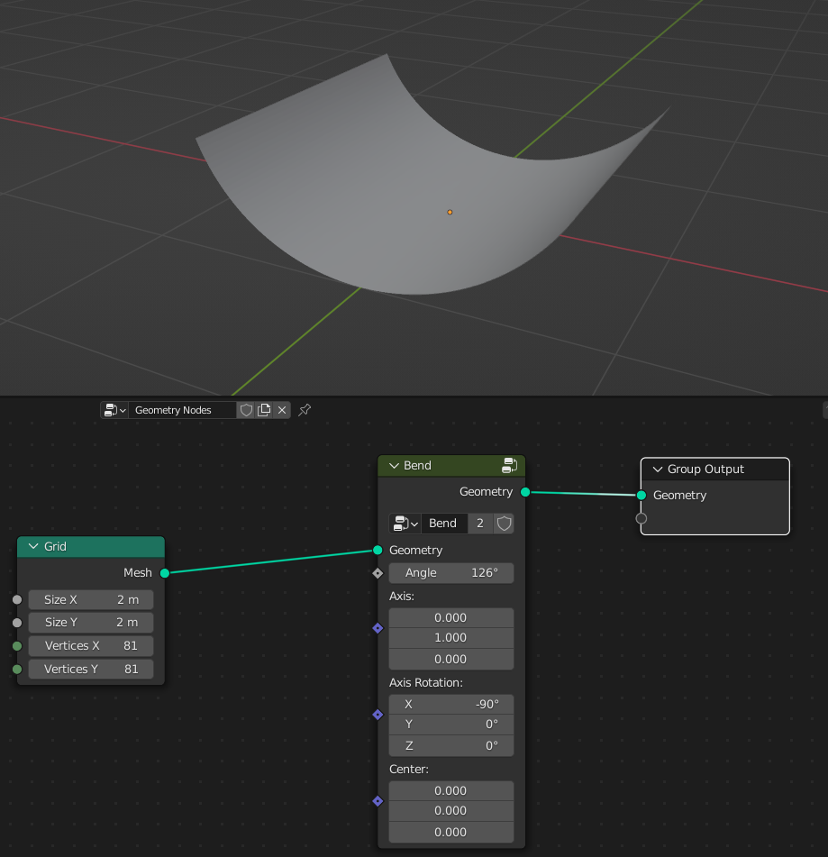
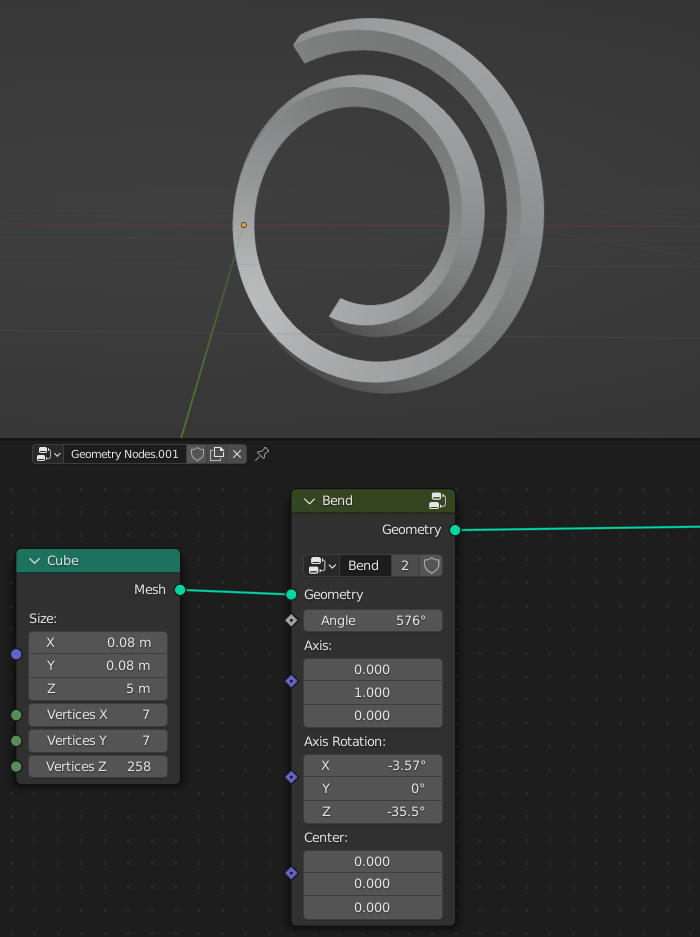
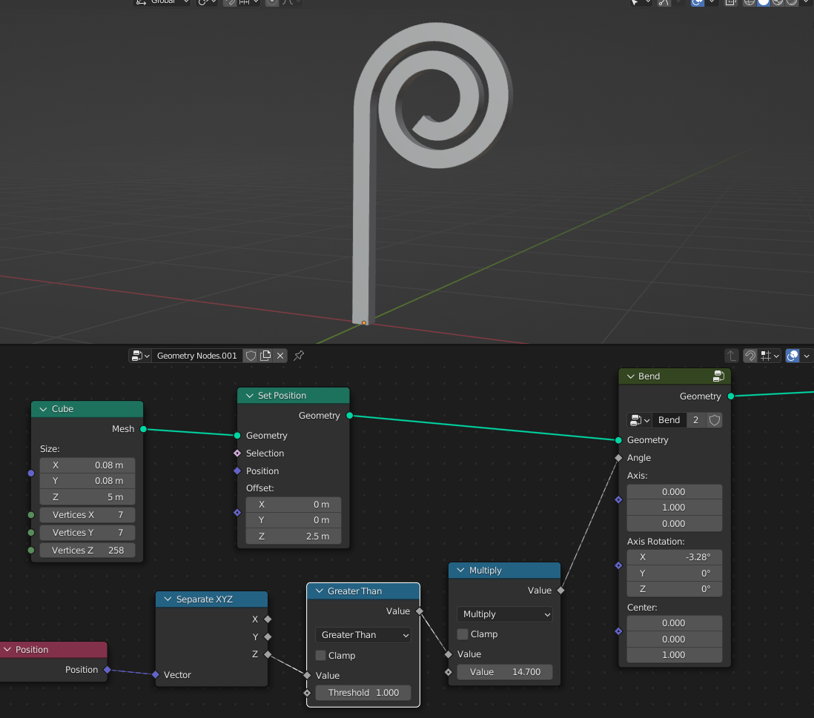
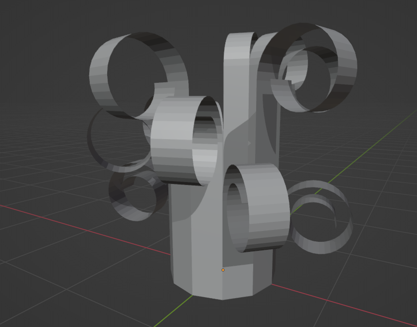
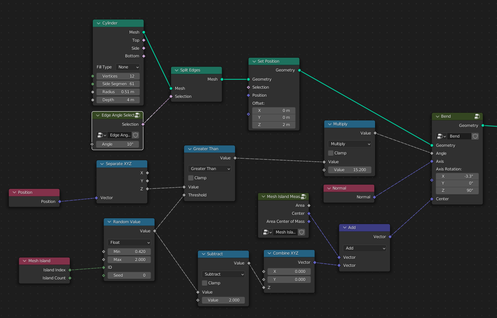
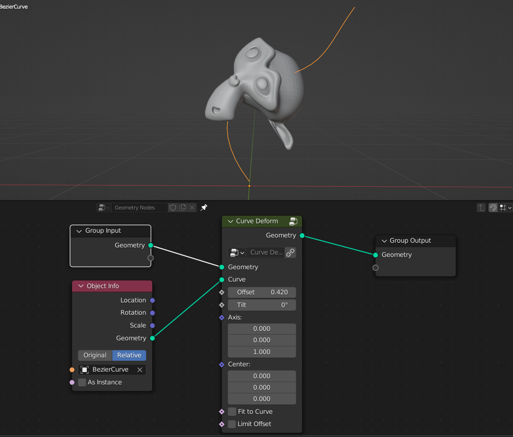
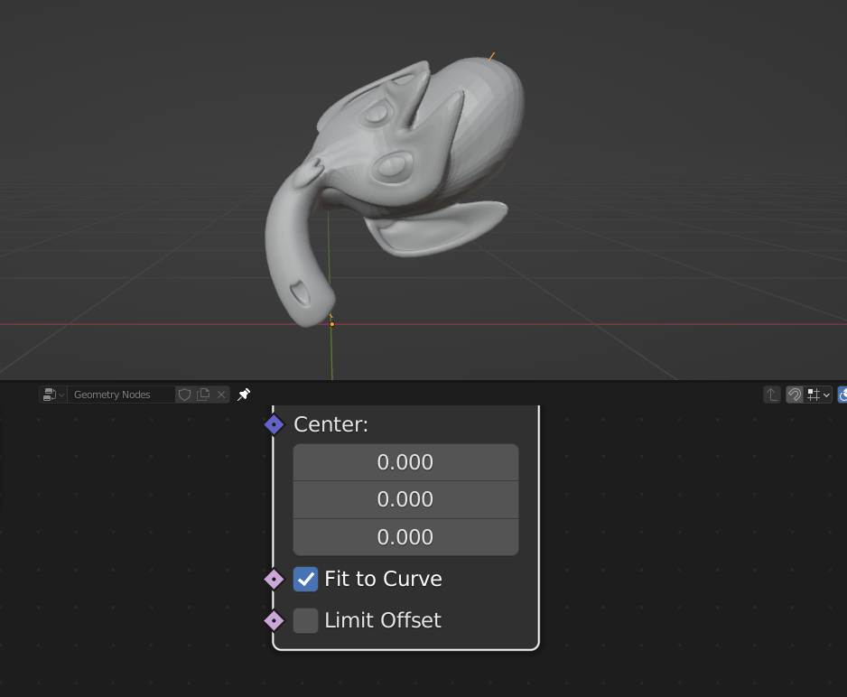
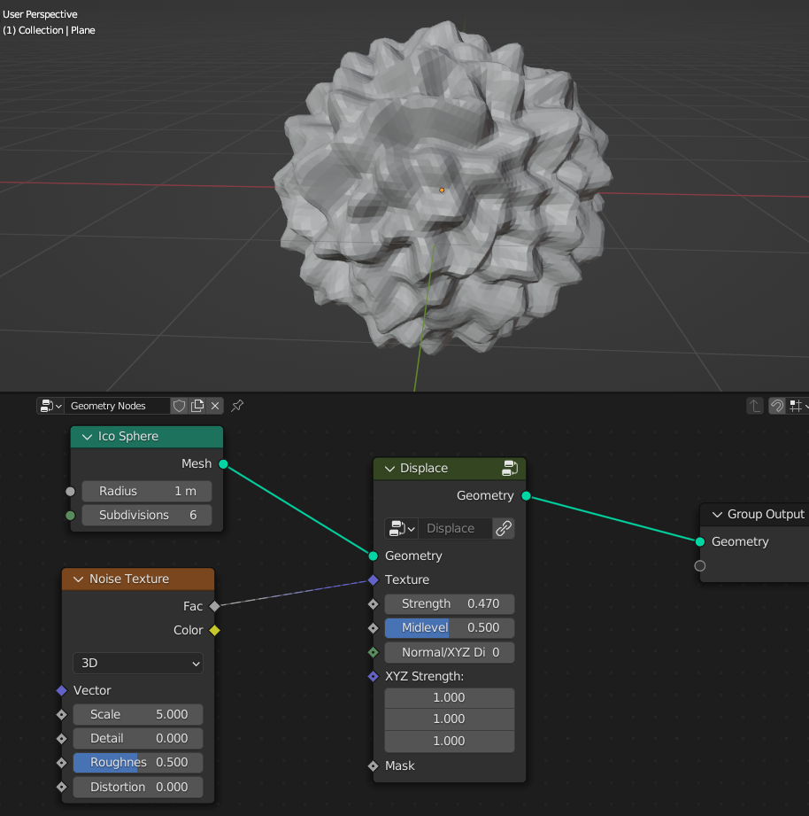
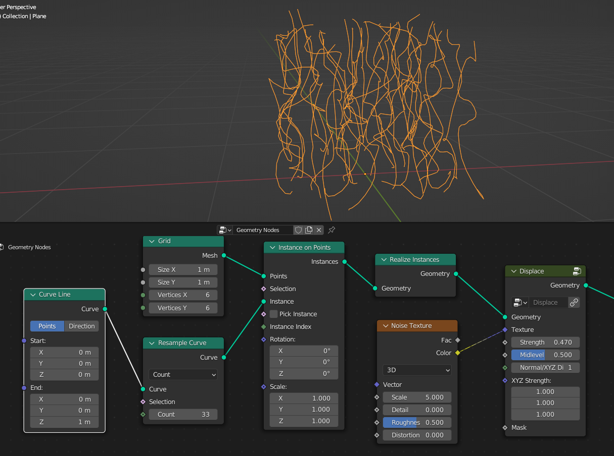
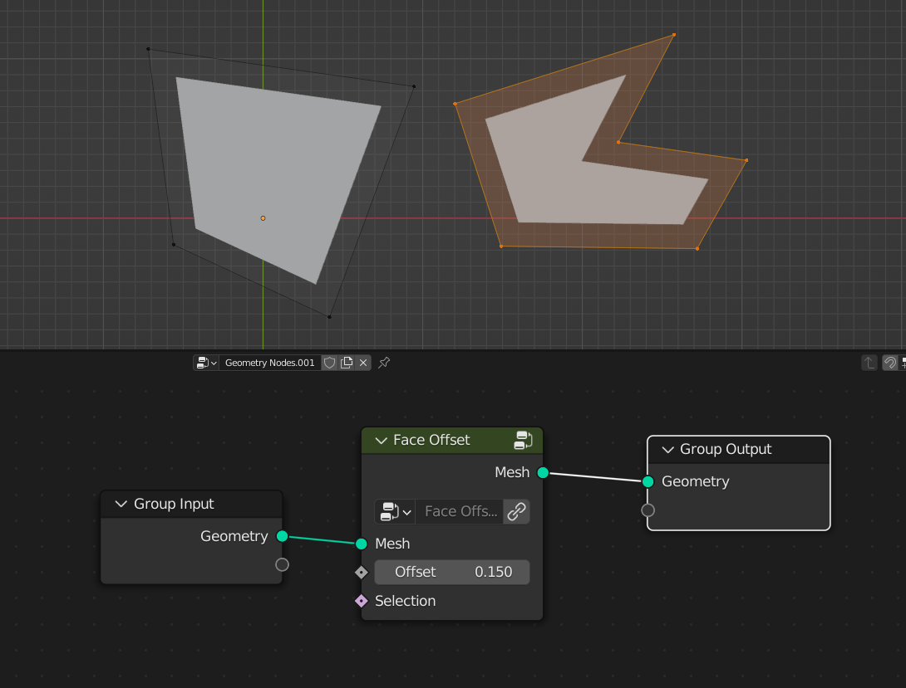

Deformers
===================================

************************************************************
Bend
************************************************************

Bends geometry over the axis

.. image:: images/bend.PNG

Angle
  Amount of deformation

Axis
  Bending direction
- 1.0.0 = **X**
- 0.1.0 = **Y**
- 0.0.1 = **Z**

.. image:: images/bend_axis.PNG

Axis Rotation
  Rotates axis direction similar how Simple Deform modifier work with Origin set as rotated empty

Center
  Poistion from where geometry bends

************************************************************
Twist
************************************************************

Twist geometry over the axis

.. image:: images/twist.PNG

Upper Angle
  Twist Amount from the axis top

Lower Angle
  Twist Amount from the axis bottom

Axis
  Twist direction
- 1.0.0 = **X**
- 0.1.0 = **Y**
- 0.0.1 = **Z**

Center
  Poistion from where geometry twist
  
Limits Lower
  Limits twist from the axis bottom
  
Limits Upper
  Limits twist from the axis top

.. image:: images/twist_limit.PNG

************************************************************
Stretch
************************************************************

Stretches geometry over the axis

.. image:: images/stretch.PNG

Factor
  Amount of steching

Axis
  Stretch direction
- 1.0.0 = **X**
- 0.1.0 = **Y**
- 0.0.1 = **Z**

**Squish**

- **On:** Squishes geometry into parabolic shape
- **Off:** Only scales geometry over the axis while preserving mesh volume

Squish Strengh
  Srengh of squish effect. Positive values **Streches** geometry, negative values **Squishes** geometry
  
.. image:: images/stretch_factor.PNG  

Center
  Poistion from where geometry stretches
  
Limits Lower
  Limits stretch from the axis bottom
  
Limits Upper
  Limits stretch from the axis top  
  
  
  
************************************************************
Taper
************************************************************

Twist geometry over the axis

.. image:: images/taper.PNG

Upper Factor
  Taper amount from the axis top

Lower Factor
  Taper amount from the axis bottom

.. image:: images/taper_factor.PNG

Axis
  Taper direction
- 1.0.0 = **X**
- 0.1.0 = **Y**
- 0.0.1 = **Z**

Squish
  Squishes geometry into parabolic shape
  
.. image:: images/taper_squish.PNG  

Center
  Poistion from where geometry tapers
  
Limits Lower
  Limits taper from the axis bottom
  
Limits Upper
  Limits taper from the axis top

************************************************************
Curve Deform
************************************************************

Deforms geometry along the curve

Offset
  Moves geometry along the curve

Axis
  Deformation direction
- 1.0.0 = **X**
- 0.1.0 = **Y**
- 0.0.1 = **Z**

Center
  Poistion from where geometry bends
  
Fit to Curve
  **On:** Stretchs geometry along the curve lenth
  

Limit Offset
  **On:** When using **Offset** values between **0** and **1** geometry bounds won't go past curve ends 

************************************************************
Displace
************************************************************

Displaces geometry along Normal or XYZ directions

Texture
  Scales direction of displacment
  
Strength
  Strength of displacment 
 
Midlevel
  Offset of texture values  
  
Normal/XYZ Direction
  Displacment along the Normal or XTZ Direction
  

  
XYZ Strength
  Strength of displacment on each axis
  
  
  
************************************************************
Face Offset
************************************************************

Evenly offsets mesh faces

Offset
  Distance of the offset
  
.. limitation::

   If faces are connected, offset will be incorect

