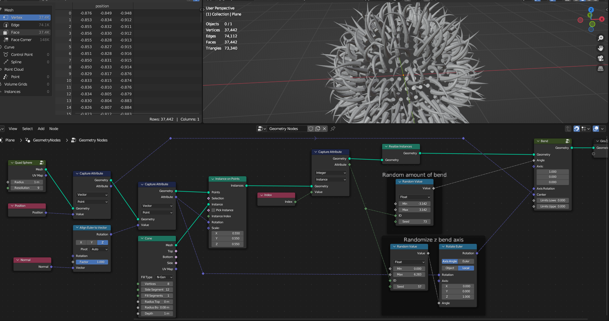
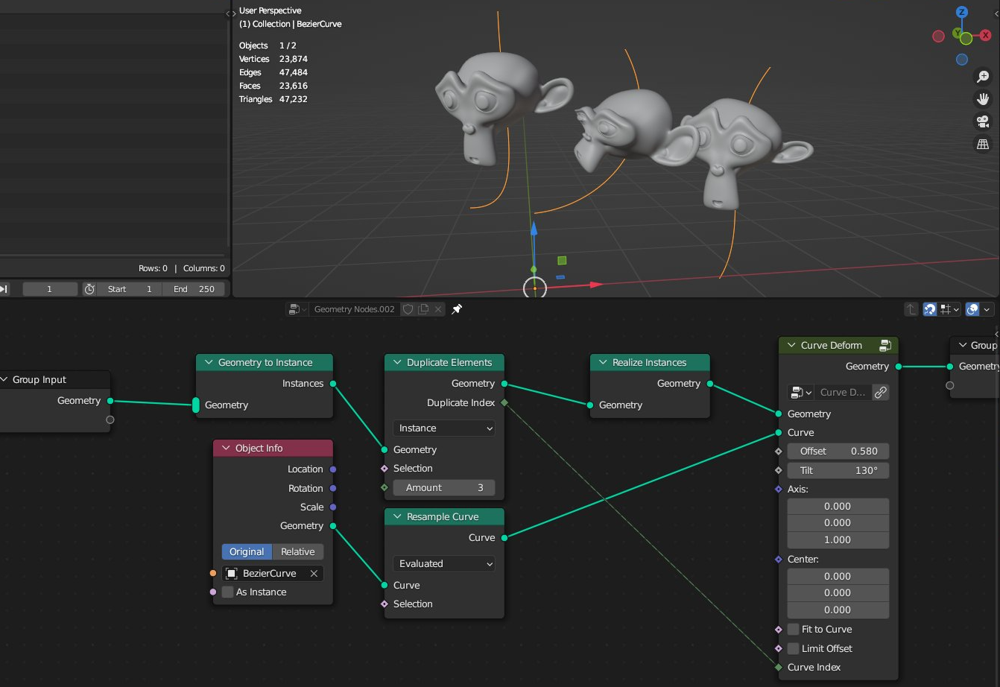
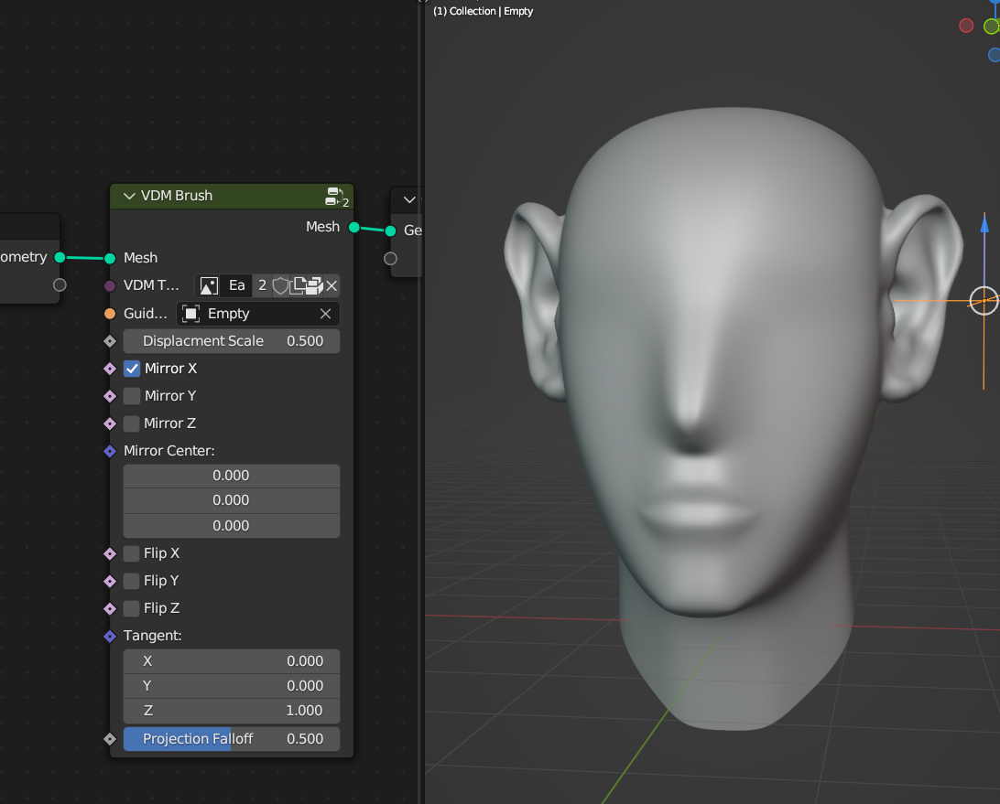
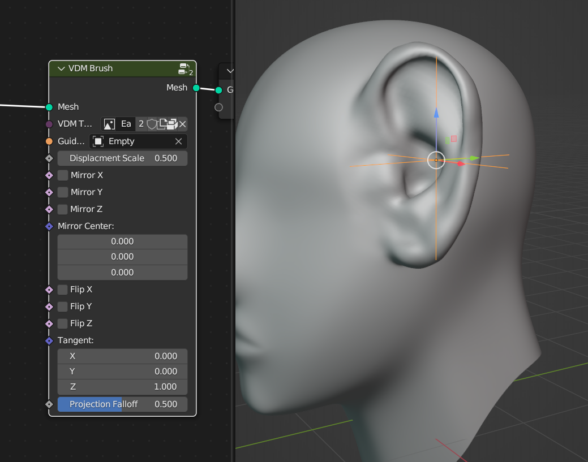
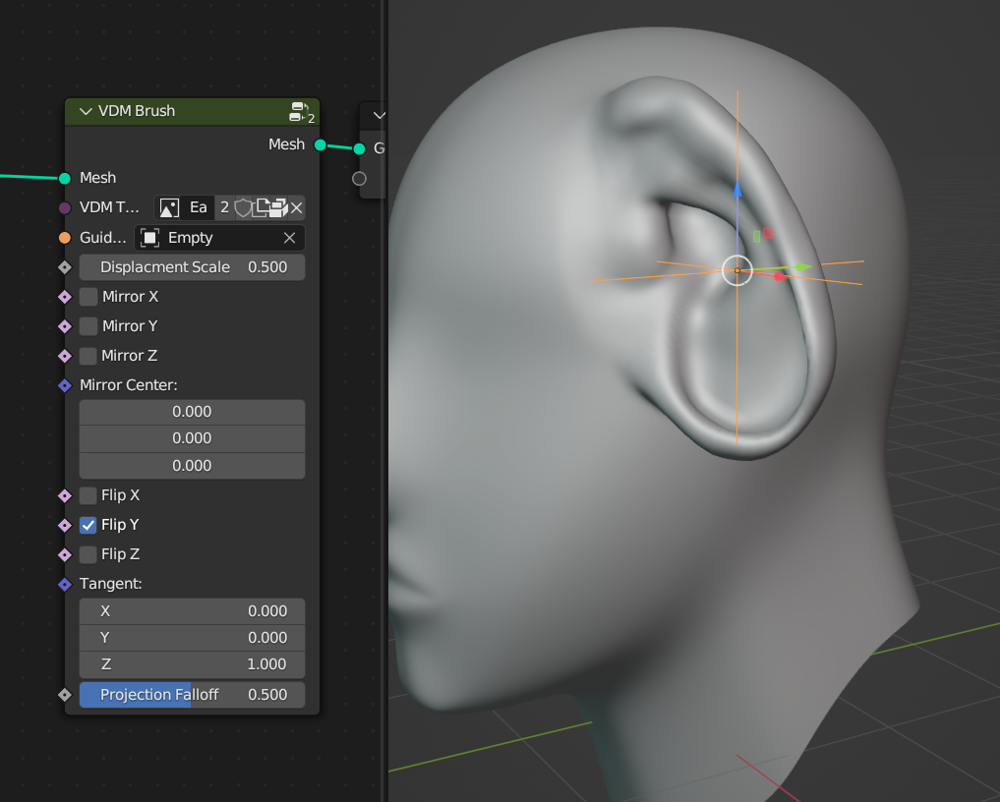
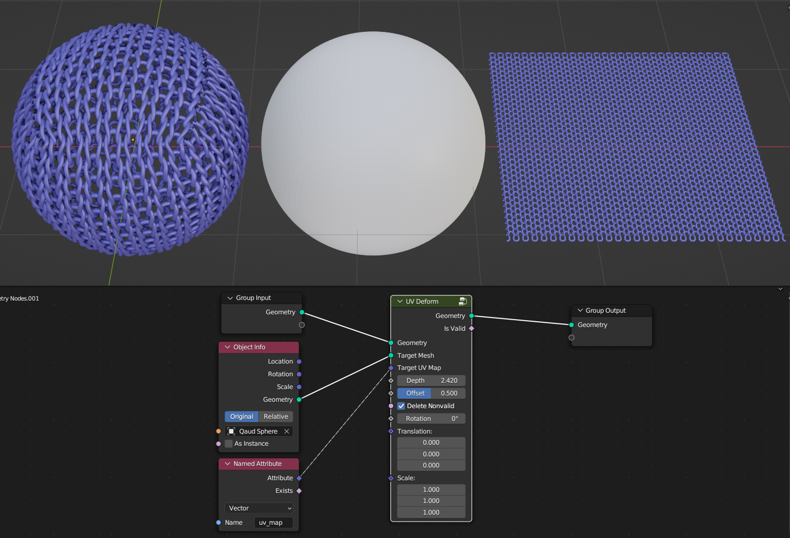
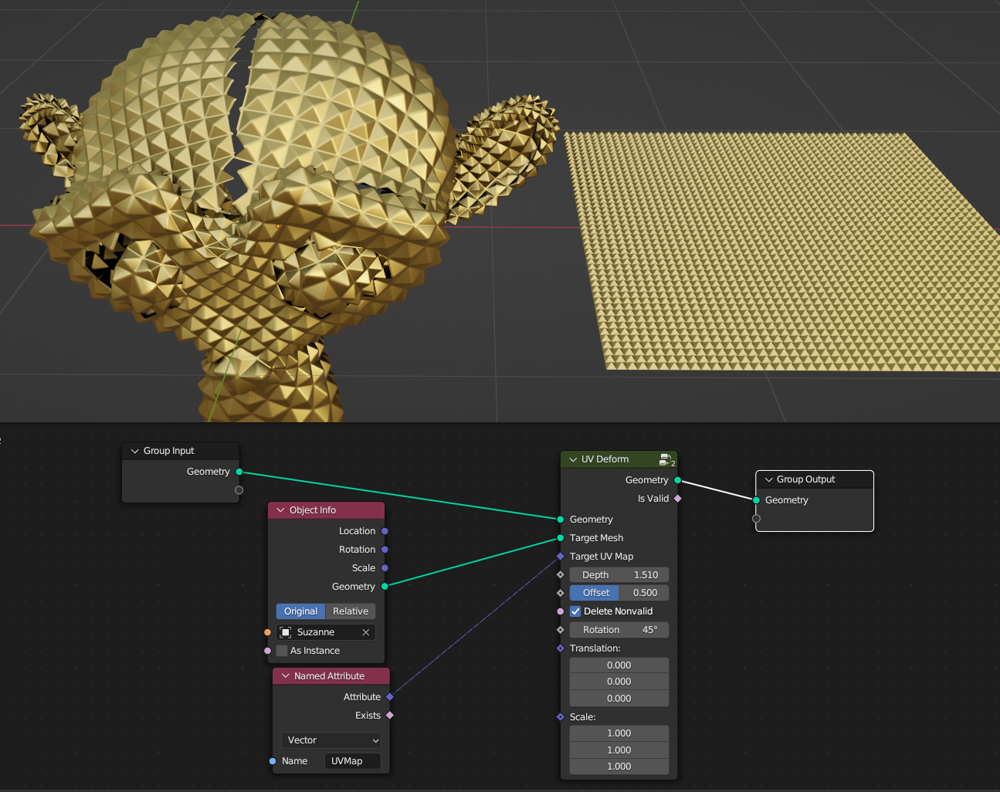
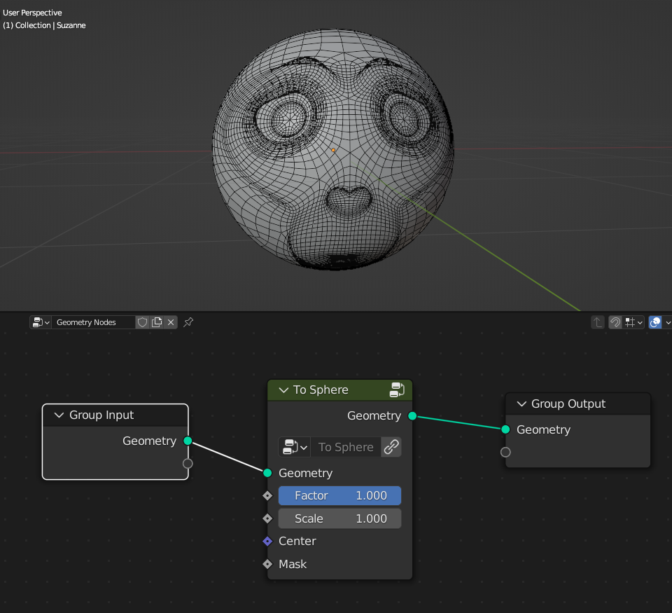
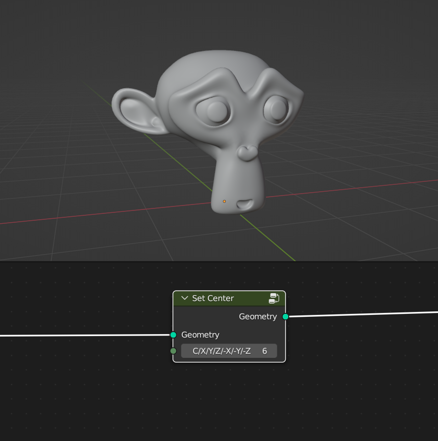

Deformers
===================================

************************************************************
Bend
************************************************************

Bends geometry over the axis

.. image:: images/bend.PNG

Angle
  Amount of deformation

Axis
  Bending direction
- 1.0.0 = **X**
- 0.1.0 = **Y**
- 0.0.1 = **Z**

.. image:: images/bend_axis.PNG

Axis Rotation
  Rotates axis direction similar how Simple Deform modifier work with Origin set as rotated empty
.. image:: images/bend_axis_rot.png
.. image:: images/bend_axis_rot1.png
.. image:: images/bend_axis_rot2.png
.. image:: images/bend_axis_rot3.png
.. image:: images/bend_axis_rot4.png

Center
  Poistion from where geometry bends

************************************************************
Twist
************************************************************

Twist geometry over the axis

.. image:: images/twist.PNG

Upper Angle
  Twist Amount from the axis top

Lower Angle
  Twist Amount from the axis bottom

Axis
  Twist direction
- 1.0.0 = **X**
- 0.1.0 = **Y**
- 0.0.1 = **Z**

Center
  Poistion from where geometry twist
  
Limits Lower
  Limits twist from the axis bottom
  
Limits Upper
  Limits twist from the axis top

.. image:: images/twist_limit.PNG

************************************************************
Stretch
************************************************************

Stretches geometry over the axis

.. image:: images/stretch.PNG

Factor
  Amount of steching

Axis
  Stretch direction
- 1.0.0 = **X**
- 0.1.0 = **Y**
- 0.0.1 = **Z**

**Squish**

- **On:** Squishes geometry into parabolic shape
- **Off:** Only scales geometry over the axis while preserving mesh volume

Squish Strengh
  Srengh of squish effect. Positive values **Streches** geometry, negative values **Squishes** geometry
  
.. image:: images/stretch_factor.PNG  

Center
  Poistion from where geometry stretches
  
Limits Lower
  Limits stretch from the axis bottom
  
Limits Upper
  Limits stretch from the axis top  
  
  
  
************************************************************
Taper
************************************************************

Twist geometry over the axis

.. image:: images/taper.PNG

Upper Factor
  Taper amount from the axis top

Lower Factor
  Taper amount from the axis bottom

.. image:: images/taper_factor.PNG

Axis
  Taper direction
- 1.0.0 = **X**
- 0.1.0 = **Y**
- 0.0.1 = **Z**

Squish
  Squishes geometry into parabolic shape
  
.. image:: images/taper_squish.PNG  

Center
  Poistion from where geometry tapers
  
Limits Lower
  Limits taper from the axis bottom
  
Limits Upper
  Limits taper from the axis top

************************************************************
Curve Deform
************************************************************

Deforms geometry along the curve

.. image:: images/curve_deform.PNG

Offset
  Moves geometry along the curve

Axis
  Deformation direction
- 1.0.0 = **X**
- 0.1.0 = **Y**
- 0.0.1 = **Z**

Center
  Poistion from where geometry bends
  
Fit to Curve
  **On:** Stretchs geometry along the curve lenth
  
.. image:: images/curve_deform_fit.PNG

Limit Offset
  **On:** When using **Offset** values between **0** and **1** geometry bounds won't go past curve ends 

************************************************************
VDM Brush
************************************************************

Displaces mesh using VDM (Vector Displacment Map) texture

.. image:: images/vmdb1.PNG

VDM Texture
  VDM (Vector Displacment Map) texture used to displace mesh

Guide Object
  Guide object to control VDM texture location, rotation, scale. Object Z rotation controls VDM texture rotation
  
Displacment Scale
  Scale of the displacment
  
Mirror X
  Mirrors VDM texture on X axis
  
Mirror Y
  Mirrors VDM texture on X axis
  
Mirror Z
  Mirrors VDM texture on X axis

Mirror Center
  Center location that of the mirror

Flip X
  Flips VDM texture on X axis

Flip Y
  Flips VDM texture on X axis

Flip Z
  Flips VDM texture on X axis

Tangent
  Tangent vector that rotation will be aligned

Projection Falloff
  Falloff of VDM displacment, mostly usefull when VDM texture scaled larger then the mesh 

************************************************************
UV Deform
************************************************************

Projects geometry to target mesh UV map

Target Mesh
  Mesh that geometry will be project on

Depth
  Scale of projected geometry along target mesh normals
  
Offset
  Offset of projected geometry along target mesh normals
  
Delete Nonvalind
  Deletes geometry that are outside the trarget mesh UV Map
  
Rotation
  Rotation of goemetry
  
Translation 
  Translation of goemetry

Scale
  Scale of geometry

************************************************************
Displace
************************************************************

Displaces geometry along Normal or XYZ directions

.. image:: images/displace.PNG

Texture
  Scales direction of displacment
  
Strength
  Strength of displacment 
 
Midlevel
  Offset of texture values  
  
Normal/XYZ Direction
  Displacment along the Normal or XTZ Direction
  
.. image:: images/displace_xyz.PNG
  
XYZ Strength
  Strength of displacment on each axis
  
Mask
  Mask for displacment strength
  
  
  
************************************************************
Face Offset
************************************************************

Evenly offsets mesh faces

.. image:: images/face_offset.PNG

Offset
  Distance of the offset
  
Selection
  Selects what faces to deform

************************************************************
To Sphere
************************************************************

Deforms geometry in to sphere

Factor
  Factor of the to sphere deformation
  
Scale
  Scale of the sphere.
  Uses Bounding Box average to calculate sphere size
  
Center
  Center of sphere deformation
  
Mask
 Mask for sphere deformation strength
 
 
 
************************************************************
Set Center
************************************************************

Places geometry relevite to local 0.0.0 coordinate (origin) depending on its bounding box

C
  Places geometry to center of bounding box
  
X
  Places geometry to center X axis of bounding box

Y
  Places geometry to center Y axis of bounding box

Z
  Places geometry to center Z axis of bounding box

**-X**
  Places geometry to center -X axis of bounding box
  
**-Y**
  Places geometry to center -Y axis of bounding box

**-Z**
  Places geometry to center -Z axis of bounding box

