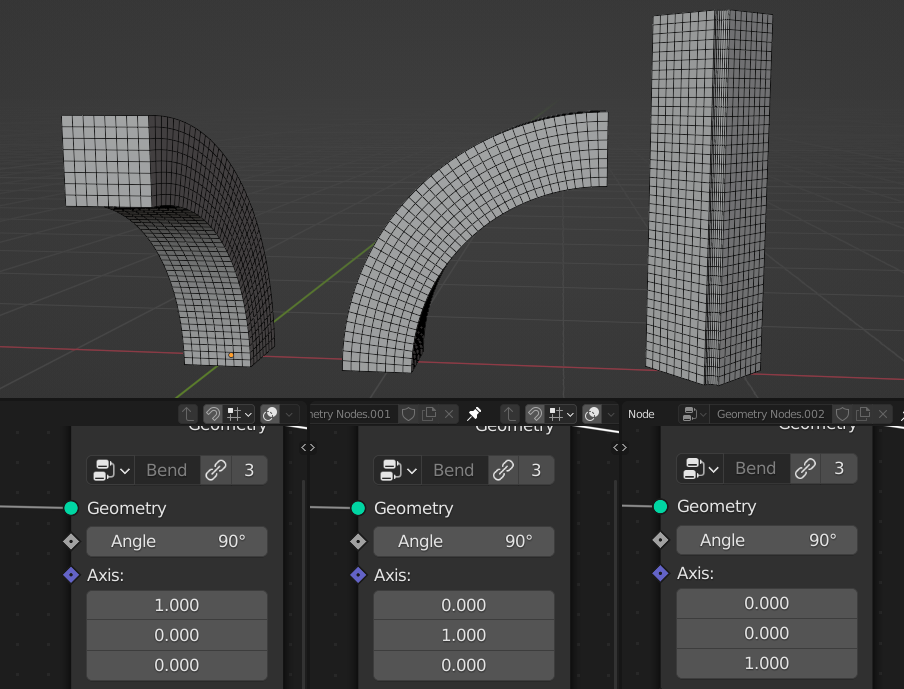
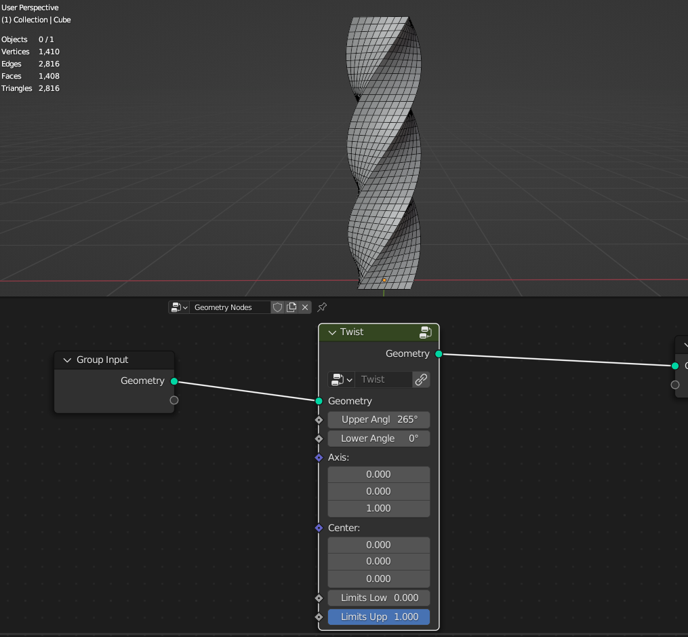
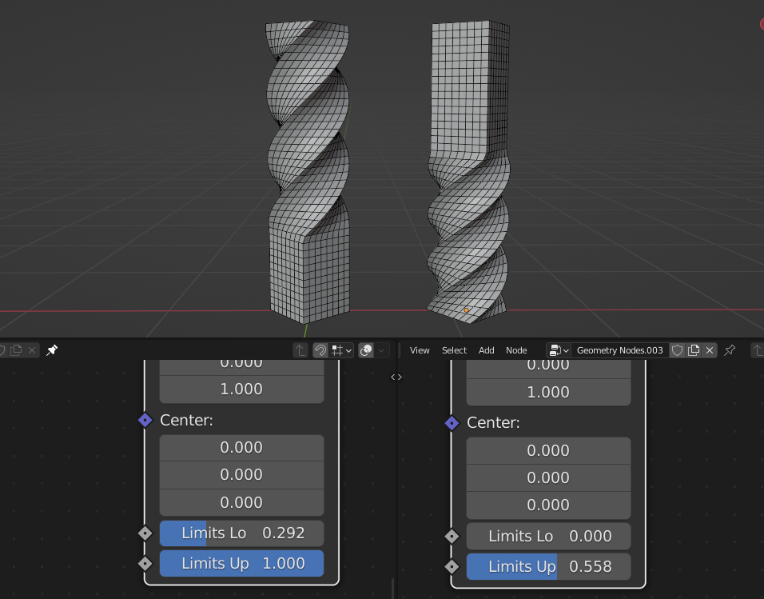
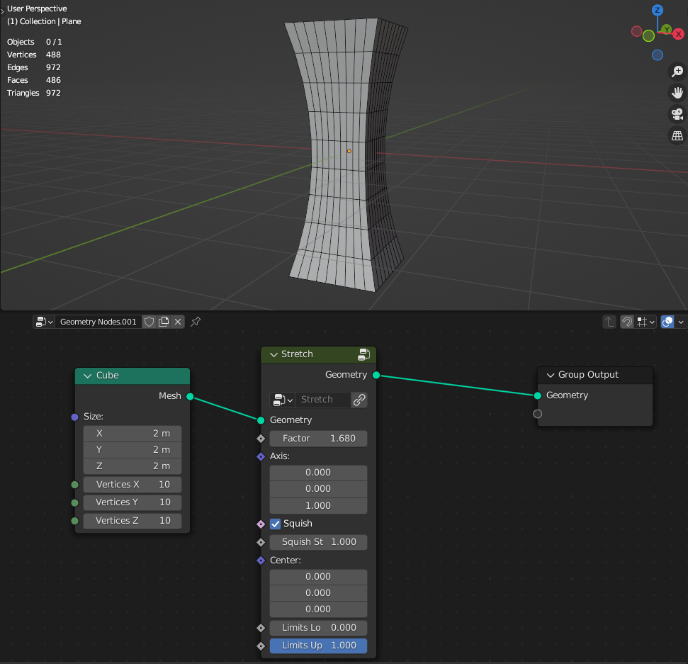
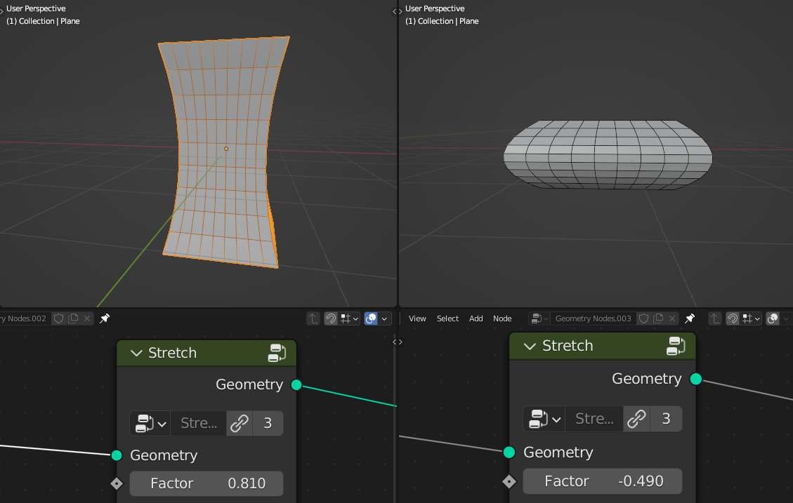
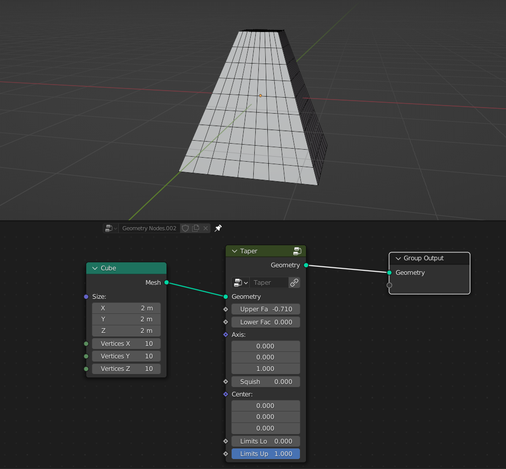
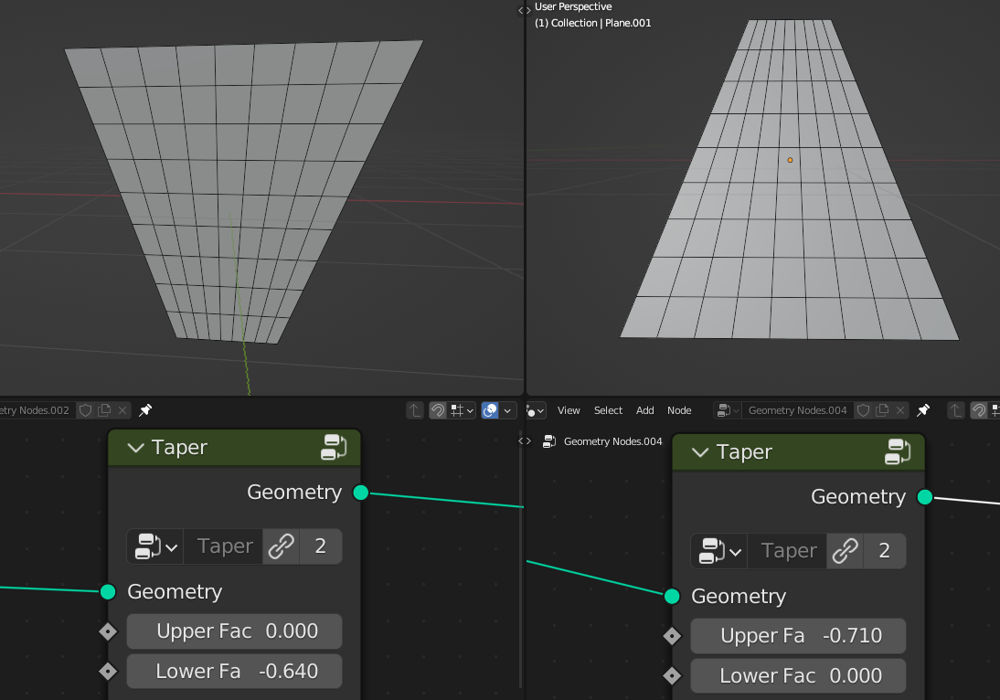
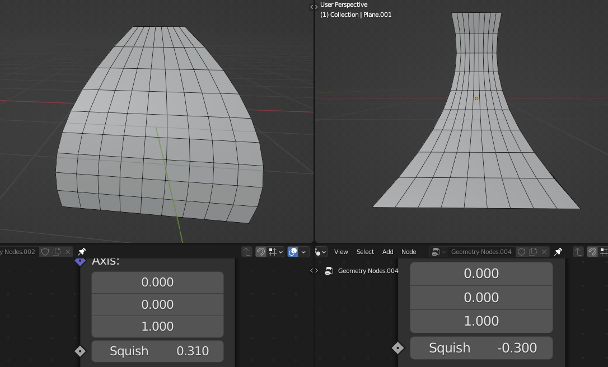

Deformers
===================================

************************************************************
Bend
************************************************************

Bends geometry over the axis

.. image:: images/bend.PNG

Angle
  Amount of deformation

Axis
  Test test test

Axis Rotation
  Test test test

Center
  Poistion from where geometry bends

************************************************************
Twist
************************************************************

Twist geometry over the axis

Upper Angle
  Twist Amount from the axis top

Lower Angle
  Twist Amount from the axis bottom

Axis
  Test test test

Center
  Poistion from where geometry twist
  
Limits Lower
  Limits twist from the axis bottom
  
Limits Upper
  Limits twist from the axis top

************************************************************
Stretch
************************************************************

Stretches geometry over the axis

Factor
  Amount of steching

Axis
  Test test test

Squish

- **On:** Squishes geometry into parabolic shape
- **Off:** Only scales geometry over the axis while preserving mesh volume

Squish Strengh
  Srengh of squish effect. Positive values **Streches** geometry, negative values **Squishes** geometry
  

Center
  Poistion from where geometry stretches
  
Limits Lower
  Limits stretch from the axis bottom
  
Limits Upper
  Limits stretch from the axis top  
  
  
  
  ************************************************************
Taper
************************************************************

Twist geometry over the axis

Upper Factor
  Taper amount from the axis top

Lower Factor
  Taper amount from the axis bottom

Axis
  Test test test

Squish
  Squishes geometry into parabolic shape
  

Center
  Poistion from where geometry tapers
  
Limits Lower
  Limits taper from the axis bottom
  
Limits Upper
  Limits taper from the axis top
