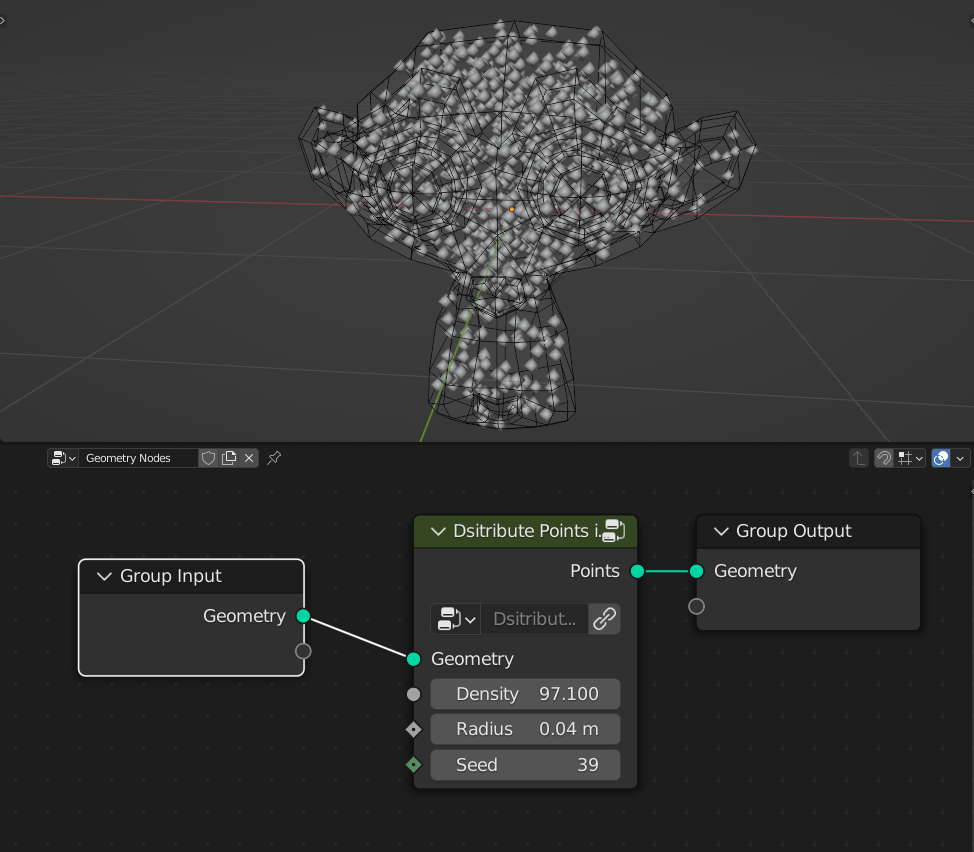
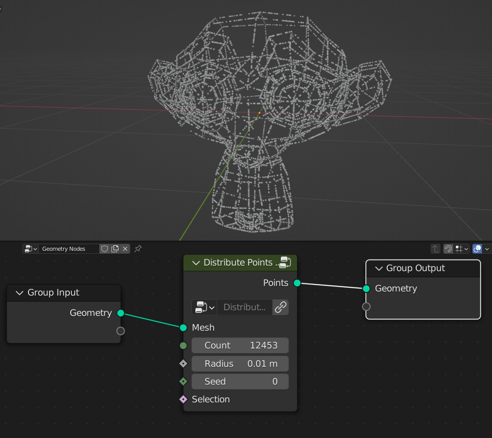
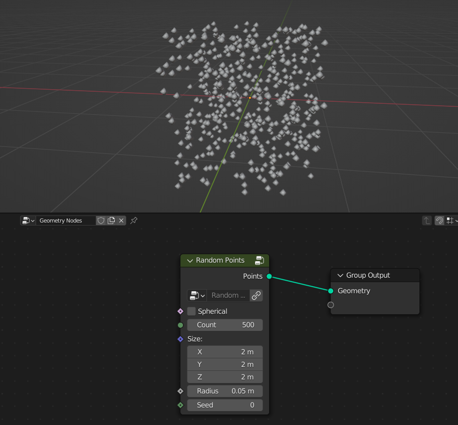
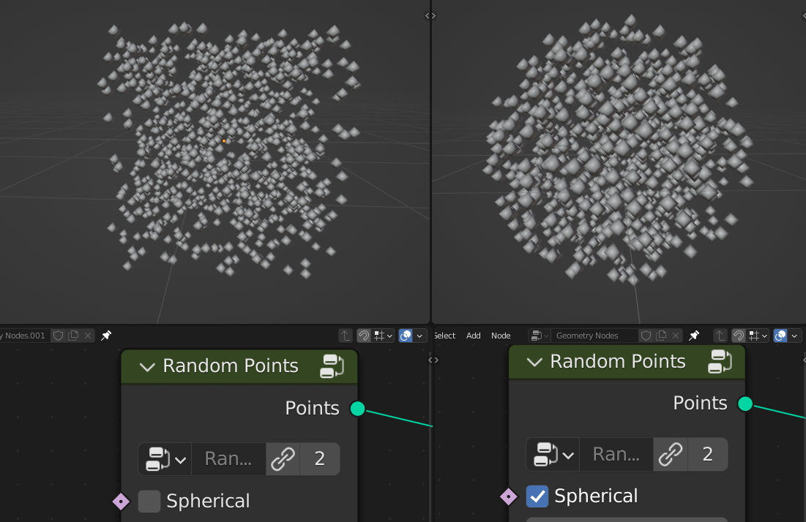
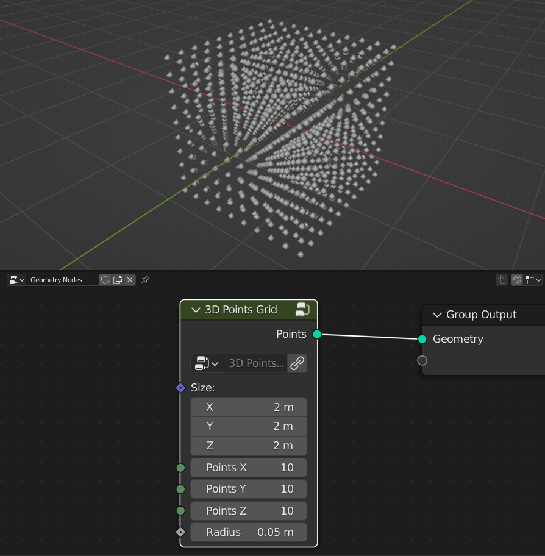

Distribution
===================================

************************************************************
Distribute Points in Volume
************************************************************

Distributes points inside mesh volume

Density
  Amount of points inside volume
  
Radius
  Radius of the points
  
Seed
  Seed of the random distribution

************************************************************
Volume Points Grid
************************************************************

Distributes points inside mesh volume in grid pattern

.. image:: images/d_p_g.PNG

Density
  Amount of points inside volume
  
World Space
  **On:** Points dstribution stays at world coordinates if mesh moving
  

************************************************************
Distribute Points on Edges
************************************************************

Distributes Points on mesh edges

Count
  Amount of points
  
Radius
  Radius of the points
  
Seed
  Seed of the random distribution
  
Selection
  Selection of the edges that points will be distributed

************************************************************
Random Points
************************************************************

Randomly distributes points

Spherical
  **On:** Random points will be distributed into sphere  
  

Count
  Count of points
  
Size
  Size of the points distrubution
  
Radius
  Radius of the point
  
Seed
  Seed of the random distribution
  
  
  
************************************************************
3D Points Grid
************************************************************

Distributes points in 3d grid

Size
  Size of the grid
  
Points X
  Amount of points in X axis
  
Points Y
  Amount of points in Y axis  
  
Points Z
  Amount of points in Z axis  
  
Radius
  Radius of the points
  
  
