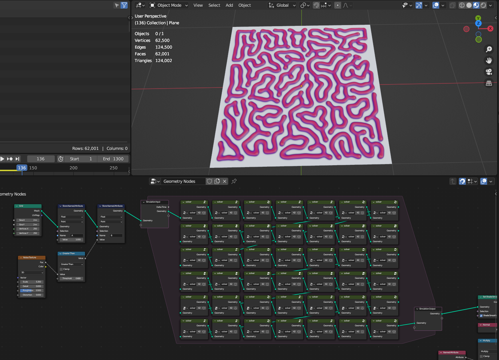
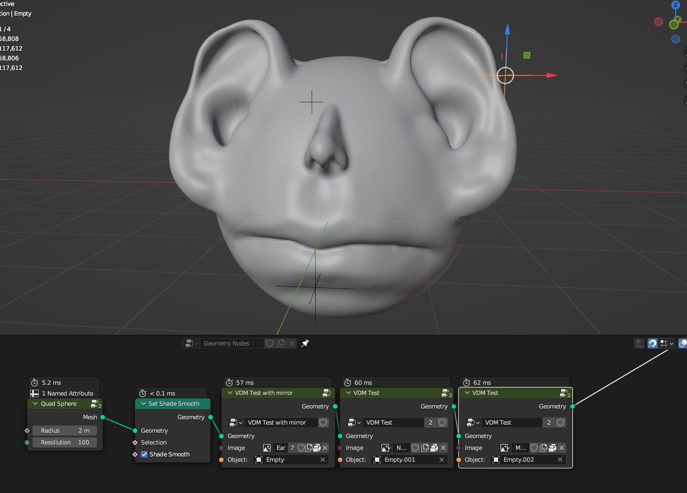

Experimental Nodes
===================================

Experimental nodes that are not finished or require custom blender version

`Download link <https://drive.google.com/drive/folders/1BJ-hDIHpXpzU4lGPlxPBoqNdhhWysa6-?usp=sharing>`

************************************************************
Reaction diffusion solver
************************************************************

Creates reaction diffusion growth simulation using Blender 3.6 alpha

|rds|

.. |rds| raw:: html
   
    
<iframe width="455" height="809" src="https://www.youtube.com/embed/JWFP6J9gXaQ" title="Blender Geometry Nodes Reaction Diffusion Solver #shorts" frameborder="0" allow="accelerometer; autoplay; clipboard-write; encrypted-media; gyroscope; picture-in-picture; web-share" allowfullscreen></iframe>

    
F and K values controls reaction diffusion pattern. To test diffrent F and K values for diffretent patterns - https://www.karlsims.com/rdtool.html
    
.. warning::
    You need Blender 3.6 version for the simulation nodes

************************************************************
VDM Displace
************************************************************

Creates VDM mesh displacment from VDM images

|vdm|

.. |vdm| raw:: html

    
<iframe width="455" height="809" src="https://www.youtube.com/embed/UxYZQ3uoZmQ" title="Blender VDM Geometry Nodes Displace Test #b3d #geometrynodes #blender" frameborder="0" allow="accelerometer; autoplay; clipboard-write; encrypted-media; gyroscope; picture-in-picture; web-share" allowfullscreen></iframe>

