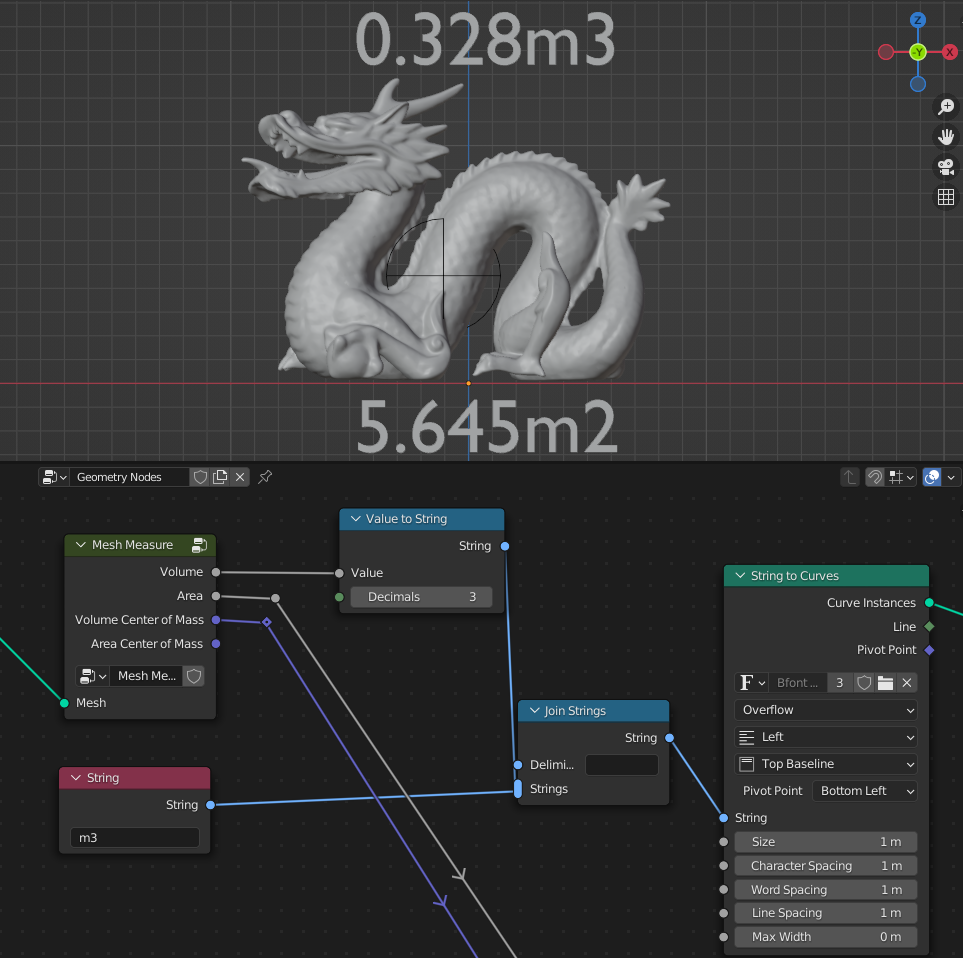
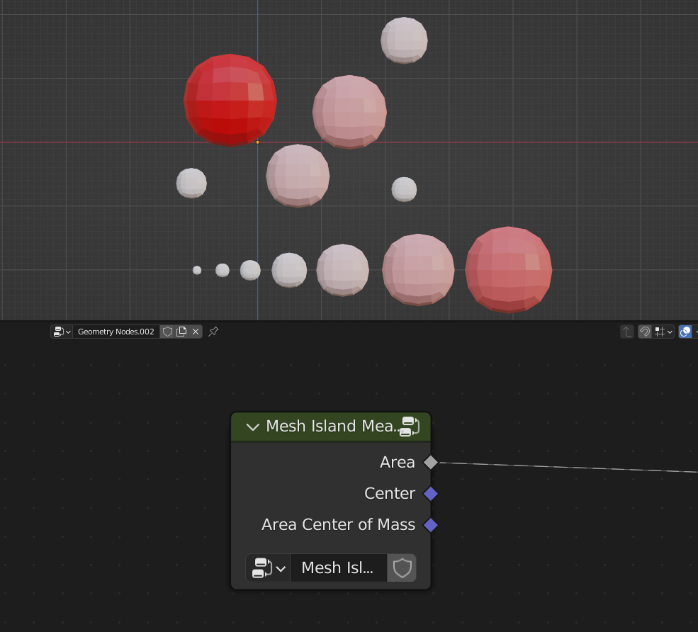
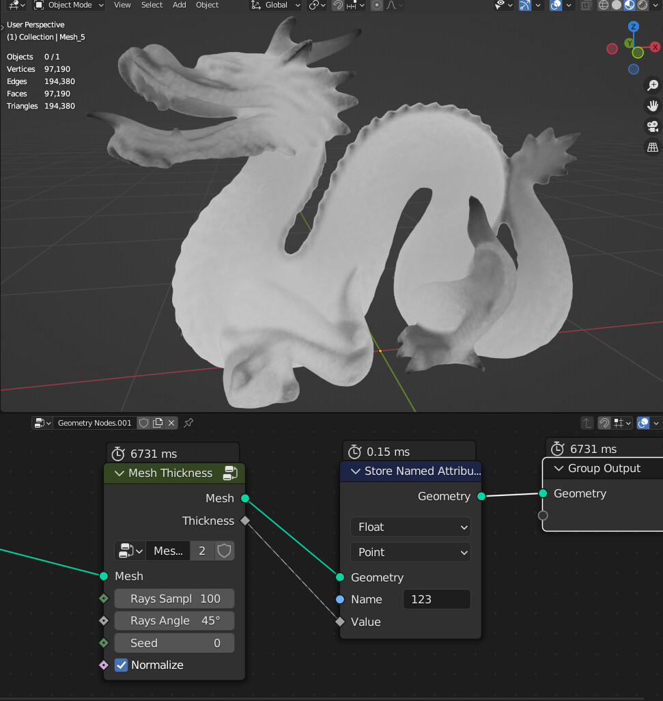

Geometry Measure
===================================

************************************************************
Mesh Measure
************************************************************

Calculates mesh total Volume, Area, Volume Center of Mass, Area Center of Mass

Volume
  Volume of the mesh
  
Area
  Area of the mesh
  
Volume Center of Mass
  Position of Volume Center of Mass

Area Center of Mass
  Position of Area Center of Mass
  
  

************************************************************
Mesh Island Measure
************************************************************

Calculates Area, Center, Area Center of Mass for each mesh island

Area
  Area of the mesh
  
Center
  Position from average vertex locations

Area Center of Mass
  Position of Area Center of Mass
  
  
  
************************************************************
Mesh Thickness
************************************************************

Calculates mesh thickness 

  
Rays Samples
  Amount of rays for sampling
  
Rays Angle
  Angle that rays direction will be randomly rotated. Bigger angle will give more accurate results but with more noise

Seed
  Random seed of the rays random direction
  
Normalize
  Fits values between 0 to 1
  
Attribute
  Name of the thickness value attribute on point domain 
  
.. warning::
    Node can be really slow depending on mesh density and rays samples. You can "bake it" by applying geometry nodes modifier and the "thickness" attribute will be stored on the mesh
  
  
  
  
  
  
