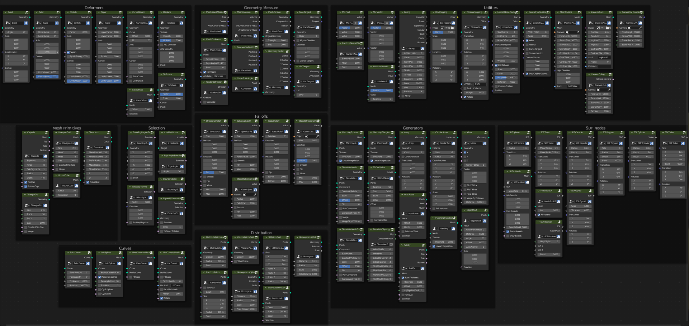

Higgsas geometry nodes groups manual
===================================

.. note::

   This project is under active development.

Contents
--------

.. toctree::

   installation
   deformers
   generators
   geometry_measure
   utilities
   distribution
   curves
   primitives
   selection
   falloffs
   usage
   api
