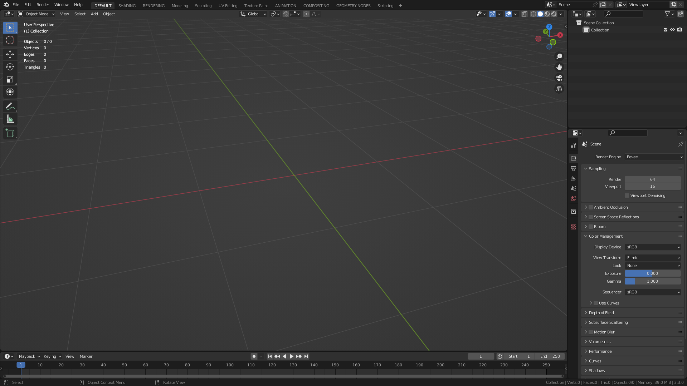

Installation
===================================

You can 

- Open `Blender`

- Go to ``File/Link``

.. image:: images/instal1.png

- Navigate to where node group file `.blend` is located and double click it

.. image:: images/instal2.png

- Double click `NodeTree` folder 

.. image:: images/instal3.png

- Select all nodes and press `Link`

.. image:: images/instal4.png

Go to ``File/Defaults/Save Startup File`` and press `Save Startup File`

.. image:: images/instal5.png
