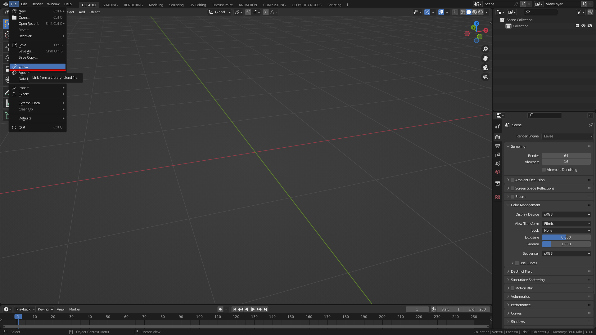
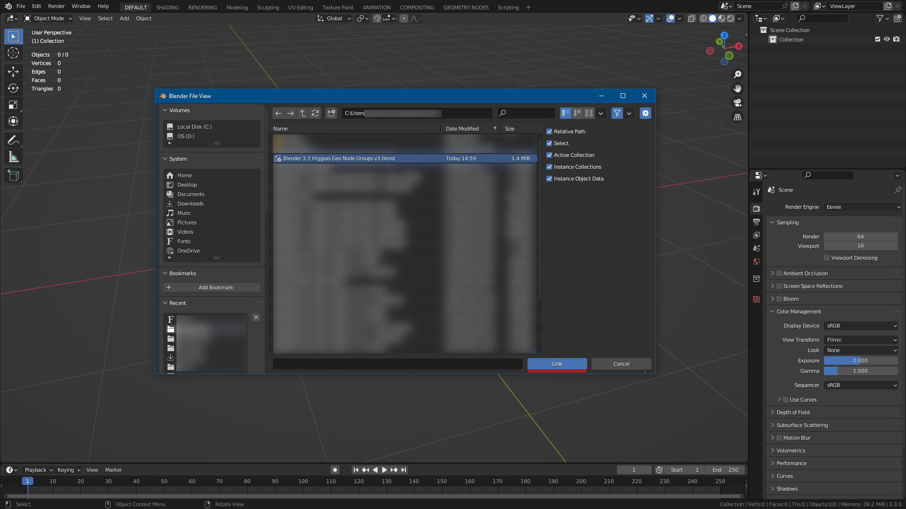
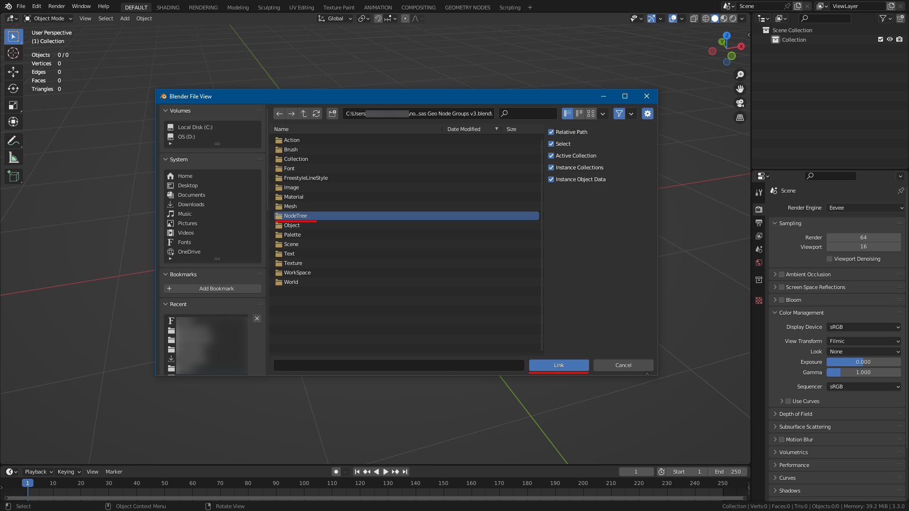
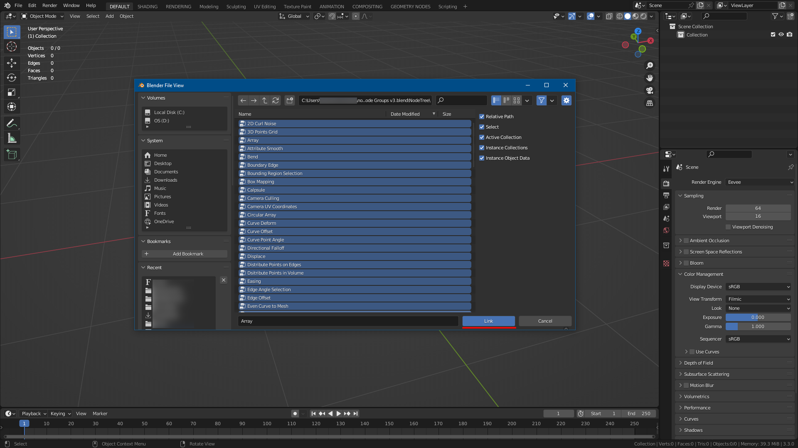
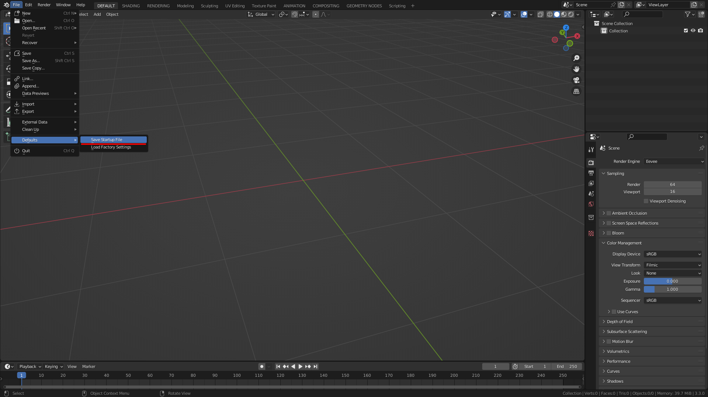

Installation
===================================

************************************************************
Installing node groups assets for Blender 3.4/3.5+
************************************************************

|install_video|

.. |install_video| raw:: html

    <iframe width="720" height="405" src="https://www.youtube.com/embed/IgIHBMXEqu4" title="YouTube video player" frameborder="0" allow="accelerometer; autoplay; clipboard-write; encrypted-media; gyroscope; picture-in-picture; web-share" allowfullscreen></iframe>

- Extract downloaded .zip file folder for your blender version
- Inside Blender go to :guilabel:`Edit/Preferences/Files Paths/Asset Libraries` and press :guilabel:`+` Add Asset Library
- Locate unzipped folder and press :guilabel:`Add Asset Library`

************************************************************
For Blender 3.3 Linking node groups to the Startup File
************************************************************

- Open :guilabel:`Blender`
- Go to ``File/Link``

- Navigate to where node group file :guilabel:`.blend` is located and double click it

- Double click :guilabel:`NodeTree` folder 

- Select all nodes (ALT-A) and press :guilabel:`Link`

Go to ``File/Defaults/Save Startup File`` and press :guilabel:`Save Startup File`

Now the node groups will be linked to the startup file, so everytime you open :guilabel:`Blender` , node groups will be available and searchable inside Geomety Nodes editor.

.. warning::
    Existing :guilabel:`Blender` files won't have node groups linked, you will have to re-link it
