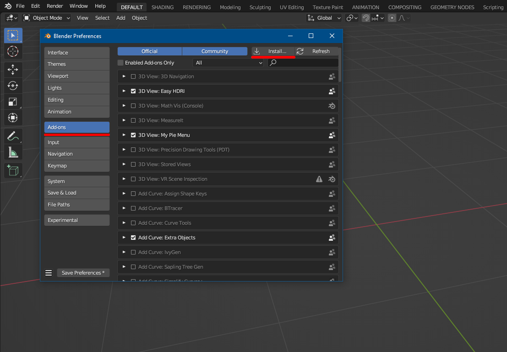
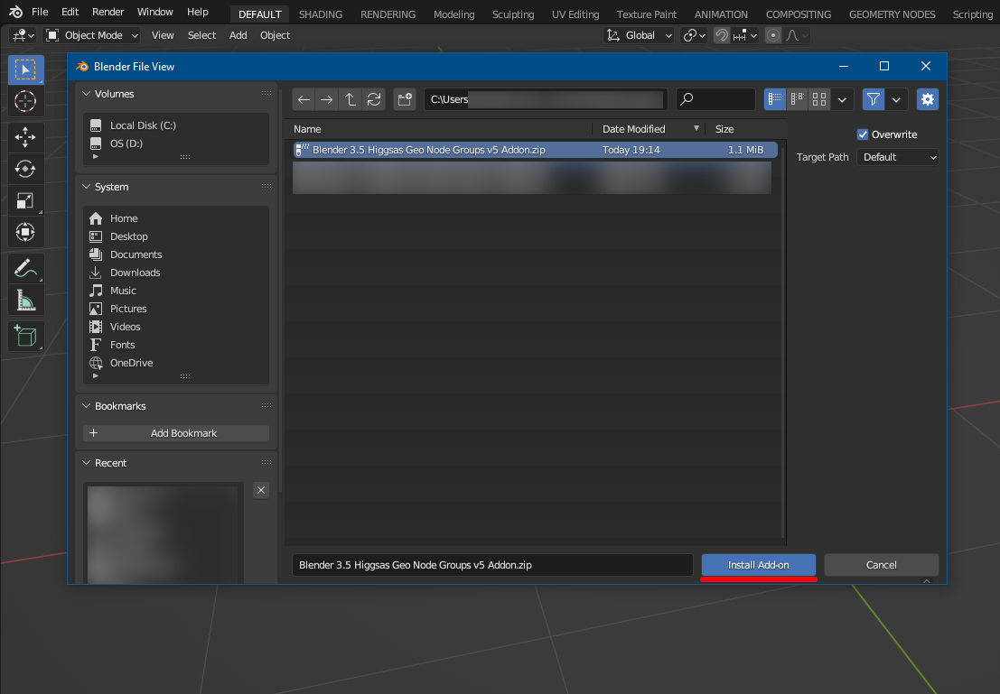
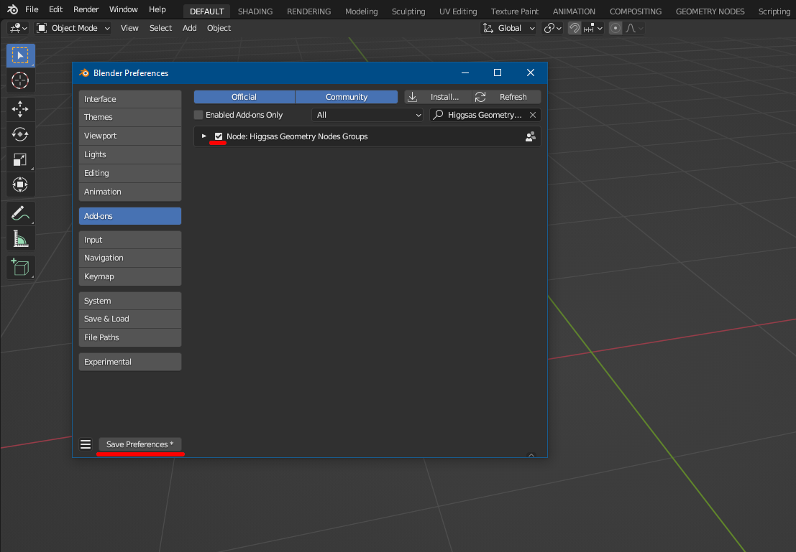
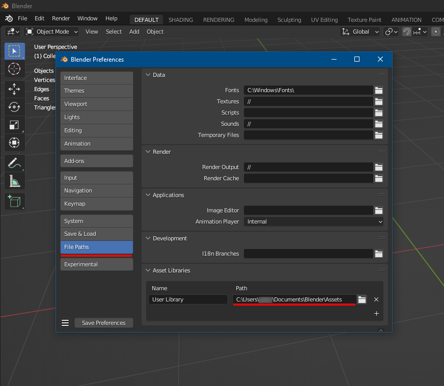
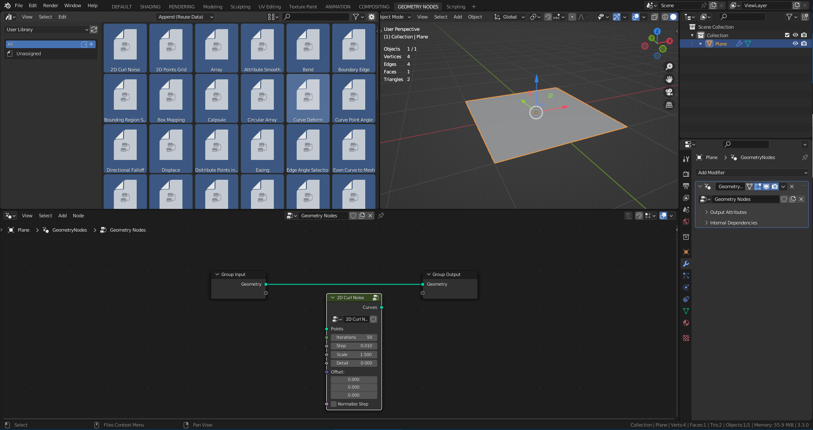

Installation
===================================

Three different installation methods:

.. warning::
    You don't need to do all three installation methods, simply just do the Addon instalation

************************************************************
Installing node groups Addon 
************************************************************

- Go to``Edit/Preferences/File Paths/Add-ons`` and press :guilabel:`Install`

- Navigate to where node group file :guilabel:`.blend` is located and click :guilabel:`Install Add-on`

- Enable Addon by pressing checkmark and click :guilabel:`Save Preferences`

************************************************************
Installing node groups Addon 
************************************************************

|install_video|

.. |install_video| raw:: html

    <iframe width="560" height="315" src="https://www.youtube.com/embed/IgIHBMXEqu4" title="YouTube video player" frameborder="0" allow="accelerometer; autoplay; clipboard-write; encrypted-media; gyroscope; picture-in-picture; web-share" allowfullscreen></iframe>

- Extract downloaded .zip file folder for your blender version
- Inside Blender go to :guilabel:`Edit/Preferences/Files Paths/Asset Libraries` and press :guilabel:`+` Add Asset Library
- Locate unzipped 

************************************************************
Adding node groups to the Assect Browser
************************************************************

Go to``Edit/Preferences/File Paths/Asset Libraries`` and add node group :guilabel:`.blend` file to the Path folder, and press :guilabel:`Safe Preferences`

Now node groups will accessible in :guilabel:`Asset Browser`

.. warning::
    Node groups are not searchable inside Geometry Nodes editor

************************************************************
Linking node groups to the Startup File
************************************************************

- Open :guilabel:`Blender`
- Go to ``File/Link``

.. image:: images/instal1.png

- Navigate to where node group file :guilabel:`.blend` is located and double click it

.. image:: images/instal2.png

- Double click :guilabel:`NodeTree` folder 

.. image:: images/instal3.png

- Select all nodes (ALT-A) and press :guilabel:`Link`

.. image:: images/instal4.png

Go to ``File/Defaults/Save Startup File`` and press :guilabel:`Save Startup File`

.. image:: images/instal5.png

Now the node groups will be linked to the startup file, so everytime you open :guilabel:`Blender` , node groups will be available and searchable inside Geomety Nodes editor.

.. warning::
    Existing :guilabel:`Blender` files won't have node groups linked, you will have to re-link it
