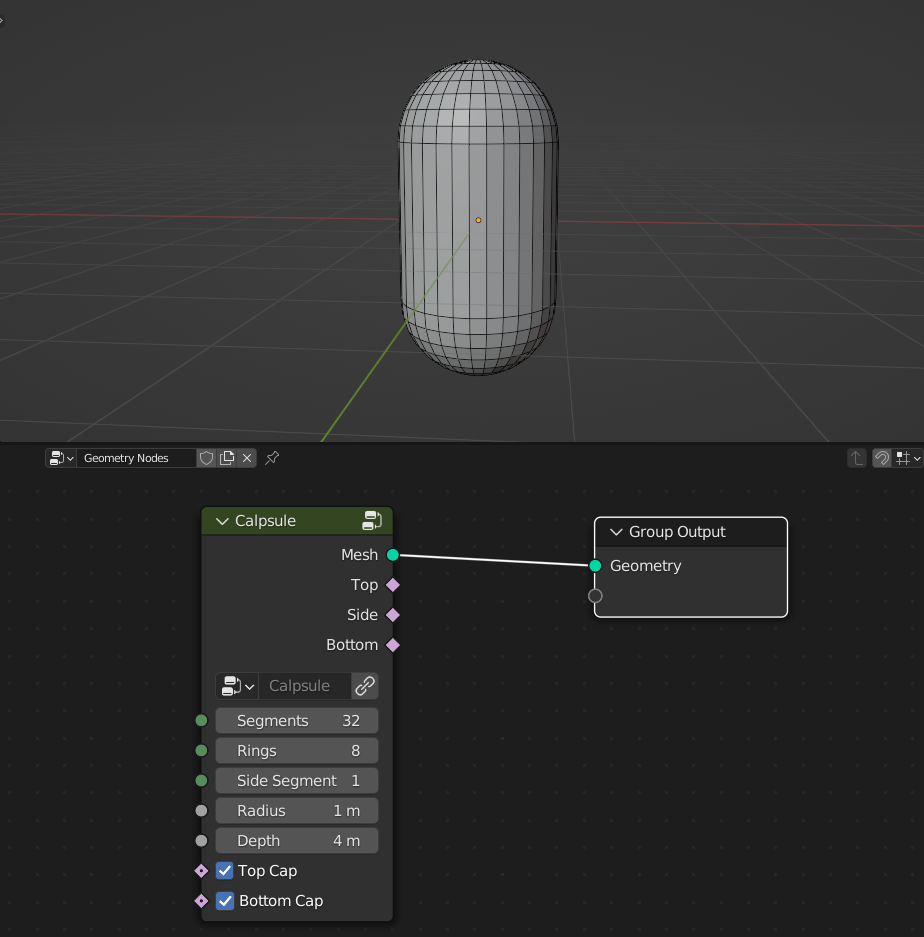
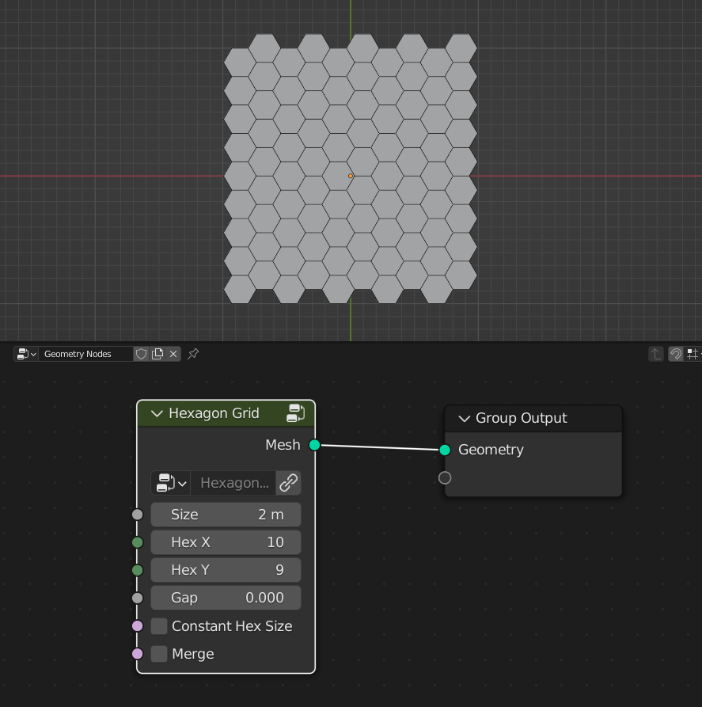
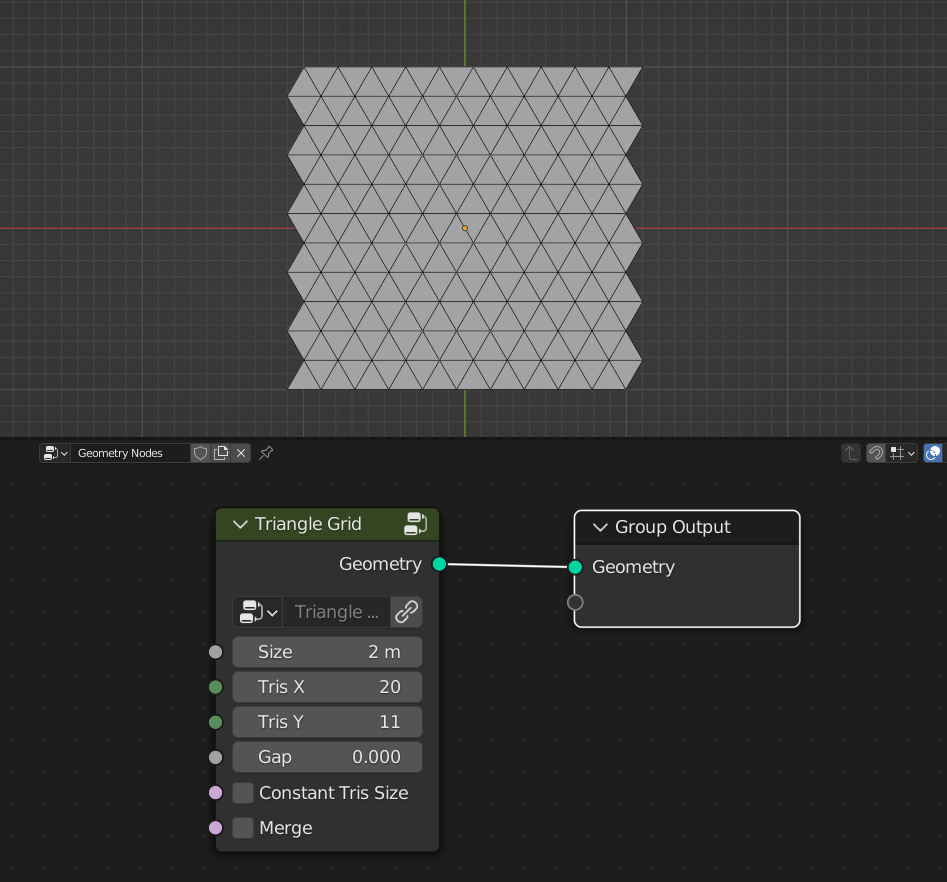
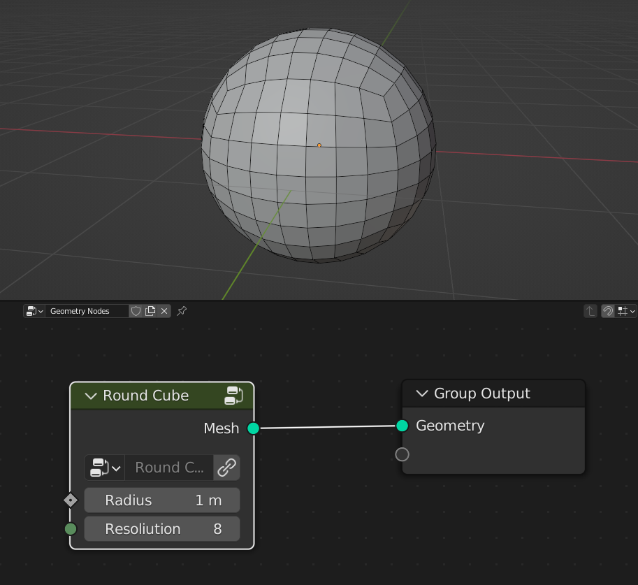
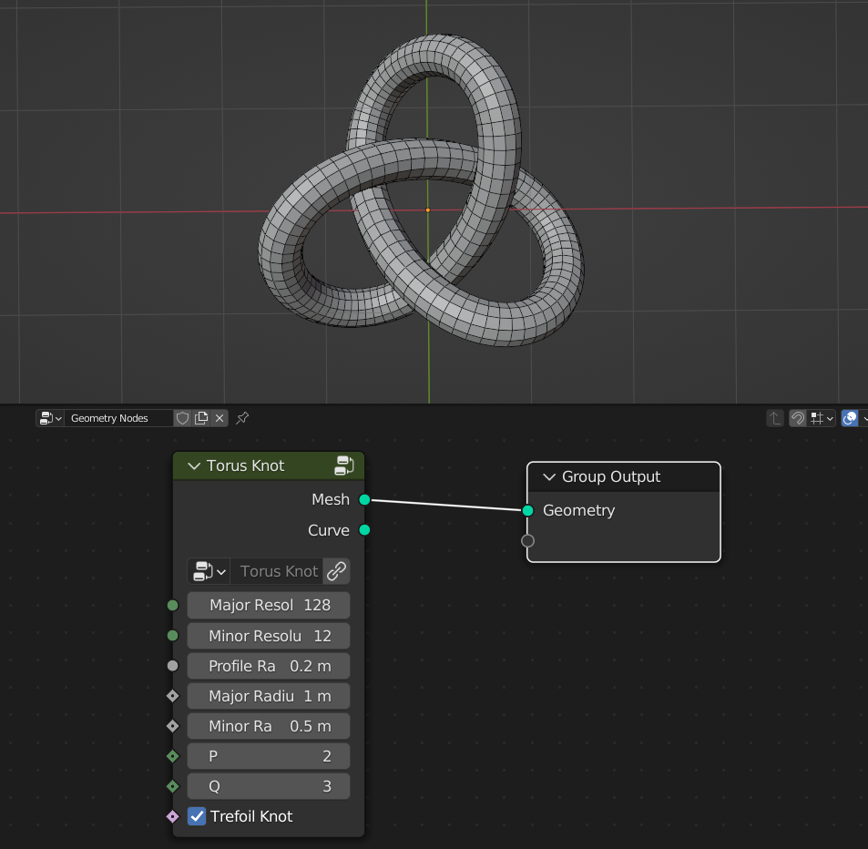
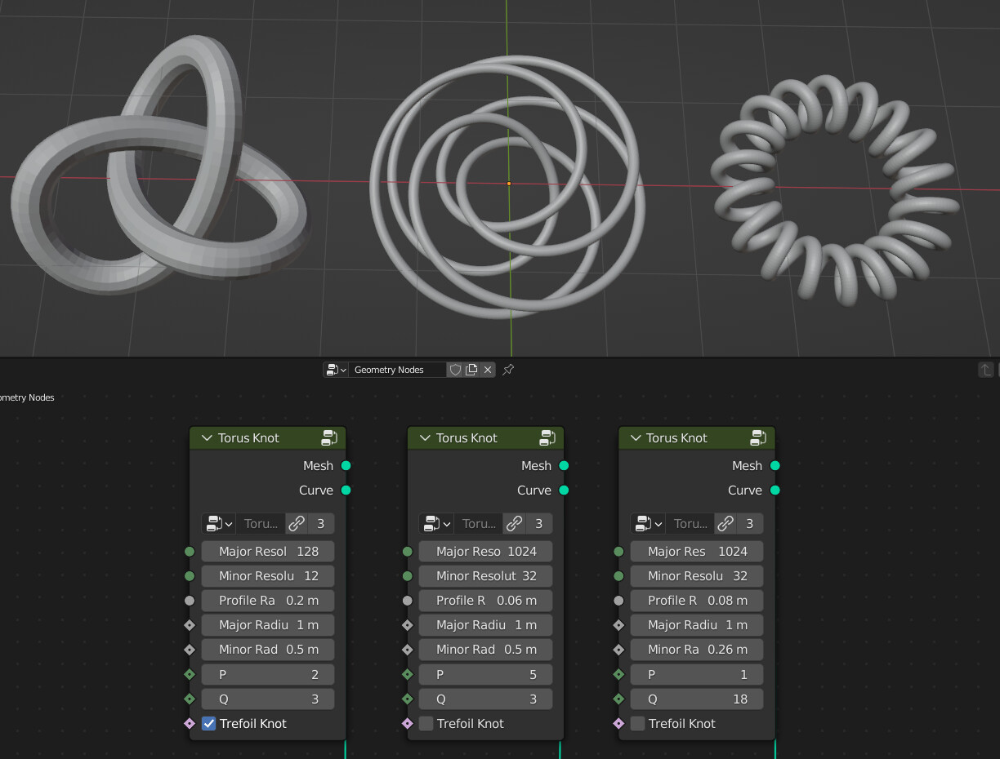

Mesh Primitives
===================================

************************************************************
Capsule
************************************************************

Mesh capsule primitive

Segments
  Number of segments
  
Rings
  Number of rings
  
Side Segments
  Number of side segments
  
Radius
  Radius of the capsule
  
Depth
  Depth of the capsule
  
**Top Cap**

- **On:** Round cap
- **Off:** Flat cap

**Bottom Cap**

- **On:** Round cap
- **Off:** Flat cap

Top
  Selection of top cap
  
Side
  Selection of side capsule
  
Bottom
  Selection of bottom cap
  
  
 
************************************************************
Hexagon Grid
************************************************************

Hexagon grid mesh primitive

Size
  Size of the grid
  
Hex X
  Number of hexagon tiles on **X** axis

Hex Y
  Number of hexagon tiles on **Y** axis

Gap
  Gap between hexagons tiles
  
Constant Hex Size
  Hexagon size will be controlled by **Size** input
  
Merge
  Hexagon tiles will be merged
  
  
************************************************************
Triangle Grid
************************************************************

Triangle grid mesh primitive

Size
  Size of the grid
  
Hex X
  Number of triangle tiles on **X** axis

Hex Y
  Number of triangle tiles on **Y** axis

Gap
  Gap between trianle tiles
  
Constant Hex Size
  Triangle size will be controlled by **Size** input
  
Merge
  Triangle tiles will be merged

************************************************************
Round Cube
************************************************************

Round cube mesh primitive

Radius
  Radius of sphere
  
Resoliution
  Resoliution of the sphere

************************************************************
Torus Knot
************************************************************

Torus knot mesh and curve primitive

Major Resolution
  Resoliution of the knot curve
  
Minor Resoliution
  Resoliution of the profile curve
  
Profile Radius
  Radius of the profile curve
  
Major Radius
  Radius of the knot curve
  
Minor Radius
  Radius of the profile curve
  
P
  Integer number for the equation  
  
Q
  Integer number for the equation  
  
Curve
  Outputs torus knot curve

  
  
  
  
  
  
  
  
  
  

