SDF Nodes
===================================

SDF - Signed distance fields creates 3d volume surface that can be definded using mathematical functions

************************************************************
SDF to Mesh
************************************************************

Converts SDF volume to mesh

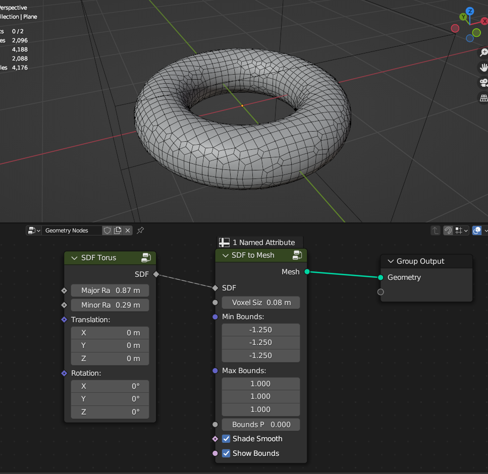

SDF
  SDF field that mesh will be created
  
Voxel Size
  Density of the mesh created. Lower values = dense mesh
  
Min Bounds
  Position in 3d space that volume will be calculated
  
Max Bounds
  Position in 3d space that volume will be calculated
  
Bounds Padding
  Extends voxels from the bounds
  
Shade Smooth
  Shades mesh smooth
  
Show Bounds
  Shows bounds visualisation that volume will be calculated
  
  
  
************************************************************
SDF Boolean
************************************************************

Creates boolean operation between 2 SDFs volumes

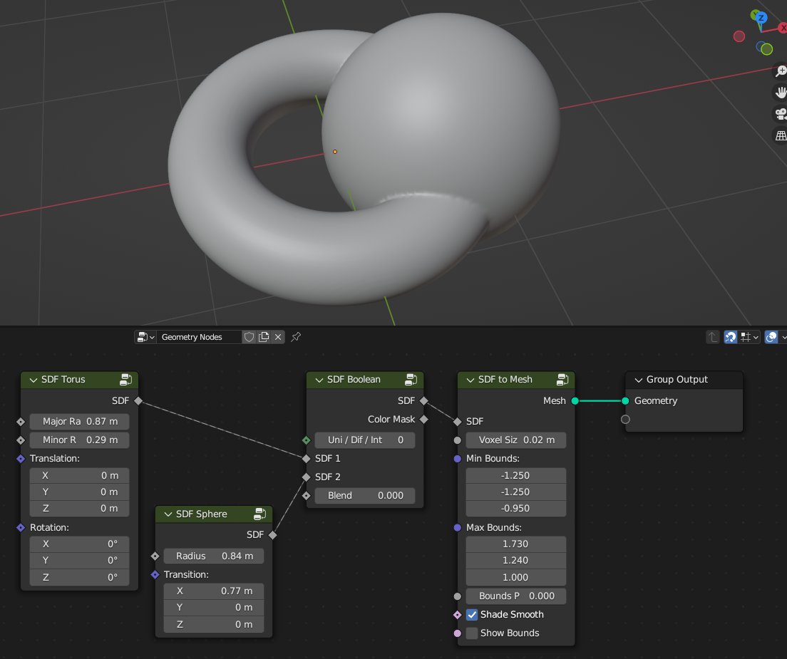
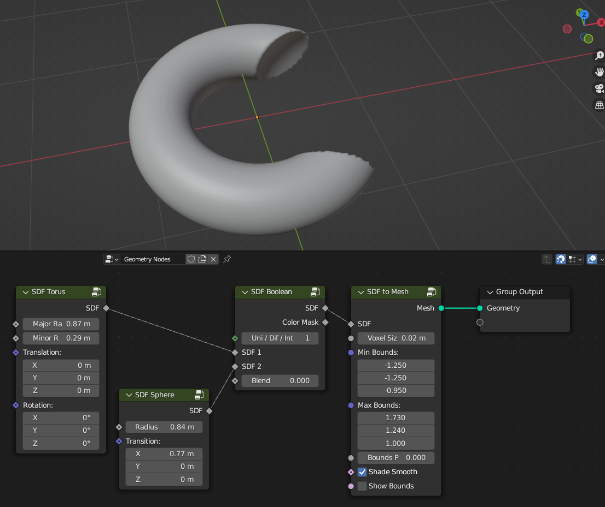
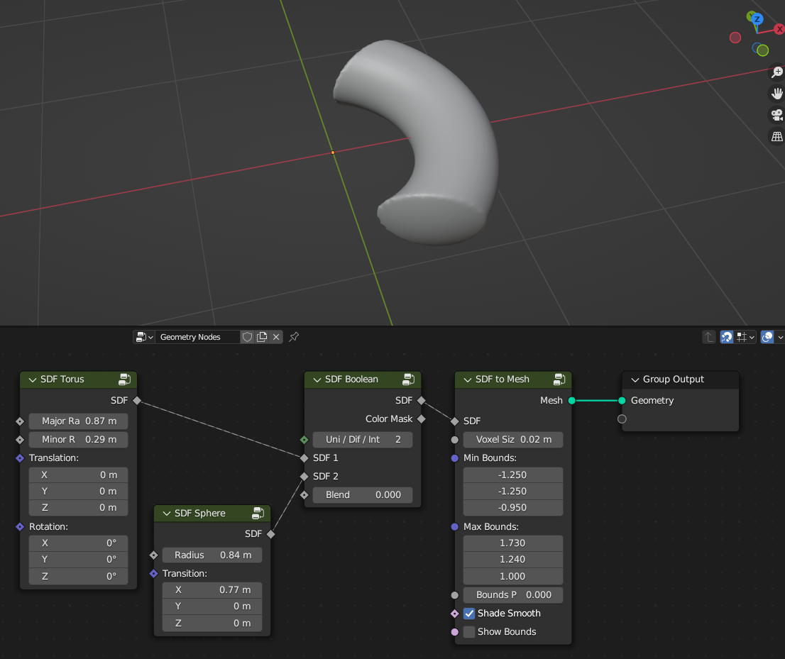

**Uni / Dif / Int**

- **Uni** Union operation
- **Dif** Difference operation
- **Int** Intersection operation
  
SDF 1
  First SDF input
  
SDF 2
  Second SDF input
  
Blend
  Smoothly blends boolean operation between 2 SDFs
  
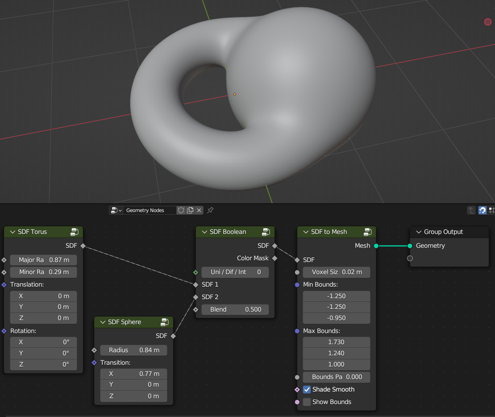

Color Mask
  Crates mask between 2 SDFs
  
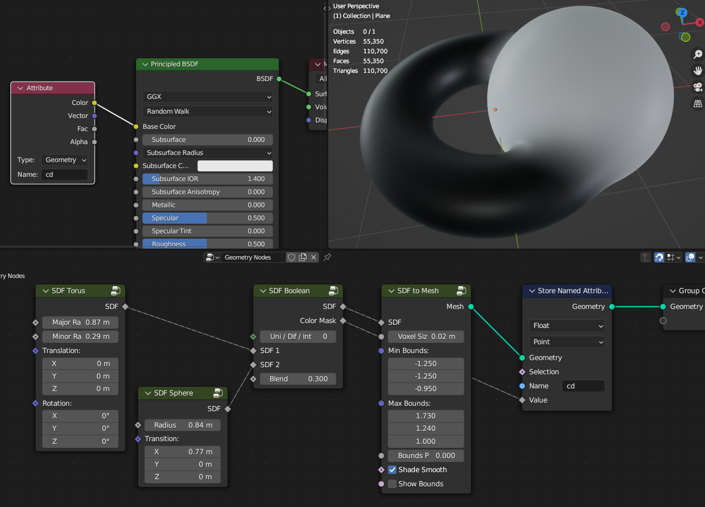
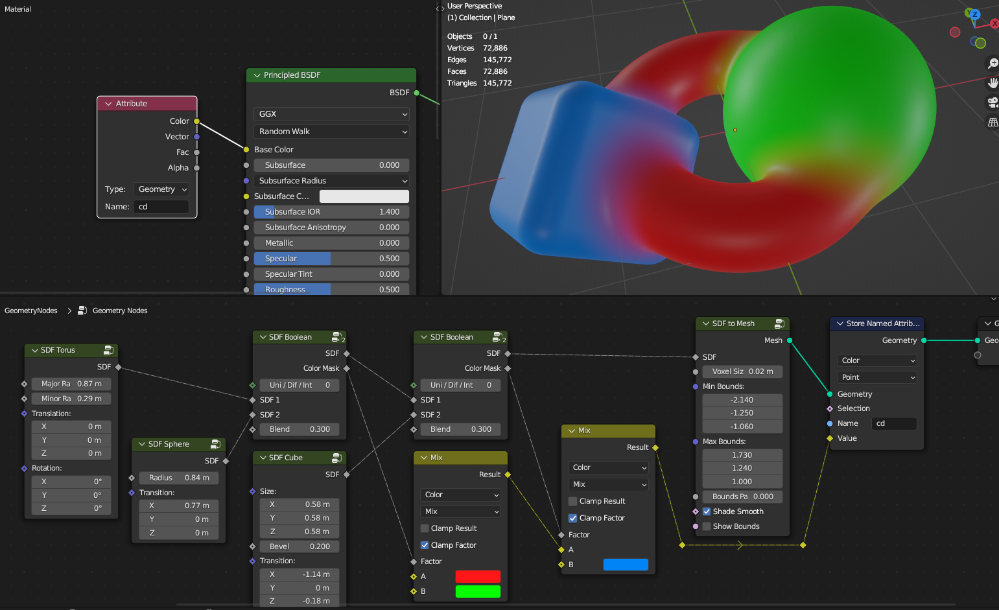
  

************************************************************
Mesh to SDF
************************************************************

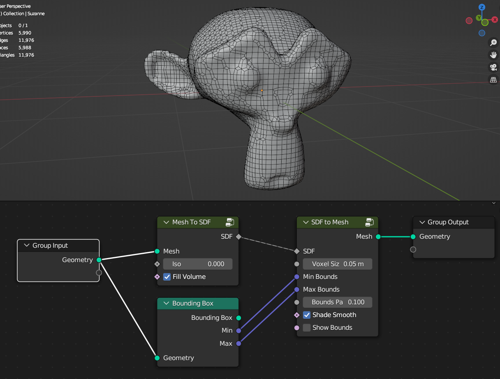

Converts mesh to SDF volume

Iso
  Volume offset from mesh surface to inside/outside
  
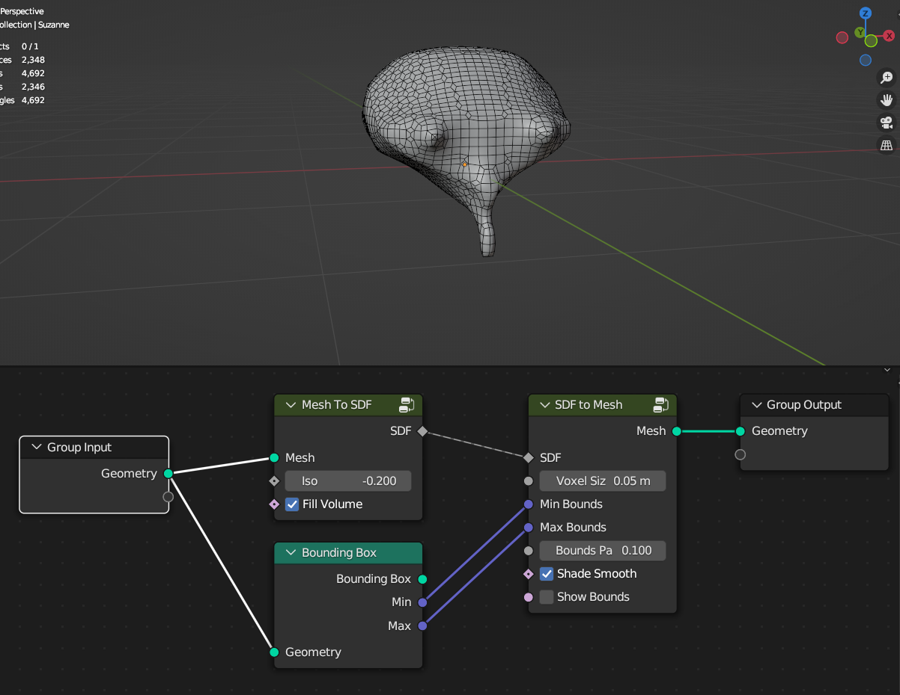
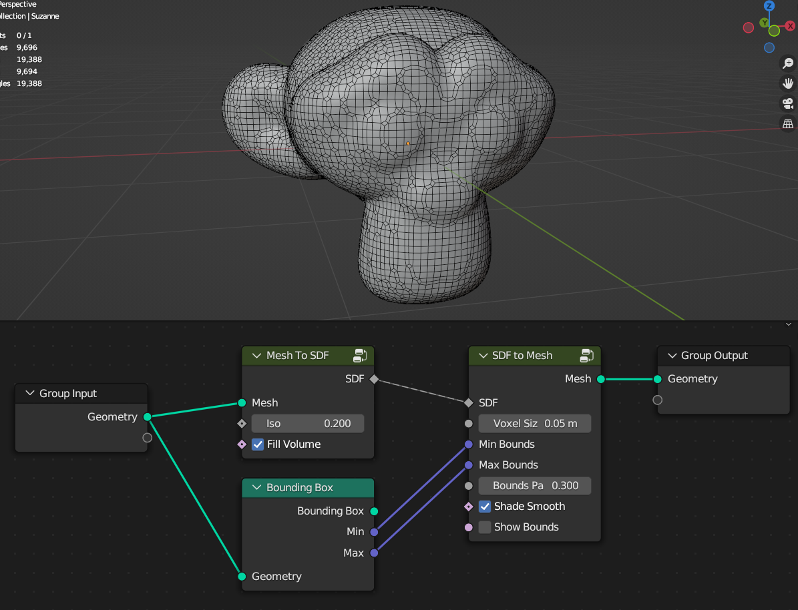

Fill Volume
  Fills SDF volume
  
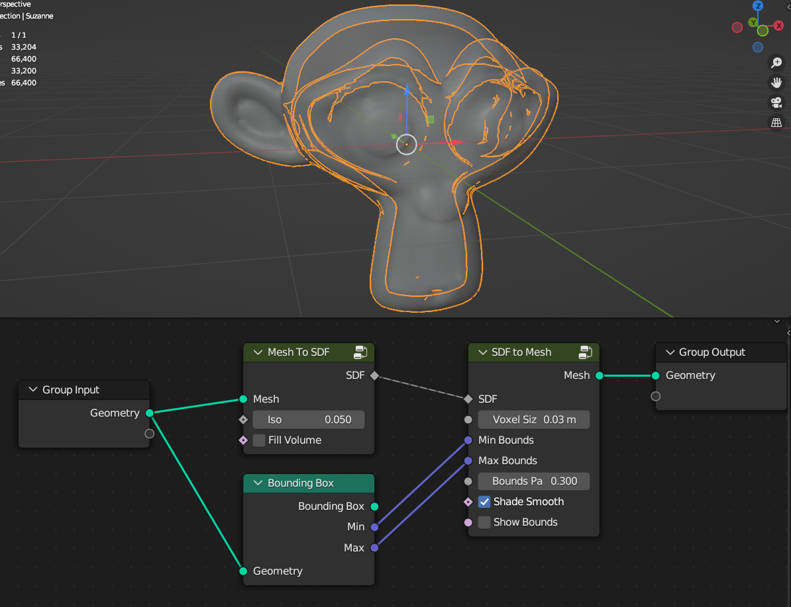

  

