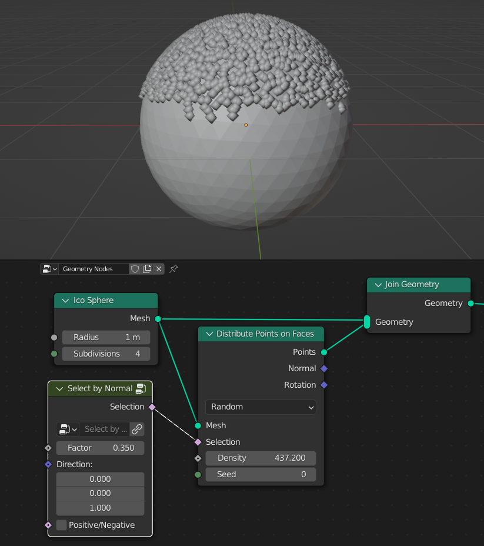

Selection
===================================

************************************************************
Bounding Region Selection
************************************************************

Boolean selection based on the axis

.. image:: images/b_r_s.PNG

X
  Axis 

************************************************************
Select by Normal
************************************************************

Boolean selection based on geometry normal direction

Factor
  Factor of the normal selection
  
Direction
  Direction of the selection
  
Positive/Negative
  **On:** Select both negative and positive directions of the normal
  

************************************************************
Is Inside Volume
************************************************************

Checks if point are inside Taget mesh volume

.. image:: images/is_inside_volume.PNG

Target
  Mesh that being used to check if points are inside it
