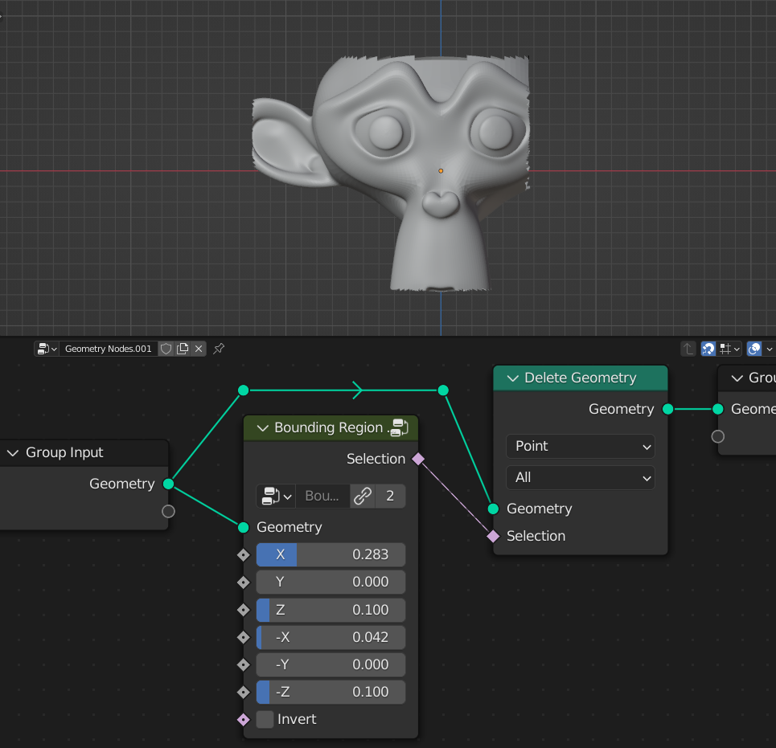
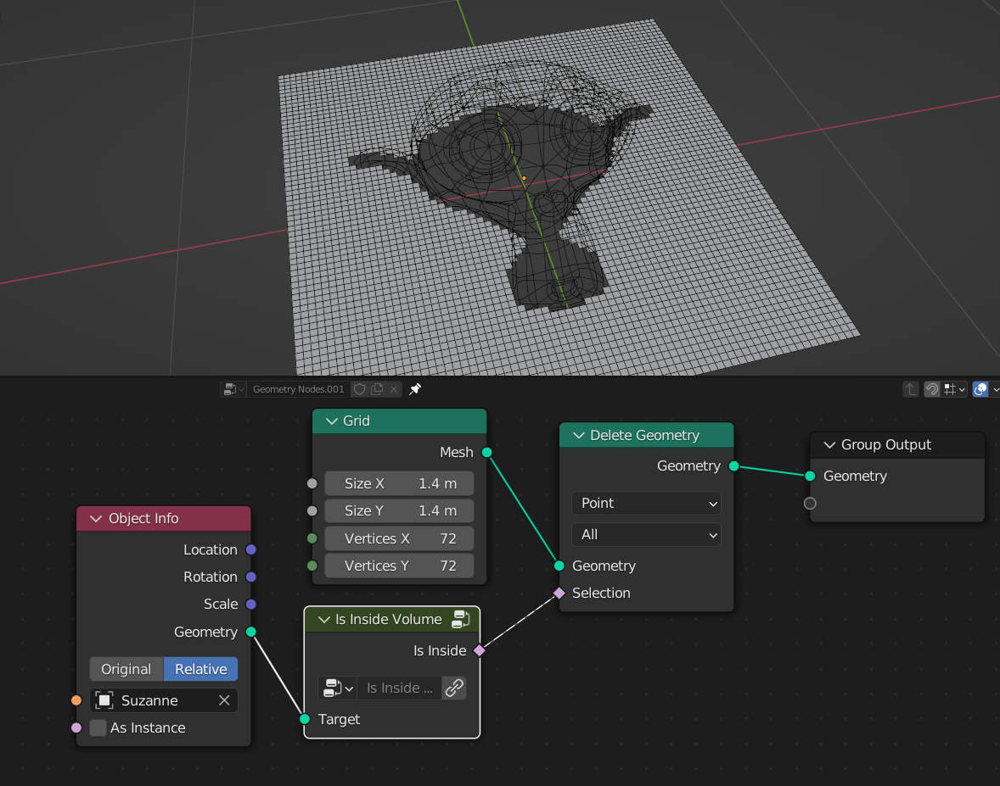
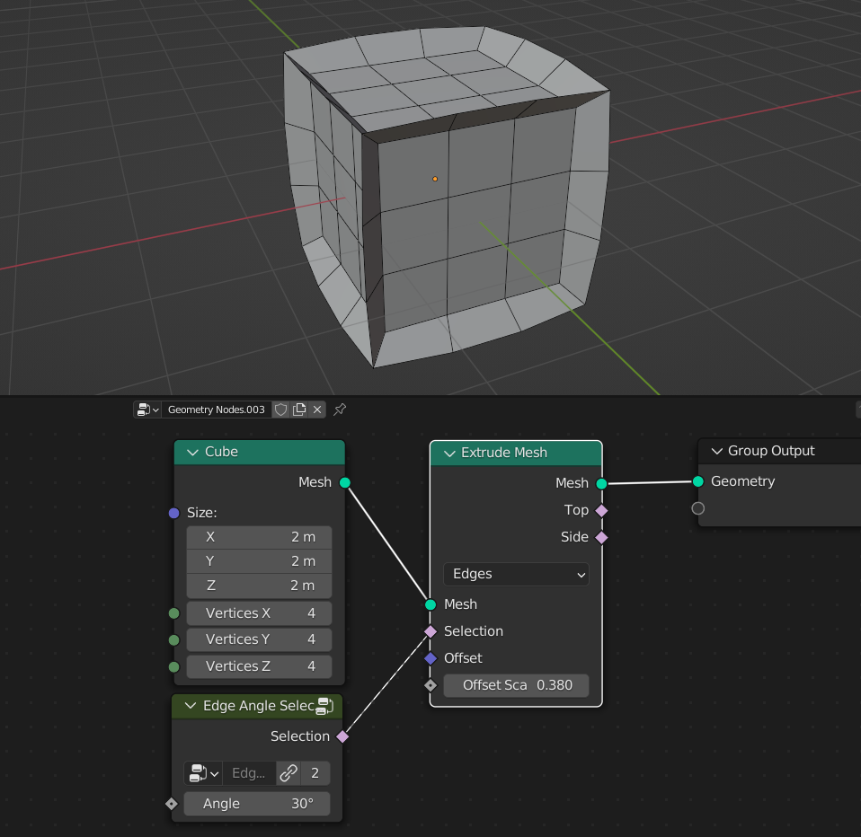
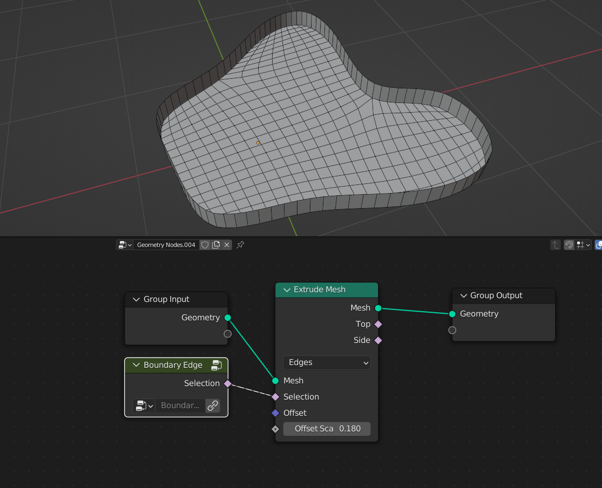
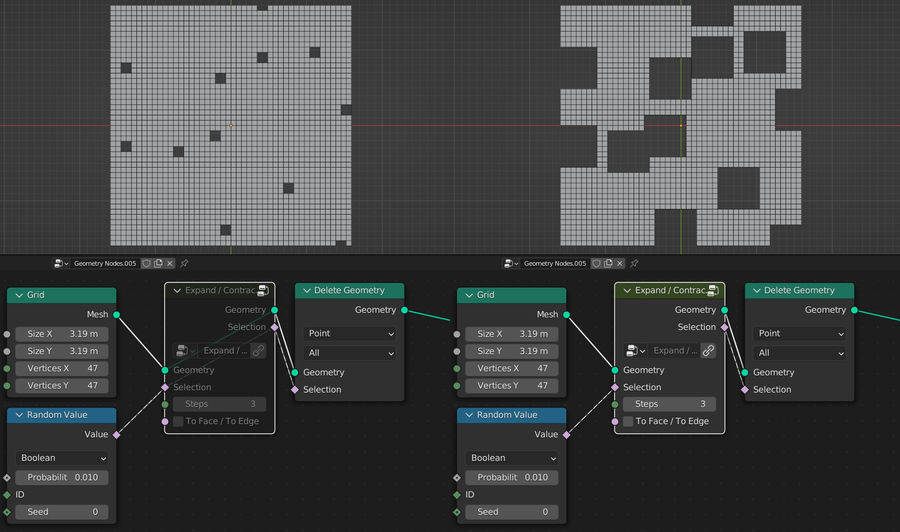

Selection
===================================

************************************************************
Bounding Region Selection
************************************************************

Boolean selection based on the axis

X
  Axis 

************************************************************
Select by Normal
************************************************************

Boolean selection based on geometry normal direction

.. image:: images/select_by_normal.png

Factor
  Factor of the normal selection
  
Direction
  Direction of the selection
  
Positive/Negative
  **On:** Select both negative and positive directions of the normal
  

************************************************************
Is Inside Volume
************************************************************

Checks if point are inside Taget mesh volume

Target
  Mesh that being used to check if points are inside it
  
  
  
************************************************************
Edge Angle Selection
************************************************************

Selects mesh edges based on edges angle

Angle
  Selects mesh edges that are greather than Angle input
  
  

************************************************************
Boundary Edge
************************************************************

Selects mesh edges that are on the boundary

************************************************************
Expand / Contract Selection
************************************************************

Expands or contracts selection

Selection
  Selection input that will be contracted expanded
  
Steps
  **Positive** values will expand selection, **Negative** values will contract selection
  
**To Face / To Edge**
  
- **On:** Expands/contract selection towards mesh neighbor edges 
- **Off:** Expands/contract selection towards mesh neighbor faces 

