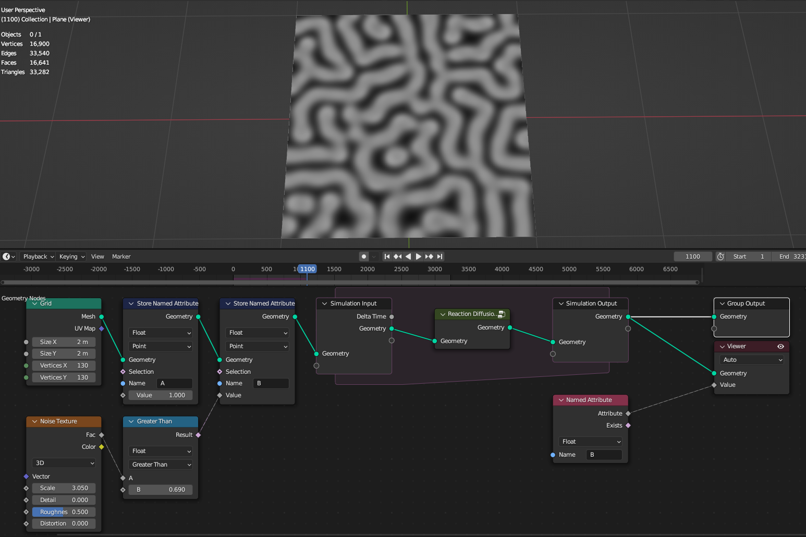
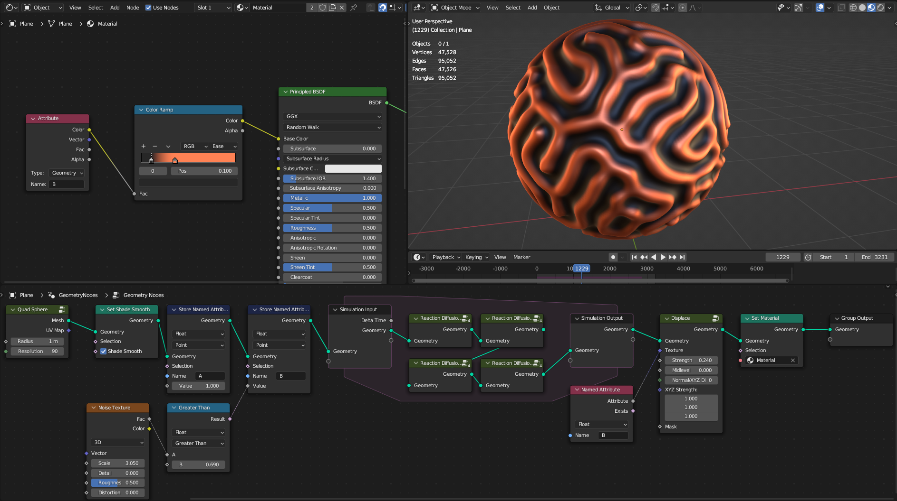
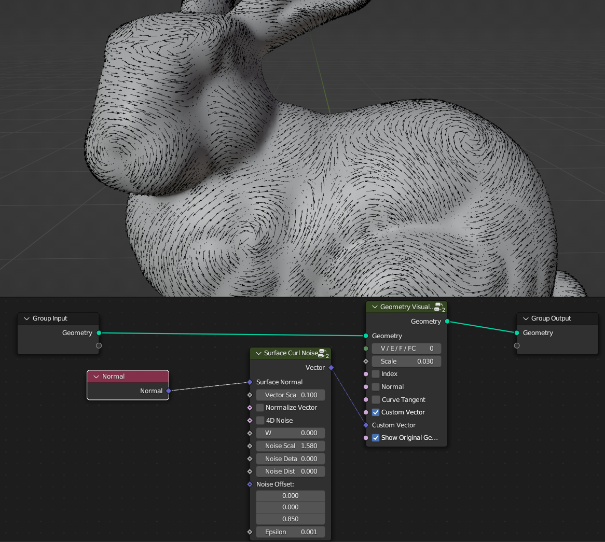
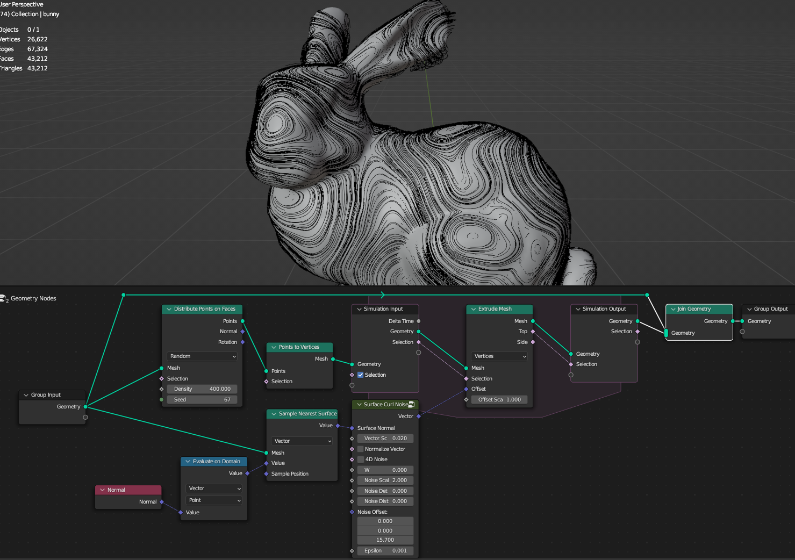
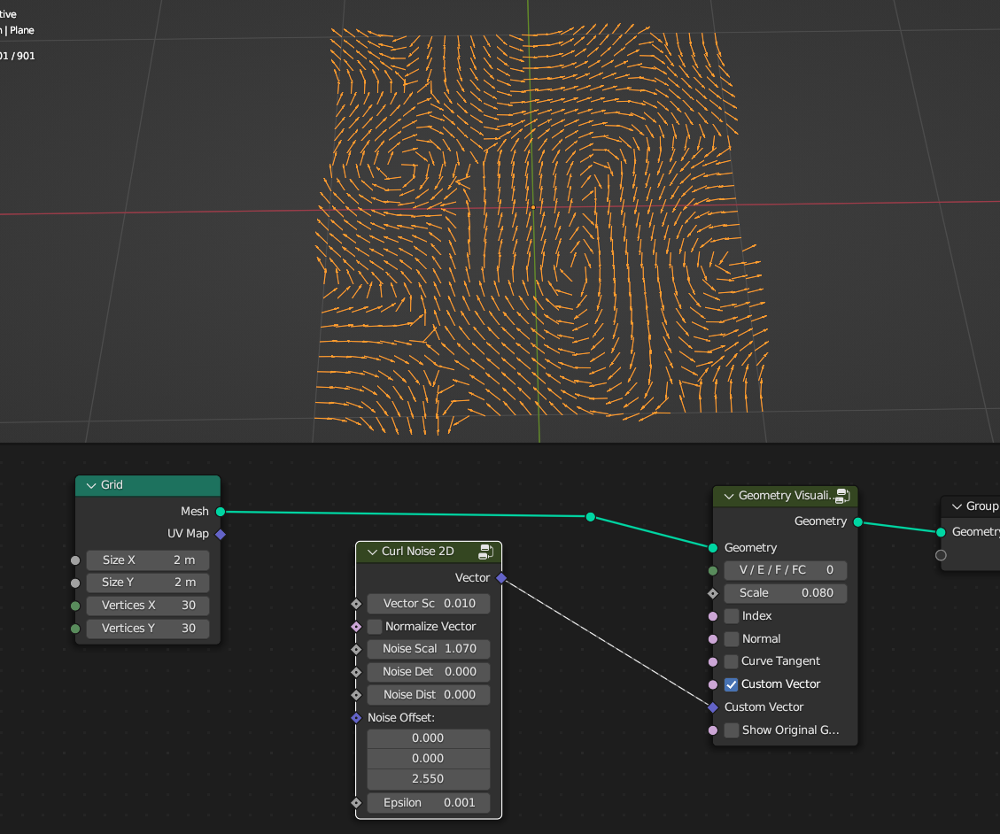
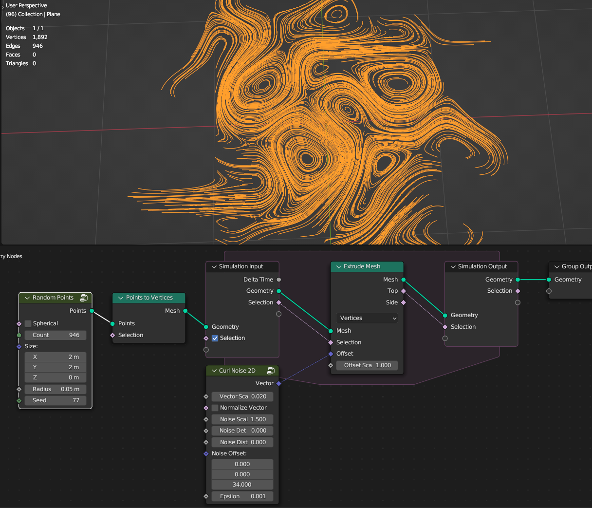
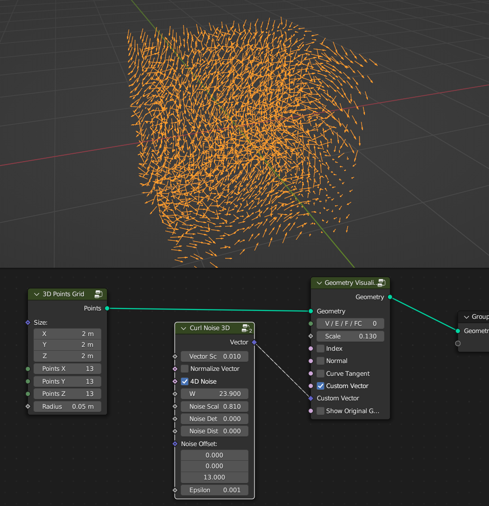
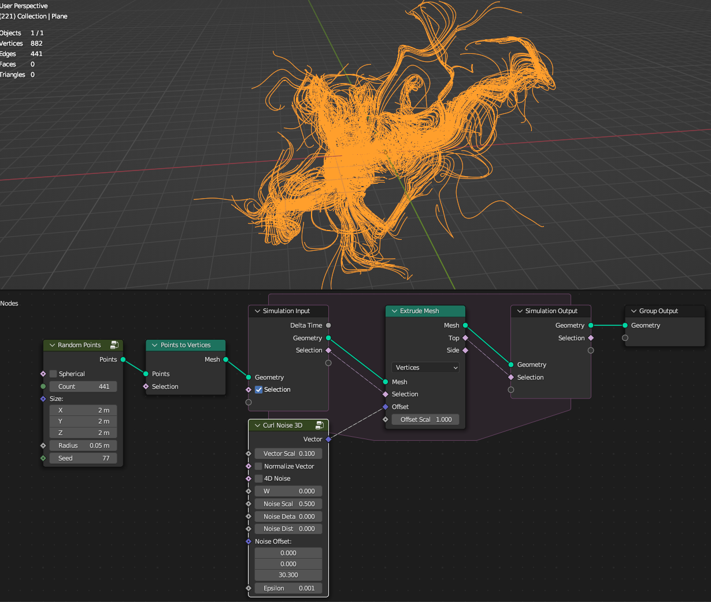

Simulation
===================================

************************************************************
Reaction Diffusion Solver
************************************************************

Creater growing/mixing effect between two virtual chemicals 

.. image:: images/reactdiff.gif

************************************************************
Surface Curl Noise
************************************************************

Creates direction vectors from a noise texture that curls on surface (follows in curl pattern) 

Surface Normal
  Normal directional vector from a surface that curl directional vectors will be aligned 

Vector Scale
  Scale of the direction vector 
  
Normalize Vector
  Normalizes direction vectors

4D Noise
  Adds time dimension to noise texture

W
  Time offset of noise
  
Noise Scale
  Scale of noise 

Noise Detail
  Detail of noise 

Noise Distortion
  Distortion of noise

Noise Offset
  Offsets noise texture

Epsilon
  Small value that offsets noise texture to sample noise from different directions to get directional vector (only change it if trying get curl noise on really small or really big sampling area)

************************************************************
Curl Noise 2D
************************************************************

Creates 2D direction vectors from a noise texture that curls (follows in curl pattern) 

Vector Scale
  Scale of the direction vector 
  
Normalize Vector
  Normalizes direction vectors
  
Noise Scale
  Scale of noise 

Noise Detail
  Detail of noise 

Noise Distortion
  Distortion of noise

Noise Offset
  Offsets noise texture

Epsilon
  Small value that offsets noise texture to sample noise from different directions to get directional vector (only change it if trying get curl noise on really small or really big sampling area)

************************************************************
Curl Noise 3D
************************************************************

Creates 3D direction vectors from a noise texture that curls (follows in curl pattern) 

Vector Scale
  Scale of the direction vector 
  
Normalize Vector
  Normalizes direction vectors

4D Noise
  Adds time dimension to noise texture

W
  Time offset of noise
  
Noise Scale
  Scale of noise 

Noise Detail
  Detail of noise 

Noise Distortion
  Distortion of noise

Noise Offset
  Offsets noise texture

Epsilon
  Small value that offsets noise texture to sample noise from different directions to get directional vector (only change it if trying get curl noise on really small or really big sampling area)

