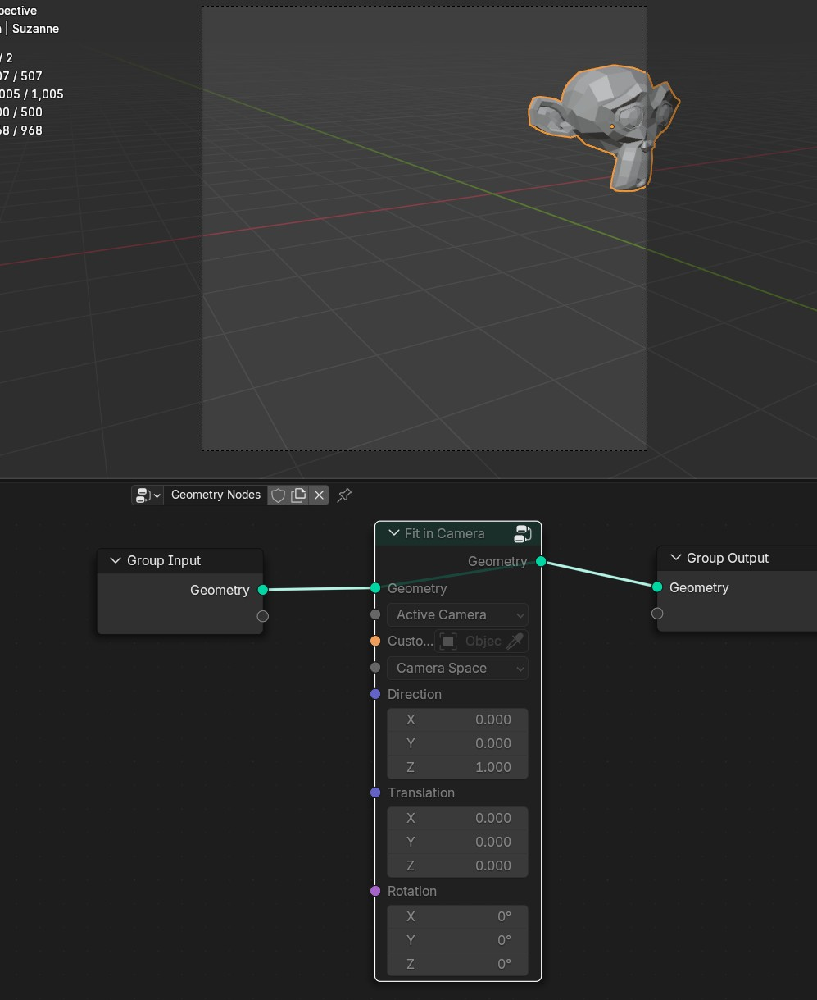
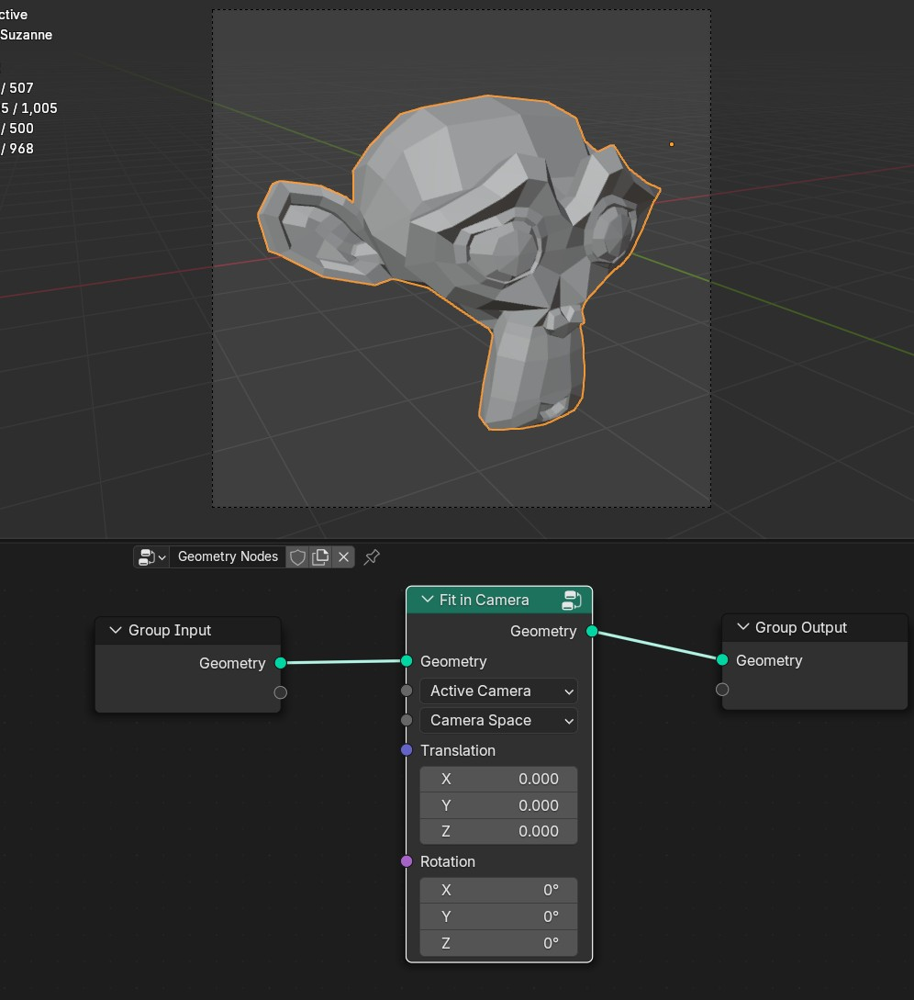
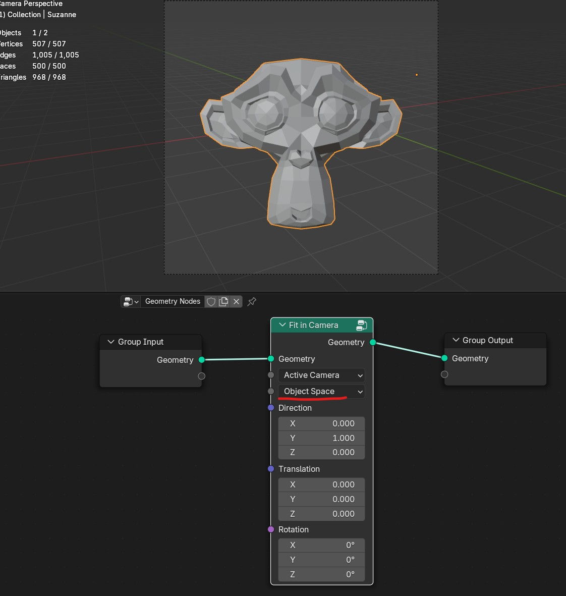

Camera
===================================

************************************************************
Fit in Camera
************************************************************

Fits geomety inside the camera by calculating bounding box and centering to the camera view

**Active Camera/Custom Camera**

- **Active Camera:** Uses active camera
- **Custom Camera:**  Uses custom camera
  

**Camera Space/Object Space**

- **Camera Space:** Centers object inside camera view without rotating it, so it faces same direction as camera
- **Object Space:**  Fits and rotates object so it faces spesified direction

Translation
  Camera space translation
  
Rotation
  Camera space rotation
