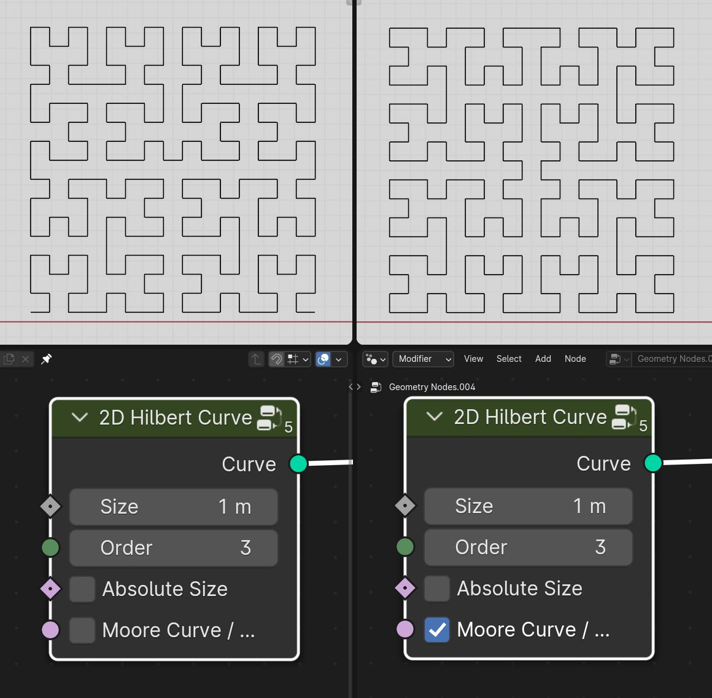

Curve Primitives
===================================

************************************************************
Capareda Curve
************************************************************

Capareda Curve

.. image:: images/capc.jpg

************************************************************
Dragon Curve
************************************************************

Dragon Curve

.. image:: images/dragoncurve.jpg

************************************************************
Heart
************************************************************

Curve heart shape

.. image:: images/cheart.PNG

************************************************************
Hilbert Curve
************************************************************

2D and 3D hilbert curve

.. image:: images/hilbc1.JPG
.. image:: images/hilbc2.JPG

Size
  Size of hilber curve

Order
  Order of hilber curve

Absolute Size
  Makes hilbert curve exactly match Size

Moore Curve / Cyclic
  Creates Moore curve that is cyclic

************************************************************
Infinite Cube
************************************************************

Infinite cube curve primite

************************************************************
Spherical Spiral 
************************************************************

Capareda Curve

.. image:: images/spsp.jpg

************************************************************
Super Ellipse
************************************************************

Super Ellipse Cruve

