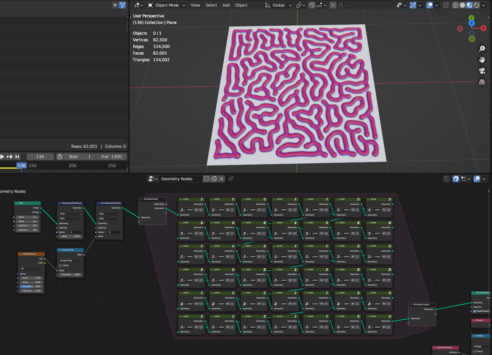
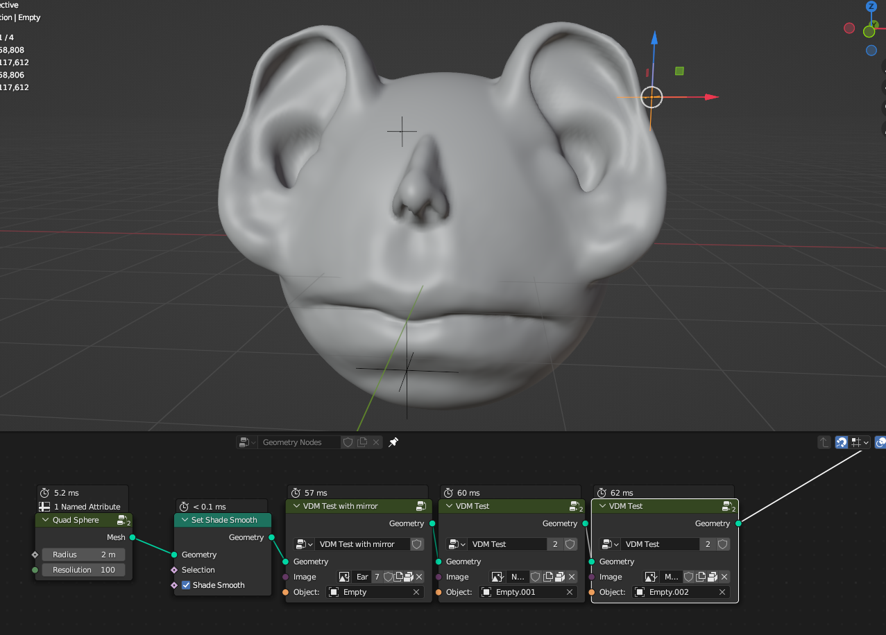

Experimental Nodes
===================================

Experimental nodes that are not finished or require custom blender version

Download link https://drive.google.com/drive/folders/1aPipVjnfs4rJnDPpXa310lVs0kx4SM4K?usp=sharing

************************************************************
3d Straight Skeleton
************************************************************

Creates internal skeleton lines from 3d mesh

Pretty slow and results not be that accurate, better voxel remesh mesh before simulation

|3dsk|

.. |3dsk| raw:: html

    <blockquote class="twitter-tweet">
Some tests for creating 3d straight skeleton<a href="https://twitter.com/hashtag/b3d?src=hash&amp;ref_src=twsrc%5Etfw">#b3d</a> <a href="https://twitter.com/hashtag/geometrynodes?src=hash&amp;ref_src=twsrc%5Etfw">#geometrynodes</a> <a href="https://t.co/lWeaFiVhes">pic.twitter.com/lWeaFiVhes</a>
&mdash; higgsas (@higgsasxyz) <a href="https://twitter.com/higgsasxyz/status/1699462208944578699?ref_src=twsrc%5Etfw">September 6, 2023</a></blockquote> 

************************************************************
Reaction diffusion solver
************************************************************

Creates reaction diffusion growth simulation using Blender 3.6 alpha

|rds|

.. |rds| raw:: html
   
    
<iframe width="455" height="809" src="https://www.youtube.com/embed/JWFP6J9gXaQ" title="Blender Geometry Nodes Reaction Diffusion Solver #shorts" frameborder="0" allow="accelerometer; autoplay; clipboard-write; encrypted-media; gyroscope; picture-in-picture; web-share" allowfullscreen></iframe>

    
F and K values controls reaction diffusion pattern. To test diffrent F and K values for diffretent patterns - https://www.karlsims.com/rdtool.html
    
.. warning::
    You need Blender 3.6 version for the simulation nodes

************************************************************
VDM Displace
************************************************************

Creates VDM mesh displacment from VDM images

|vdm|

.. |vdm| raw:: html

    
<iframe width="455" height="809" src="https://www.youtube.com/embed/UxYZQ3uoZmQ" title="Blender VDM Geometry Nodes Displace Test #b3d #geometrynodes #blender" frameborder="0" allow="accelerometer; autoplay; clipboard-write; encrypted-media; gyroscope; picture-in-picture; web-share" allowfullscreen></iframe>

    
    
    
************************************************************
Rope Simulation
************************************************************

Rope simulation solver

|rope|

.. |rope| raw:: html

    <blockquote class="twitter-tweet">
Simple rope simulation with blender 3.6 <a href="https://twitter.com/hashtag/geomentrynodes?src=hash&amp;ref_src=twsrc%5Etfw">#geomentrynodes</a><a href="https://twitter.com/hashtag/b3d?src=hash&amp;ref_src=twsrc%5Etfw">#b3d</a> <a href="https://twitter.com/hashtag/simulation?src=hash&amp;ref_src=twsrc%5Etfw">#simulation</a> <a href="https://t.co/v1yC65oojF">pic.twitter.com/v1yC65oojF</a>
&mdash; higgsas (@higgsasxyz) <a href="https://twitter.com/higgsasxyz/status/1665762313519919104?ref_src=twsrc%5Etfw">June 5, 2023</a></blockquote> 

