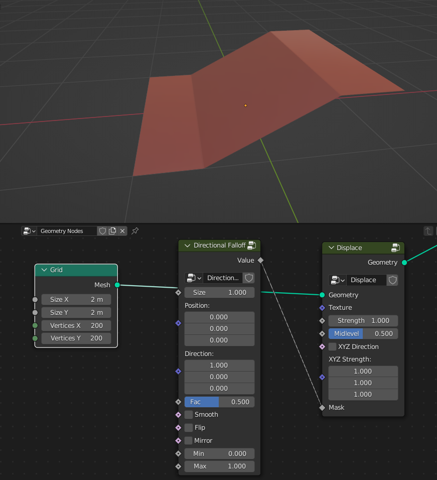

Falloffs
===================================

************************************************************
Directional Falloff
************************************************************

Creates directional falloff

Size
  Size of the falloff

Position
  Position of the falloff
  
Direction
  Direction of the falloff
  
Fac
  Offset of falloff position
  
Smooth
  Smooths falloff
  
Flip
  Flips falloff
  
Mirror
  Mirros falloff
  
Min
  Falloff min Value
  
Max
  Falloff max Value

************************************************************
Objectr Directional Falloff
************************************************************

Creates directional falloff that is controlled by an object

Size
  Size of the falloff

Direction
  Direction of the falloff
  
Offset
  Offset of falloff position
  
Smooth
  Smooths falloff
  
Flip
  Flips falloff
  
Mirror
  Mirros falloff
  
Min
  Falloff min Value
  
Max
  Falloff max Value

************************************************************
Object Spherical Falloff
************************************************************

Creates spherical falloff that is controlled by an object

Radius
  Radius of the falloff
  
Falloff Fac
  Falloff factor of the sphere gradient
  
Smooth 
  Smooths falloff
  
Min
  Falloff min Value
  
Max
  Falloff max Value

************************************************************
Radial Falloff
************************************************************

Creates radial falloff

Rotation
  Rotation of the falloff
  
Direction
  Direction of the falloff
  
Position
  Position of the falloff
  
Flip 
  Flips falloff
  
Min
  Falloff min Value
  
Max
  Falloff max Value

************************************************************
Spherical Falloff
************************************************************

Creates spherical falloff

Size
  Size of the falloff
  
Position
  Position of the falloff
  
Falloff Fac
  Falloff factor of the sphere gradient
  
Smooth 
  Smooths falloff
  
Min
  Falloff min Value
  
Max
  Falloff max Value

************************************************************
Wave Falloff
************************************************************

Creates spherical falloff that is controlled by an object

Spherical/Directional
  Spherical or directional falloff
  
Time
  Moves the wave
  
Width 
  Width of the wave
  
Narrowness
  Narrowness of the wave
  
Position
  Position of the wave
  
Direction
  Direction of the directional wave

Falloff
  Falloff the the wave

Min
  Falloff min Value
  
Max
  Falloff max Value

