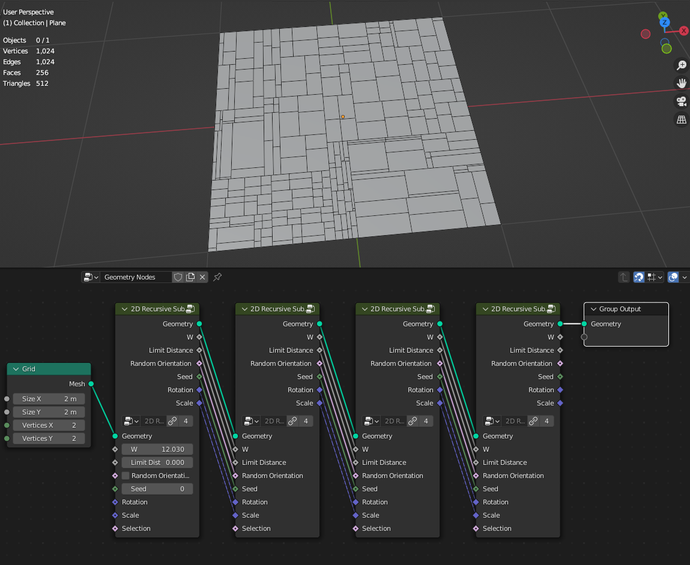
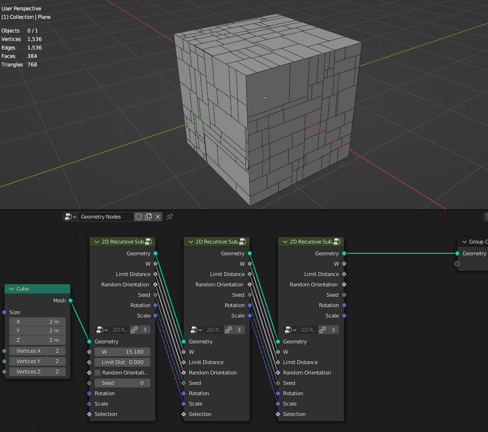
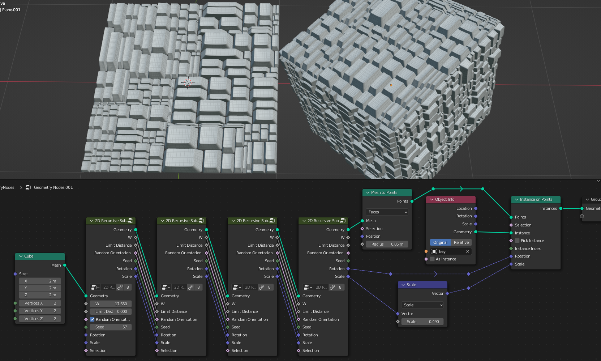
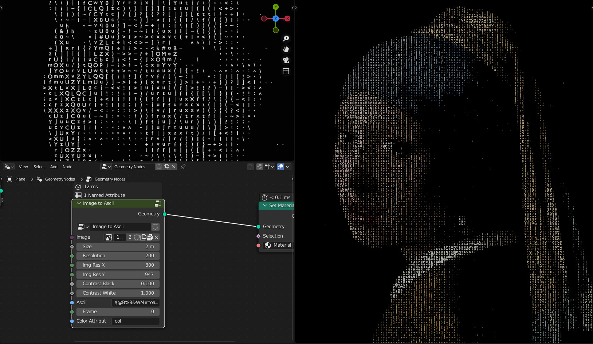
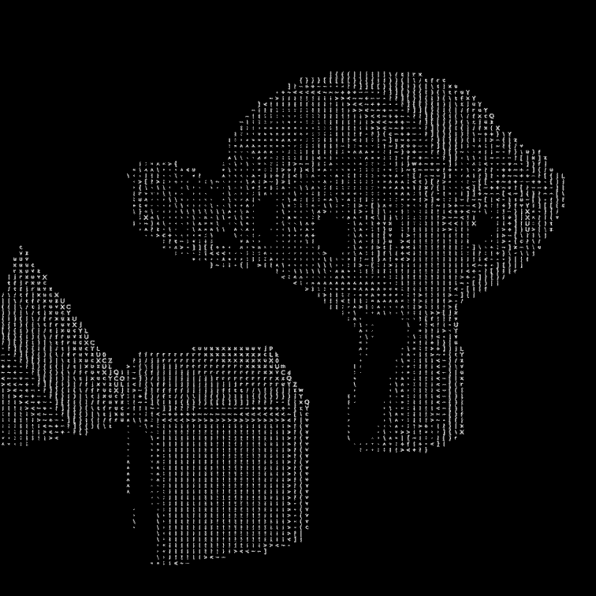
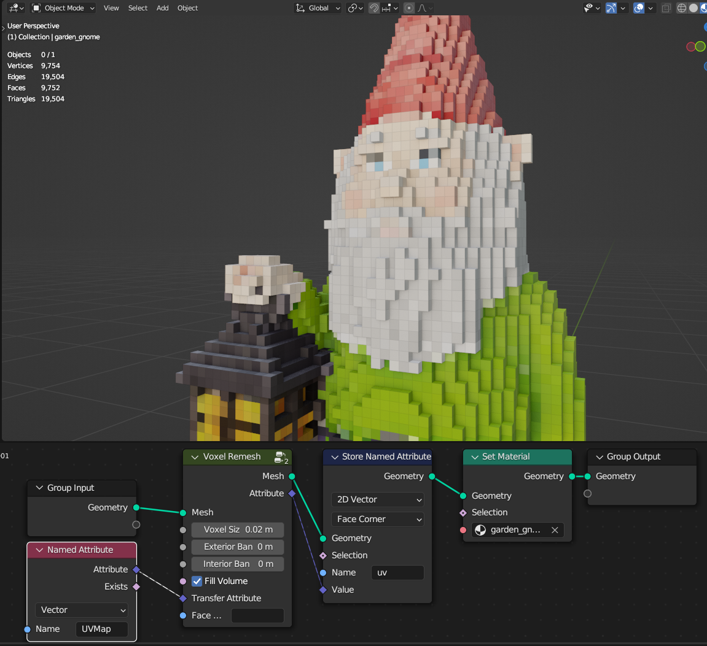

Generators
===================================

************************************************************
2D Recursive Subdivision
************************************************************

Subdivides quad faces with offset

.. image:: images/2drec.gif

W
  Controls subdivided quad movement 

Limit Distance
  Limits subdivided quad movement side to side
  
Random Orientation
  Randomize movement verticaly and horizontaly  
  
Seed
  Seed of random orientation
  
Rotation
  Rotation
  
Scale
  Scale
  
Selection
  Selects which faces to subdivide 
    
.. warning::
    Subdivision only wokrs on non-deformed quad faces

************************************************************
2D Triangular Remesh
************************************************************

Remeshes 2d mesh using delaunay triangulation

Density
  Density of triangles

Corner Angles
  Keeps corners sharp

Relax Iterations
  Relaxing triangles for more even spacing
  
.. warning::
    Input meshes has to be on the Z axis

************************************************************
Connect Points
************************************************************

Connects points with segment by distance

  
Distance
  Distance that points will be connected
  
Connect All
  Connects all points

************************************************************
Cube Recursive Subdivision
************************************************************

Recursively subdivides cubes with offset

W
  Controls subdivided quad movement 

Limit Distance
  Limits subdivided quad movement side to side
  
Random Orientation
  Randomize movement verticaly and horizontaly  
  
Seed
  Seed of random orientation
   
Scale
  Scale of the cubes
  

  
Selection
  Selects which cubes to subdivide 
  

    
.. warning::
    Cubes subdivision only wokrs correctly on geometry nodes Cube

************************************************************
Edge Bisect
************************************************************

Bisects edges from plane defined from position/direction

Position
  Position of intersection plane
  
Direction
  Direction of intersection plane
  
Flip Direction
  Flips intersection direction

************************************************************
Edge Offset
************************************************************

Evenly offsets, extrudes or dublicates selected edges

**Offset/Extrude/Dublicate**

- **Offset** Offsets edges
- **Extrude** Extrude edges  
- **Dublicate** Dublicates edges  
  
Distance
  Distance of the offset
  
Angle
  Rotates offset around the selected edge
  
Offset
  Offset of the offseted and original edges
  
Axis/Normal
  Direction that edges will be offseted
  
- **Axis** Uses Axis vector input for offset direction
- **Normal** Uses face normals directions

Axis
  Direction of the offset
  
Selection
  Selects what edges to offset

************************************************************
Image to Ascii
************************************************************

Creates Ascii from image

Image
  Image input
  
Resoliution
  Grid resolution of Ascii
  
Img Res X
  Input image X resolution

Img Res Y
  Input image Y resolution

Contrast Min
  Min contrast of the image values

Contrast Max
  Max contrast of the image values

Ascii
  Ascii characters that used for gradient values. Black/empty is space " " 
  
Frame
  Frame of the image input
  
Color Attribute
  Creates color attribute from image colors

************************************************************
Inset Faces
************************************************************

Insets mesh faces

Offset
  Offset of the inset
  
Depth
  Push inseted faces from face normal
  
Reletive Offset
  Offsets inseted faces reletive to face area
  
Selection
  Selection of the face inset

************************************************************
Marching Squares Isolines
************************************************************

Creates edge lines on quad faces using gradient of the texture

.. image:: images/marching_squares2.png

Texture
  Texture 
  
Threshold
  Threshold
  
**Linier Interpolation**
  
- **On**  Smoothly interpolates values from texture
- **Off**  Places line on face edge midpoint

.. tip::
    Use **Attribute Smooth** node to smooth edges
    
    .. image:: images/marching_squares_tip.png
    
    .. image:: images/marching_squares_tip1.png
    
.. warning::
    Node only works on quad faces (faces that has 4 vertises)

************************************************************
Marching Squares Surface
************************************************************

smoothly cuts mesh using texture

Texture
  Texture 
  
Threshold
  Threshold
  
**Linier Interpolation**
  
- **On**  Smoothly interpolates values from texture
- **Off**  Places line on face edge midpoint

.. warning::
    Node only works on quad faces (faces that has 4 vertises)

************************************************************
Marching Triangles Isolines
************************************************************

Creates edge lines on tris faces using gradient of the texture

.. image:: images/marching_triangles_s1.png

Texture
  Texture 
  
Threshold
  Threshold
  
**Linier Interpolation**
  
- **On**  Smoothly interpolates values from texture
- **Off**  Places line on face edge midpoint

.. tip::
    Use **Attribute Smooth** node to smooth edges
    
    .. image:: images/marching_squares_tip.png
    
    .. image:: images/marching_squares_tip1.png
    
.. warning::
    Node only works on tris faces (faces that has 3 vertises)

************************************************************
Maze Solver
************************************************************

Generates maze edge walls on the mesh using random walk with backtracing

  
Start Face
  Index of face from where random walk beginds
  
End Face
  Index of face that finds shortest path between start and end faces. Note this will not effect maze generation

Seed
  Seed of maze generation

Start End Path
  Curve path between start and end faces

All Paths
  All pahts of the maze

Edge Walls
  Edges selection of maze walls

Start Face
  Face selection of start face

End Face
  Face selection of end face

.. tip::
    Note that after maze generated you might not want to use **Start Face** as start of the maze, because it will give more easier path to the end, so use it as the end of the maze

************************************************************
Mesh Contours
************************************************************

Creates contour lines from mesh

Slice Distance
  Distance between contour slices
  
Single Slice
  Creates just a single contour slice

Plane Position
  Position of the contour slices
  
Plane Normal
  Direction of the contour slices

************************************************************
Mesh Face Divider
************************************************************

Divides mesh face horizontally and vertically / U or V

U/V Ratio
  Ratio of more U or V divisions
  
Divide Propability
  Propability of face to be divided

Even Propability
  Makes division more even

Limit Distance
  Limits division distance from the center

Seed
  Seed of random divisions

Selection
  Selection of faces being divided

.. warning::
    Tris and n-gon faces will be ignored 

************************************************************
Mesh to Ascii
************************************************************

Creates Ascii representation of geometry inside camera

Mesh
  Mesh that will be projected as Ascii

Camera
  Camera that Ascii will be projected from

Focal Lenth
  Camera focal lenth
  
Sensor Size
  Camera censor size
  
Scene Res X
  Scene X resoliution
   
Scene Res Y
  Scene Y resoliution
  
Grid Resoliution
  Resoliution of the Ascii grid
  
Grid offset
  Grid offset inside camera
  
Contrast Min
  Min contrast of the mesh normals dot product

Contrast Max
  Max contrast of the mesh normals dot product

Light Direction
  Gradient direction
  
Ascii
  Ascii characters that used for gradient values. Black/empty is space " " 

************************************************************
Solidify
************************************************************

Evenly solidifies mesh

  
Even Thickness
  Evenly solidifies mesh
  
Thickness
  Thickness of solidify
  
Offset
  Offset of solidify
  
**All/TopSide/TopBottom**

- **All:** Outputs all mesh faces
- **TopSide:** Outputs Top and Side mesh faces
- **TopBottom:** Outputs Top and Bottom mesh faces

Individual
  Solidified individual faces
  
Selection
  Selection of the faces that will be solified

Top
  Selection of the top solified faces

Side
  Selection of the side solified faces

Bottom
  Selection of the bottom solified faces

************************************************************
Spheres Intersections
************************************************************

Instaces sphere meshes on points and deforms it to not intersect

Sphere Mesh
  Mesh of spheres that will be deformed

Radius
  Controls radius of sphere on points

Relax Interations
  Relaxes mesh spheres

.. warning::
    Sphere Mesh must have radius of 1

************************************************************
Tessellate Align Orientation
************************************************************

Aligns components rotation to direction

Direction
  Direction that compotent will be aligned
  
Flip Offset
  Offsets component oreantation by 90 degree 
  

************************************************************
Tessellate Mesh
************************************************************

Instances geometry (Component) on mesh faces and deforms to match face

Component
  Geometry that is being deformed to match mesh faces
  
**Constant/Reletive Scale**

- **Constant Scale:** Uniformly scales component
- **Reletive Scale:**  Scales component reletive to face area

Scale
  Scale factor
  
Offset
  Offsets component location from mesh face normal
  
Flip
  Rotates component 90 degrees 
  
- **0** = 0°   
- **1** = 90° 
- **2** = 180° 
- **3** = 270° 
  
Pick Component
  **ON:** Picks component from the instances list, similar how **Instance on Points/Pick Instace** node works   
  

Component Index
  When **Pick Component** is On, Selects which component to use from the instaces list, similar how **Instance on Points/Instance Index** node works  
  
Merge
  Merges geometry by distance
  
Merge Distance
  Distance when geoemty gets merge
  
.. warning::
    For triangle and n-gon faces results can be undesirable
    
    .. image:: images/tessellate_mesh_warn.PNG

************************************************************
Tessellate Mesh Smooth
************************************************************

Instances geometry (Component) on mesh faces and deforms to match (Subdivision Surface) face

Component
  Geometry that is being deformed to match mesh faces
  
Subdivisions
  Smoothly subdivides (Subdivision Surface) input mesh 
  

  
**Constant/Reletive Scale**

- **Constant Scale:** Uniformly scales component
- **Reletive Scale:**  Scales component reletive to face area

Scale
  Scale factor
  
Offset
  Offsets component location from mesh face normal
  
Flip
  Rotates component 90 degrees 
  
- **0** = 0°   
- **1** = 90° 
- **2** = 180° 
- **3** = 270° 
  
Pick Component
  **ON:** Picks component from the instances list, similar how **Instance on Points/Pick Instace** node works   
  

Component Index
  When **Pick Component** is On, Selects which component to use from the instaces list, similar how **Instance on Points/Instance Index** node works  
    
.. warning::
    Tris and n-gon faces will be ignored 

************************************************************
Voxel Remesh
************************************************************

Remeshes mesh to surface voxels without voxels inside volume

  
Voxel Size
  Size of a voxel
  
Exterior Band Width
  The maximum distance of the included voxels to the surface on the outside of the mesh

Interior Band Width
  The maximum distance of the included voxels to the surface on the inside of the mesh

Fill Volume
  The entire enclosed volume or otherwise only the voxels close to the surface will get a density greater than zero. This setting is only used when the mesh object is Manifold.
  
Transfer Attribute
  Transfer attribute from source mesh to a voxel

Face UV Map
  Creates uv map for each face

