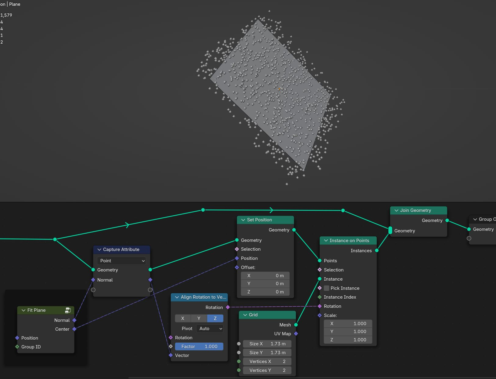
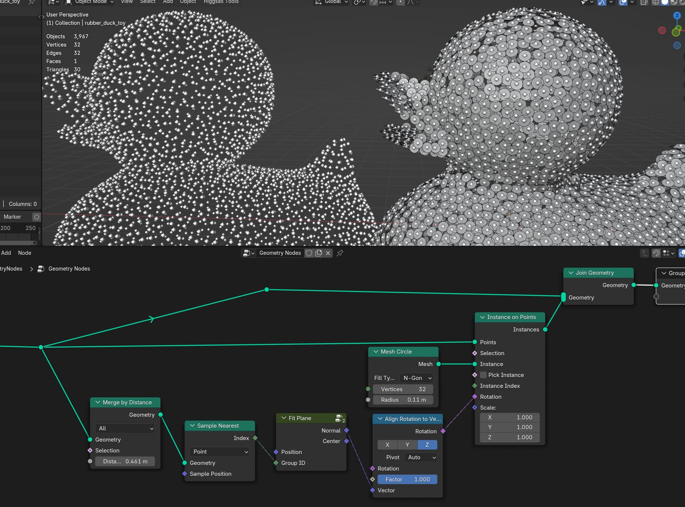
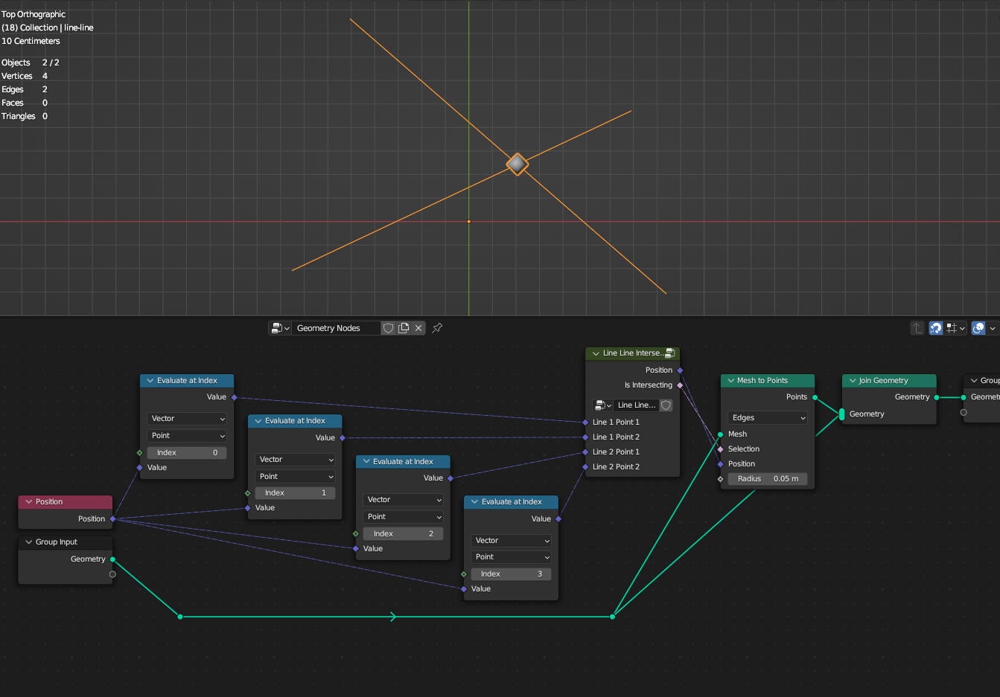
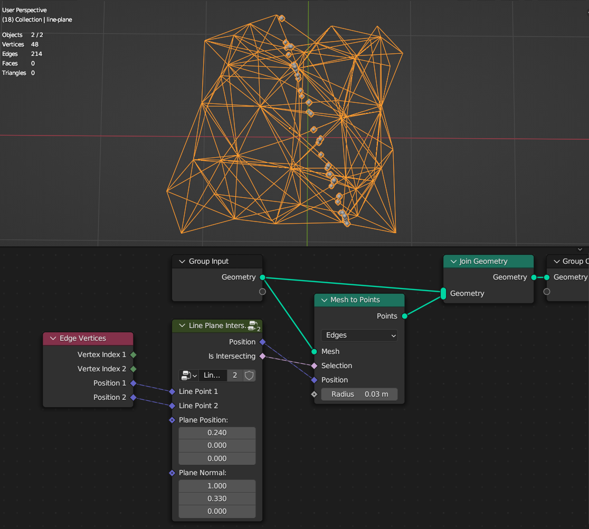
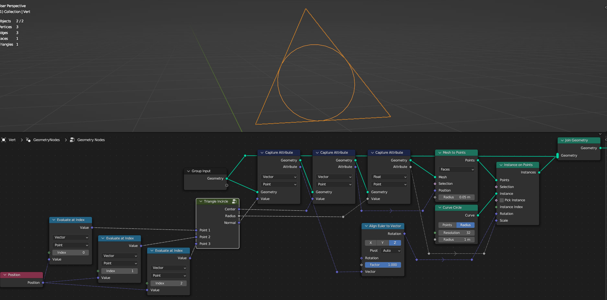
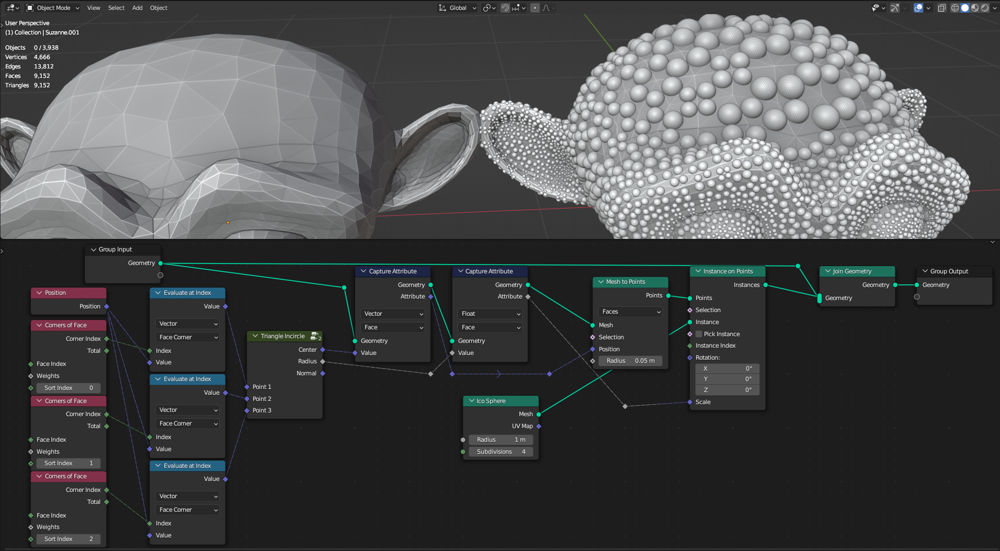

Geometry Measure
===================================

************************************************************
Face Tangent
************************************************************

Creates Direction Vector that points from Face center to its edge

Order
  Selects to which face edge vector points
  
Aligh to Direction
  Choses direction that are closest to the **Direction** input

Direction
  Direction
  
Corner Tangent
  Creates Direction Vector that points from Face center to its vertex

************************************************************
Fit Plane
************************************************************

Creates diretional normal vector given point cloud 

.. image:: images/fitp.JPG

Position
  Position of the points
  
Group ID
  Group if for points

************************************************************
Gradient Direction
************************************************************

Creates directional vector from gradient 

Gradient
  Gradient float input
  
Solenoidal
  Divergence-free vector field

************************************************************
Instances Bounding Box
************************************************************

Generates bounding box min max values for each instance in global coordinate space

.. image:: images/bboxinst.JPG

Min
  Min of bounding box

Max
  Max of bounding box

************************************************************
Line Line Intersection
************************************************************

Calculates intersection point between 2 lines on the Z axis

Line 1 Point 1
  First point of the line

Line 1 Point 2
  Second point of the line

Line 2 Point 1
  First point of the line

Line 2 Point 2
  Second point of the line

************************************************************
Line Plane Intersection
************************************************************

Calculates intersection points between lines and plane

Line Point 1
  First point of the line

Line Point 2
  Second point of the line

Plane Position
  Position of intersection plane

Plane Normal
  Normal of intersection plane

************************************************************
Mesh Ambient Occlusion
************************************************************

Calculates mesh ambient occlusion

  
Rays Samples
  Amount of rays for sampling
  
Rays Angle
  Angle that rays direction will be randomly rotated. Bigger angle will give more accurate results but with more noise

Seed
  Random seed of the rays random direction
  
Blur Iterations
  Smooth ambient occlusion map
  
External Mesh
  Uses external mesh that rays will hit from main mesh to calculate ambient occlusion map
  

  
Attribute
  Name of the thickness value attribute on point domain 
  
.. warning::
    Node can be really slow depending on mesh density and rays samples. You can "bake it" by applying geometry nodes modifier and the "ao" attribute will be stored on the mesh

************************************************************
Mesh Curvature
************************************************************

Calculates different types of mesh curvatures

Angle Unsigned

  
Angle Signed

Gaussian Curvature

Mean Curvature

************************************************************
Mesh Fresnel
************************************************************

Calculates mesh fresnel from camera point of view

  
Camera/Origin
  Uses Camera or Custom origin location for calculating direction 

Origin
  Location of hte origin

Bias
  Offset of the fresnel

Scale
  Intensity of the fresnel

Exponent
  Falloff of the fresnel

************************************************************
Mesh Island Measure
************************************************************

Calculates Area, Center, Area Center of Mass for each mesh island

Area
  Area of the mesh
  
Center
  Position from average vertex locations

Area Center of Mass
  Position of Area Center of Mass
  
  
************************************************************
Mesh Measure
************************************************************

Calculates mesh total Volume, Area, Volume Center of Mass, Area Center of Mass

Volume
  Volume of the mesh
  
Area
  Area of the mesh
  
Volume Center of Mass
  Position of Volume Center of Mass

Area Center of Mass
  Position of Area Center of Mass

************************************************************
Mesh Tension
************************************************************

Creates Compression and Tension masks by comparing edge lenghts before and after mesh deformation

.. image:: images/tension.jpg
.. image:: images/tension3.jpg
.. image:: images/tension4.jpg

Rest Position
  Position attribute that needs to be captured/stored before the mesh deformation happens. If using Armature use "rest_position" attribute by enabling it in properties/data tab

.. image:: images/tension2.jpg

Strength Tension
  Strength of the Tension mask

Strength Compression
  Strength of the compression mask
  
Bias Tension
  Offset of the tension values 
  
Bias Compression
  Offset of the compression values 

Clamp
  Clamps tension and compresions mask values between 0 and 1

************************************************************
Mesh Thickness
************************************************************

Calculates mesh thickness 

  
Rays Samples
  Amount of rays for sampling
  
Rays Angle
  Angle that rays direction will be randomly rotated. Bigger angle will give more accurate results but with more noise

Seed
  Random seed of the rays random direction
  
Normalize
  Fits values between 0 to 1
  
Attribute
  Name of the thickness value attribute on point domain 
  
.. warning::
    Node can be really slow depending on mesh density and rays samples. You can "bake it" by applying geometry nodes modifier and the "thickness" attribute will be stored on the mesh

************************************************************
Triangle Incircle
************************************************************

Calculate incircle from triangle

Point 1
  Point 1 of triangle
  
Point 2
  Point 2 of triangle

Point 3
  Point 3 of triangle

Center
  Center of circle

Radius
  Radius of circle

Normal
  Normal direction of circle

************************************************************
UV Tangent
************************************************************

Creates directional vector from UV map on face domain

UV
  UV map input for direction calculation
  
U/V
  Choses UV map alightment axis to **U** or **V**

  
  
