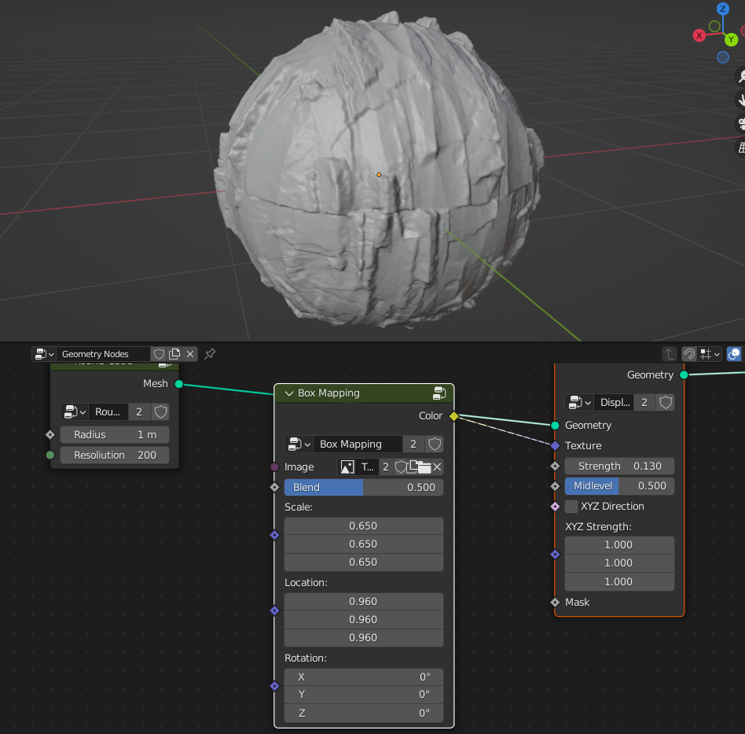
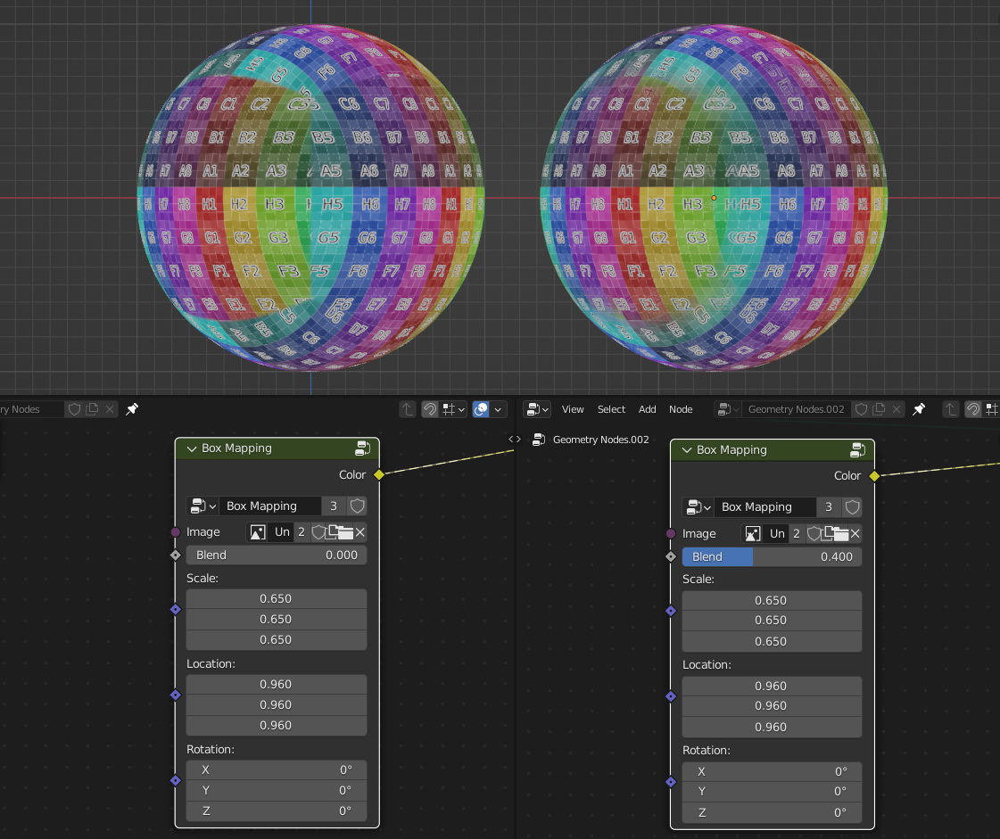

Image
===================================

************************************************************
Image Box Mapping  
************************************************************

Map image on mesh using box mapping method 

Image
  Input of the image that will be box mapped on the mesh
  
Blend
  Blends between seams

Translation
  Translation of box mapping
  
Rotation
  Rotation of box mapping
  
Scale
  Scale of box mapping

************************************************************
Image Pixel Sorting
************************************************************

Sorts image pixel values on rows or columns

Image
  Image input
  
Resoliution Scale
  Grid resolution scale from image pixels
  
Vertical/Horizontal
  Sorts pixels values in vertical strips or horizontal

Frame
  Current frame of image/video

Threshold - Lightness/Saturation/Hue/Red/Blue/Green
  Image grey scale channels that will be used by Treshhold

Threshold
  Threshold selection where pixel sorting will happen

Invert Threshold
  Inverts threshold selection

Sorting - Lightness/Saturation/Hue/Red/Blue/Green
  Image grey scale channels that will be used for sorting pixels

Invert Sorting
  Invers sorting values

Randomize
  Randomly splits veritcal or horizontal sorting groups

.. image:: images/imgsort6.JPG
  
Seed
  Seed of randomize

.. tip::
    To correctly render the image:
    
    - Set camera to Orthographic mode 
    - Set scene resolution that matches image. Node outputs image Width and Height to help set scene resoliution 
    - Use Cycles render endgine with sample of 1 to get most accurate results. Samples above 1 will create blury pixels 
    
    .. image:: images/imgsort4.JPG

************************************************************
Image to Ascii
************************************************************

Creates Ascii from image

.. image:: images/i_t_ac.jpeg

Image
  Image input
  
Resoliution
  Grid resolution of Ascii
  
Img Res X
  Input image X resolution

Img Res Y
  Input image Y resolution

Contrast Min
  Min contrast of the image values

Contrast Max
  Max contrast of the image values

Ascii
  Ascii characters that used for gradient values. Black/empty is space " " 
  
Frame
  Frame of the image input
  
Color Attribute
  Creates color attribute from image colors
