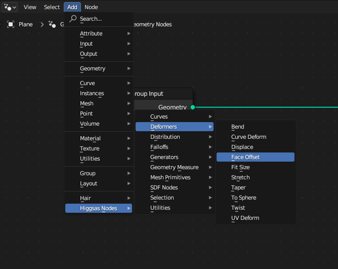

Higgsas geometry nodes groups manual
===================================

.. image:: images/mainnodes2.jpg

`Gumroad <https://higgsas.gumroad.com/l/wrusot>`_

`Blendermarket <https://blendermarket.com/products/geometry-nodes-groups>`_

`Artstation <https://www.artstation.com/marketplace/p/Wm5o5/higgsas-blender-3-3-3-4-3-5-geometry-nodes-groups-toolset-pack>`_ 

Contents
--------

.. toctree::

   installation
   camera
   curves
   curveprimitives
   deformers
   distribution
   falloffs
   generators
   geometry_measure
   image
   primitives
   sdf
   selection
   simulation
   uv
   utilities
   vectorfields

.. toctree::

   experimental
   contact
   updates
