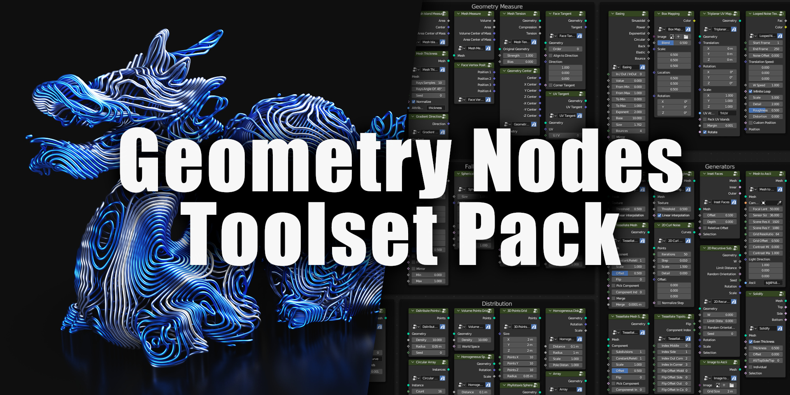

Higgsas geometry nodes groups manual
===================================

`Gumroad <https://higgsas.gumroad.com/l/wrusot>`_

`Blendermarket <https://blendermarket.com/products/geometry-nodes-groups>`_

`Artstation <https://www.artstation.com/marketplace/p/Wm5o5/higgsas-blender-3-3-3-4-3-5-geometry-nodes-groups-toolset-pack>`_ 

Contents
--------

.. toctree::

   installation
   deformers
   generators
   geometry_measure
   utilities
   distribution
   curves
   primitives
   selection
   falloffs
   sdf
   simulation
   uv

.. toctree::

   experimental
   contact
   updates
