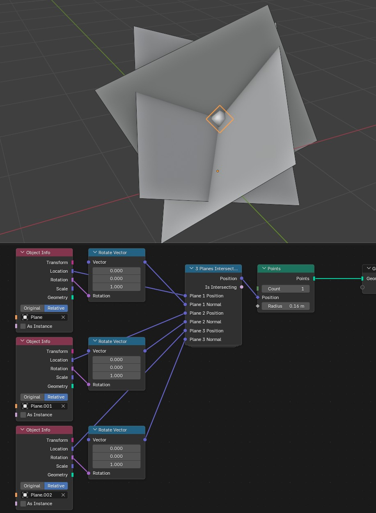
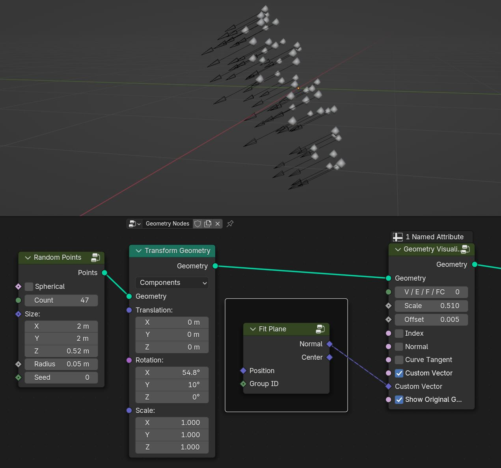
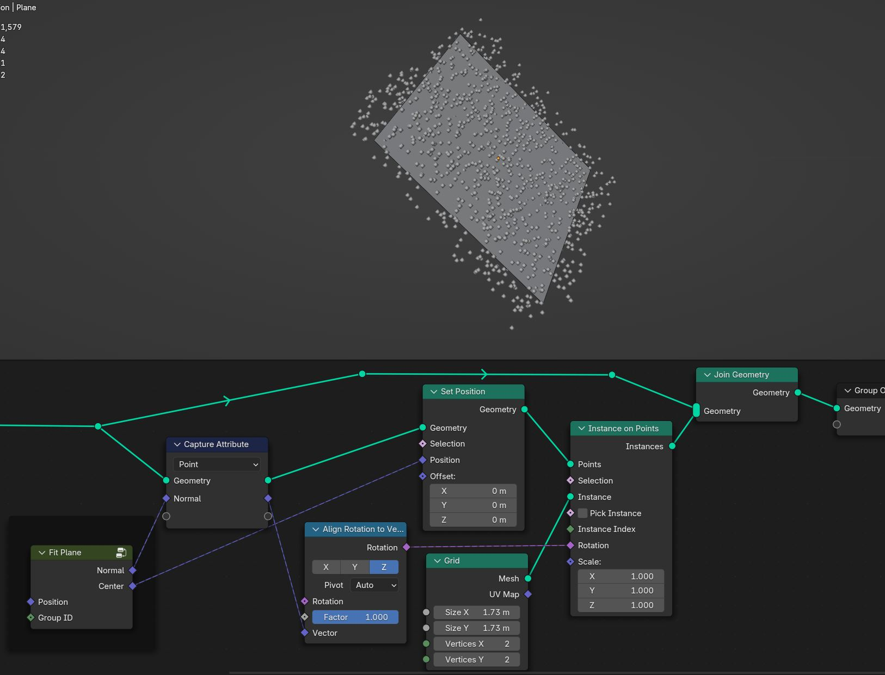
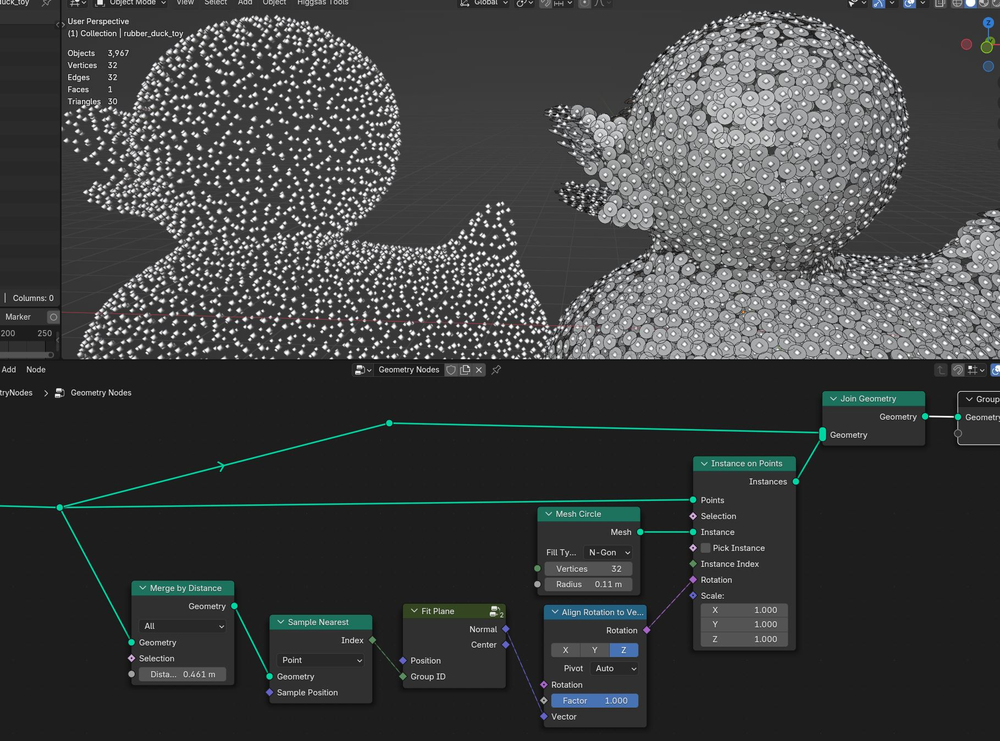
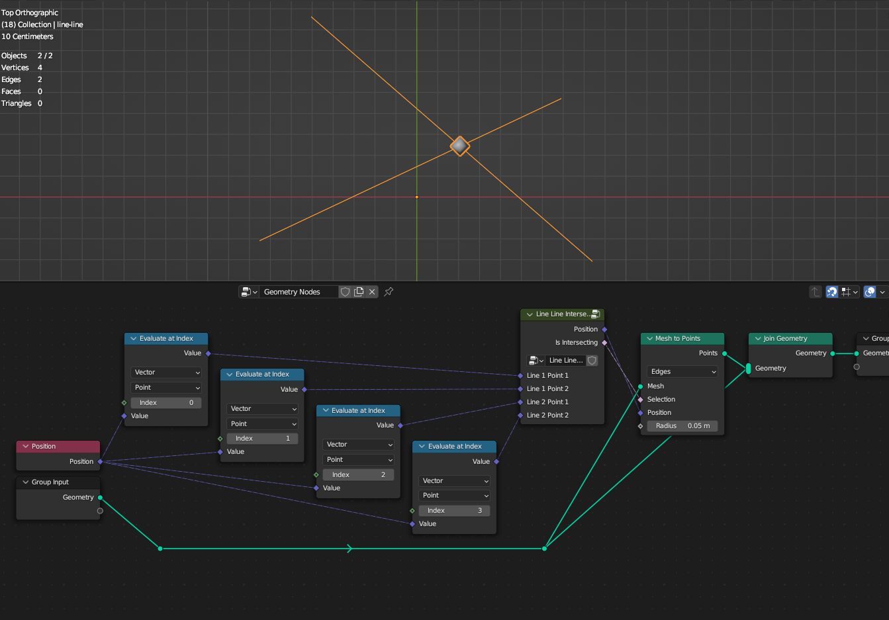
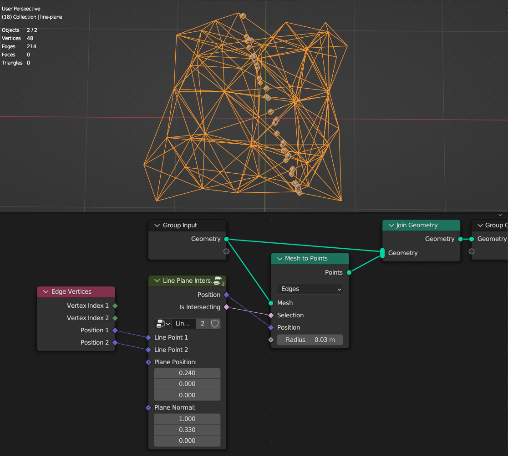
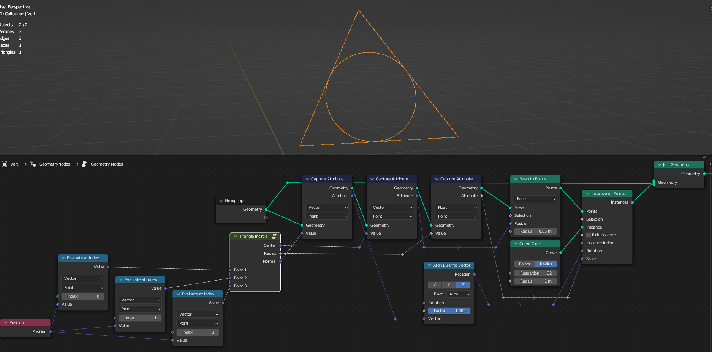
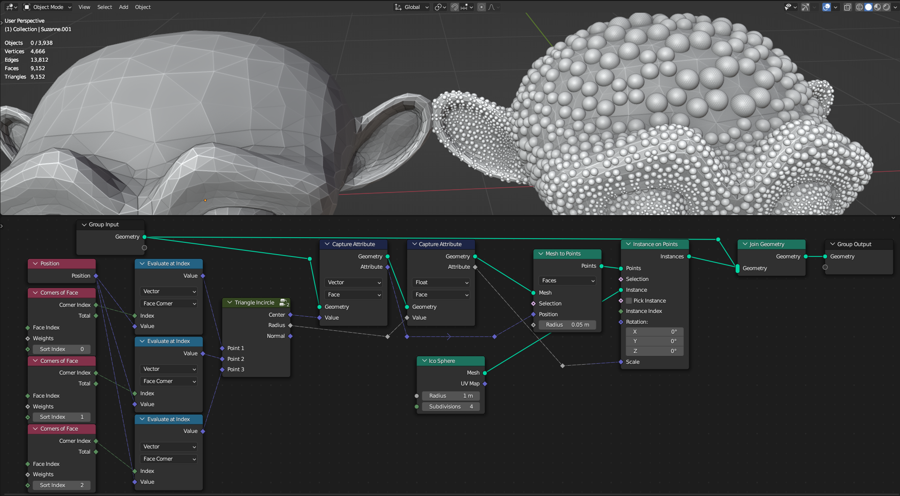

Linear Algebra
===================================

************************************************************
3 Planes Intersection
************************************************************

Creates diretional normal vector given point cloud 

Plane 1 Position
  Position of plane
  
Plane 1 Normal
  Normal of plane

Plane 2 Position
  Position of plane
  
Plane 2 Normal
  Normal of plane

Plane 3 Position
  Position of plane
  
Plane 3 Normal
  Normal of plane

************************************************************
Fit Plane
************************************************************

Creates diretional normal vector given point cloud 

Position
  Position of the points
  
Group ID
  Group if for points

************************************************************
Line Line Intersection
************************************************************

Calculates intersection point between 2 lines on the Z axis

Line 1 Point 1
  First point of the line

Line 1 Point 2
  Second point of the line

Line 2 Point 1
  First point of the line

Line 2 Point 2
  Second point of the line

************************************************************
Line Plane Intersection
************************************************************

Calculates intersection points between lines and plane

Line Point 1
  First point of the line

Line Point 2
  Second point of the line

Plane Position
  Position of intersection plane

Plane Normal
  Normal of intersection plane

************************************************************
Triangle Incircle
************************************************************

Calculate incircle from triangle

Point 1
  Point 1 of triangle
  
Point 2
  Point 2 of triangle

Point 3
  Point 3 of triangle

Center
  Center of circle

Radius
  Radius of circle

Normal
  Normal direction of circle
