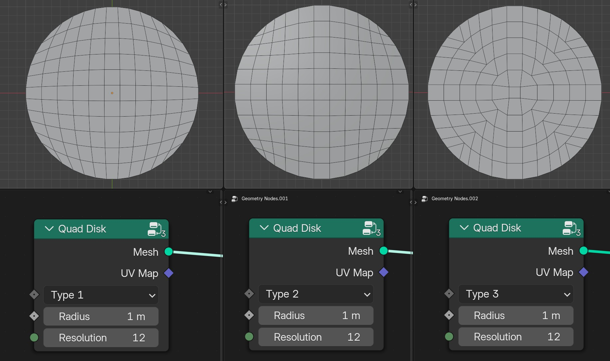
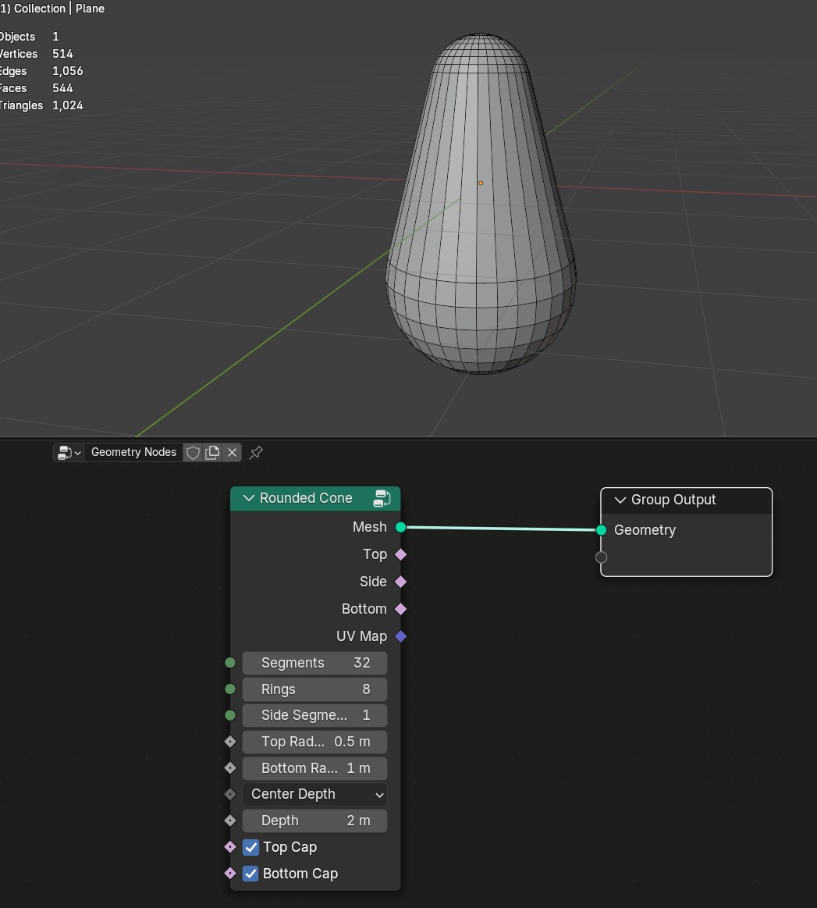

Mesh Primitives
===================================

************************************************************
Bricks Grid
************************************************************

Creates bricks grid

X Grid Size
  Size of X axis
  
Y Grid Size
  Size of Y axis
  
Absolute Grid Size
  Will mach exactly size of grid 
  
X Brick Size
  Brick size of X axis
  
Y Brick Size
  Brick size of Y axis

Offset
  Offset of every second brick row
  
Side Bricks
  Adds side bricks

Mortar Size
  Creates gap between bricks
  
Depth
  Adds depth to the bricks

Depth Size
  Size of the bricks depth

Can also be using with repeat zone to create multiple bricks walls

************************************************************
Cairo Tile Grid
************************************************************

Hexagon grid mesh primitive

Size
  Size of the grid
  
Tile X
  Number of tiles on **X** axis

Tile Y
  Number of tiles on **Y** axis

Tile Angle
  Rotation of the tile shape

Gap
  Gap between tiles
  
Constant Hex Size
  Tile size will be controlled by **Size** input
  
Merge
  Tiles will be merged

************************************************************
Capsule
************************************************************

Mesh capsule primitive

Segments
  Number of segments
  
Rings
  Number of rings
  
Side Segments
  Number of side segments
  
Radius
  Radius of the capsule
  
Depth
  Depth of the capsule
  
**Top Cap**

- **On:** Round cap
- **Off:** Flat cap

**Bottom Cap**

- **On:** Round cap
- **Off:** Flat cap

Top
  Selection of top cap
  
Side
  Selection of side capsule
  
Bottom
  Selection of bottom cap

************************************************************
Gabriels Horn
************************************************************

Hexagon grid mesh primitive

************************************************************
Hexagon Grid
************************************************************

Hexagon grid mesh primitive

Size
  Size of the grid
  
Hex X
  Number of hexagon tiles on **X** axis

Hex Y
  Number of hexagon tiles on **Y** axis

Gap
  Gap between hexagons tiles
  
Constant Hex Size
  Hexagon size will be controlled by **Size** input
  
Merge
  Hexagon tiles will be merged

************************************************************
Klein Bottle
************************************************************

Klein Bottle Mesh

************************************************************
Oloid
************************************************************

Oloid mesh

Outer Resolution
  Outer Resolution

Inner Resolution
  Inner Resolution

Size
  Size of the oloid

************************************************************
Pyramid
************************************************************

Pyramid mesh

************************************************************
Quad Disk
************************************************************

Pyramid mesh

************************************************************
Quad Sphere 
************************************************************

Quad sphere mesh primitive

************************************************************
Rounded Cone
************************************************************

Rounded cone mesh primitive

************************************************************
Spur Gear
************************************************************

Spur gear mesh primitive

Module
  Size of a gear tooth

Teeth
  Gear teeth count

Pressure  Angle
  Angle formed between the tooth face and the gear wheel tangent

Height
  Height of the gear

Addendum Factor
  Radial distance from Pitch Circle to the top of the gear tooth

Dedendum Factor
  Distance from Pitch Circle to the bottom of the gear tooth

Teeth Resolution
  Resolution of the teeths

**Flat Fillet/Circular Fillet**

Side Segments
  Side segmets count of the gear

Rotate Half Teeth
  Roates gear half of the teeth

Rotate
  Rotation of the gear

************************************************************
Super Ellipsoid
************************************************************

3d shape that generalizes an ellipsoid

************************************************************
Rounded Cube
************************************************************

Rounded cube mesh primitive

************************************************************
Torus Knot
************************************************************

Torus knot mesh and curve primitive

.. image:: images/torus_knot.PNG

Major Resolution
  Resoliution of the knot curve
  
Minor Resoliution
  Resoliution of the profile curve
  
Profile Radius
  Radius of the profile curve
  
Major Radius
  Radius of the knot curve
  
Minor Radius
  Radius of the profile curve
  
P
  Integer number for the equation  
  
Q
  Integer number for the equation  
   
Trefoil Knot
  Trefoil Knot
  

Curve
  Outputs torus knot curve

************************************************************
Triangle Grid
************************************************************

Triangle grid mesh primitive

Size
  Size of the grid
  
Hex X
  Number of triangle tiles on **X** axis

Hex Y
  Number of triangle tiles on **Y** axis

Gap
  Gap between trianle tiles
  
Constant Hex Size
  Triangle size will be controlled by **Size** input
  
Merge
  Triangle tiles will be merged

  
  
  
  
  
  

