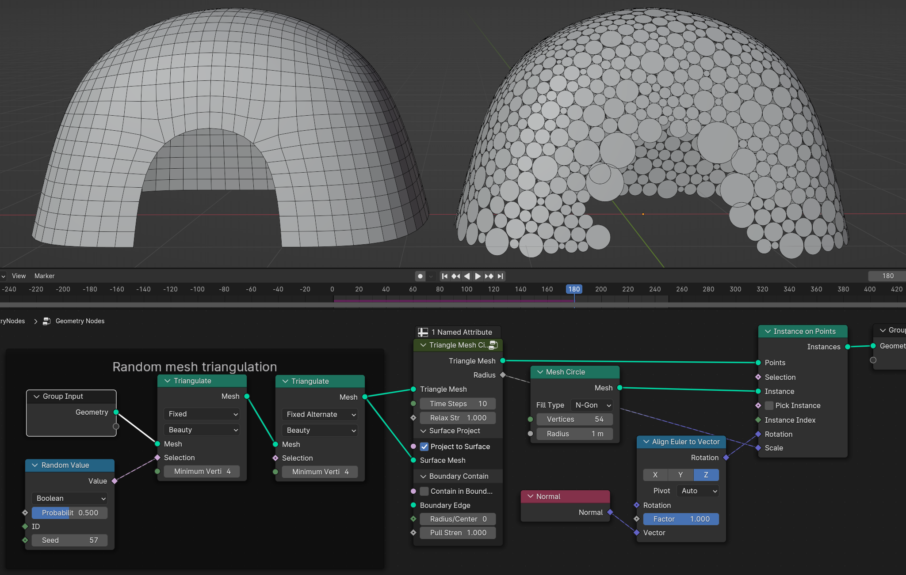
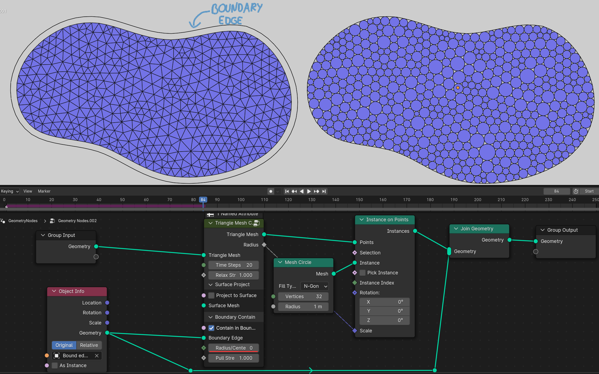
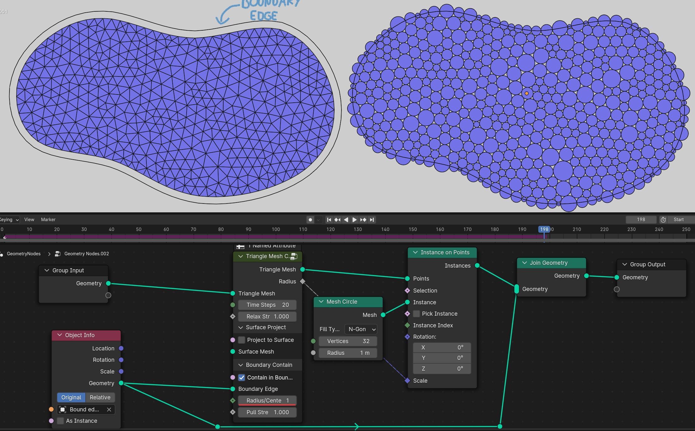
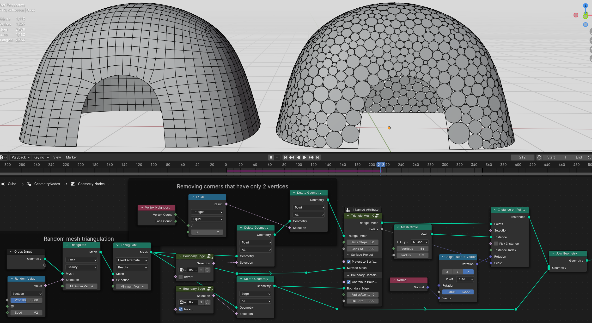

Simulation
===================================

************************************************************
Reaction Diffusion Solver
************************************************************

Creates growing/mixing effect between two virtual chemicals 

.. image:: images/reactdiff1.PNG
.. image:: images/reactdiff.gif
.. image:: images/reactdiff2.PNG

Inside Reaction Diffusion Solver node group (tab to open)

.. image:: images/reactdiff3.PNG

A
  Chemical A value stored on the mesh (set to 1)

B
  Chemical B value stored on the mesh (set it to some random texture/noise that effect will growth from)

F
  Chemicals feed rate

K
  Chemicals kill rate

.. image:: images/reactshow.png

T
  Time scale of the simulation (going above 1.5 simulation will become unstable)

Scale
  Scale of the grouth pattern

.. image:: images/diffsale.png

************************************************************
Image Points Stippling
************************************************************

Recreates image using point/dots for the gradiant shading using weighted voronoi technique 

.. image:: images/stipp1.JPG
.. image:: images/stipp2.JPG
.. image:: images/stipp3.JPG

**Setting up the solver**

- First open image of your choice 
- Connect **Initial Distribution View** to the **Group Output** or a viewer node
- Adjust **Min Brightness** and **Max Brightness** to best match gradient of the image 

.. image:: images/stippa1.JPG

- **Min Points Amount** and **Max Points Amount** controls density of points for bright and dark portions of the image. For the best results adjust **Min Points Amount** to get small amount of points in bright areas while keeping image contrast, can leave it to the default. **Max Points Amount** can be decreased if you have too many points in dark areas, preferably leave it default of 1

.. image:: images/stippa2.JPG
.. image:: images/stippa3.JPG

- **Min Distance** controls density in the dark areas, lower values will results in more points in dark areas. Be carefull not to set value too low, resulting in way too many points that will slow simulation significantly. For decent results aim total point count somewhere between 10k / 30k

- **Points Count** initial points count that points will be deleted using image brightness values. Preferably leave it to the default and only increase it, if in some areas points are too sparse

**Simulation**

- After adjusted Initial Distribution settings, connect **Points Stippling Simulation** to the Group Output and rund the simulation

.. image:: images/stipps1.JPG
.. image:: images/stipps2.JPG

- Usually it will take about 50 frames to get good stippling effect
- Instancing spheres on to points with small radius

.. image:: images/stipps3.JPG

- **Sharpness/Softness** controls the gradient of the points distribution, negatives values will results in sharper gradient cut off, positives values results in softer gradient. Preferably use the values in between 0 and 1

.. image:: images/stipps4.JPG
.. image:: images/stipps5.JPG
.. image:: images/stipps6.JPG

- **Sharpness Scale** controls gradient difference between bright and dark ares. If set **Sharpness Scale** to 0, points in bright ares will not apear. Leave it default value 0.01 

.. image:: images/stipps7.JPG

- **Grid Resolution** used to calculate weighted voronoi coordinates for points directions to move. For better quality of points distribution, grid resolution can be increased. Make sure keep it around 1200 / 2000 or higher grid resolution will make simulation significantly slower

- **Color** attribute can be use for controlling points scale from image texture for better effect

.. image:: images/stipps8.JPG

- Stippling effect can be inverted by inverting **Min Brightness** and **Max Brightness** values

.. image:: images/stipps9.JPG

- To apply the simulation, apply geo nodes modifier with realized circle instances, or convert points to vertices by using **Points to Vertices** nodes and apply the geo nodes modifier

.. tip::
    You can use fill curve trick to convert points to triangular mesh 
    
    .. image:: images/stipps10.JPG

************************************************************
Triangle Mesh Circle Packing
************************************************************

Relaxes triangulated mesh to fit tangent circles using simulation

.. image:: images/tmeshc.PNG
.. image:: images/tmeshc1.PNG

Time Steps
  Number of simulation steps per frame

Relax Strenght 
  The amount of relaxation per step. Going above 1 can create unstable simulation. Value bellow 1 will slow down the simulation for more stable relaxations, but it slow down convergence for circle packing. Preferably leave at 1
  
Project to Surface
  Will shrinkwraps relaxed mesh to input mesh to keep the shape

Surface Mesh
  Surface mesh that triangle mesh will be shrinkwraped

Contain in Boundary
  Tries to contain circles inside the boundary edge

Boundary Edge
  Mesh boundary edge

**Radius/Center**

- **0** Circles will touch the boundary edge with circle side. **Important** boundary edge must be some distance offsetted from triangle mesh
- **1** Circles center will be on the boundary edge

Pull Strength
  Strength for pulling circles to the boundary edge

**Using boundary edge on 3d surface**

.. warning::
    **Limitations**

    Boundary trianges that has only 2 vertex neighbors will not move during simulation and can give bad packing results

    .. image:: images/tmeshc10.PNG

    Best is to avoid these triangles when generating triangular mesh if posible, if not simple solution would be deleting vertices with only 2 neighbors untill no more bad triangles left

    .. image:: images/tmeshc11.PNG
    .. image:: images/tmeshc12.PNG

    In some cases circles on edges can overlap
    
    .. image:: images/tmeshc7.PNG

    Surfaces that has holes inside will not pack well

    .. image:: images/tmeshc8.PNG    

