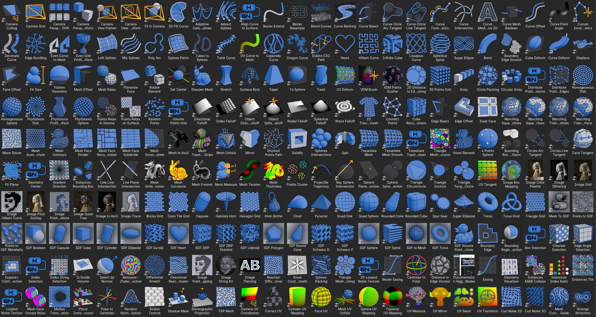
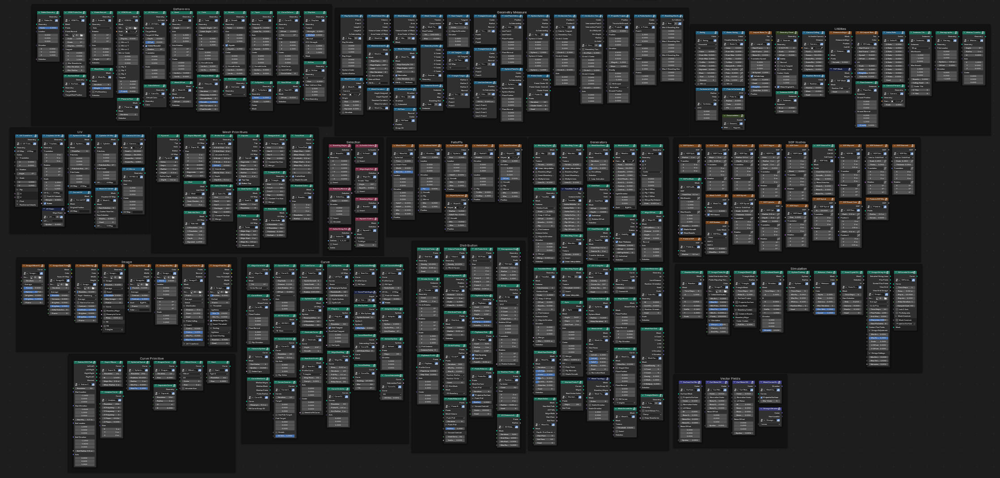
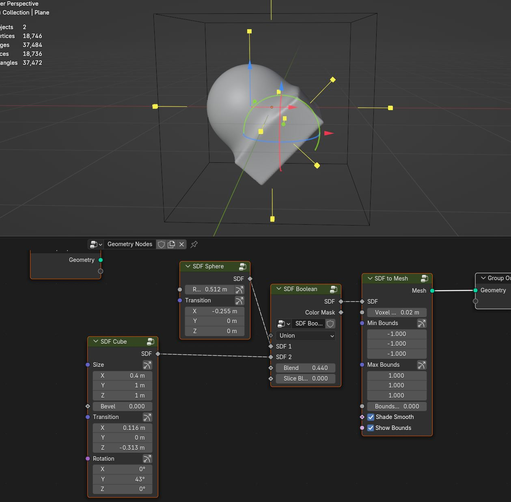
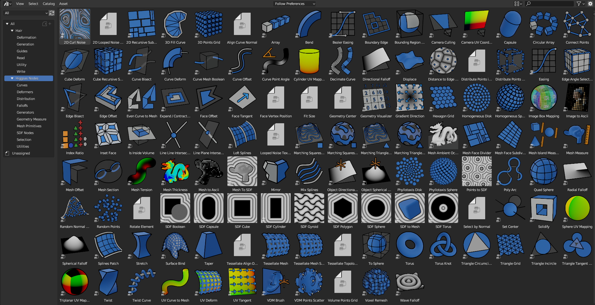
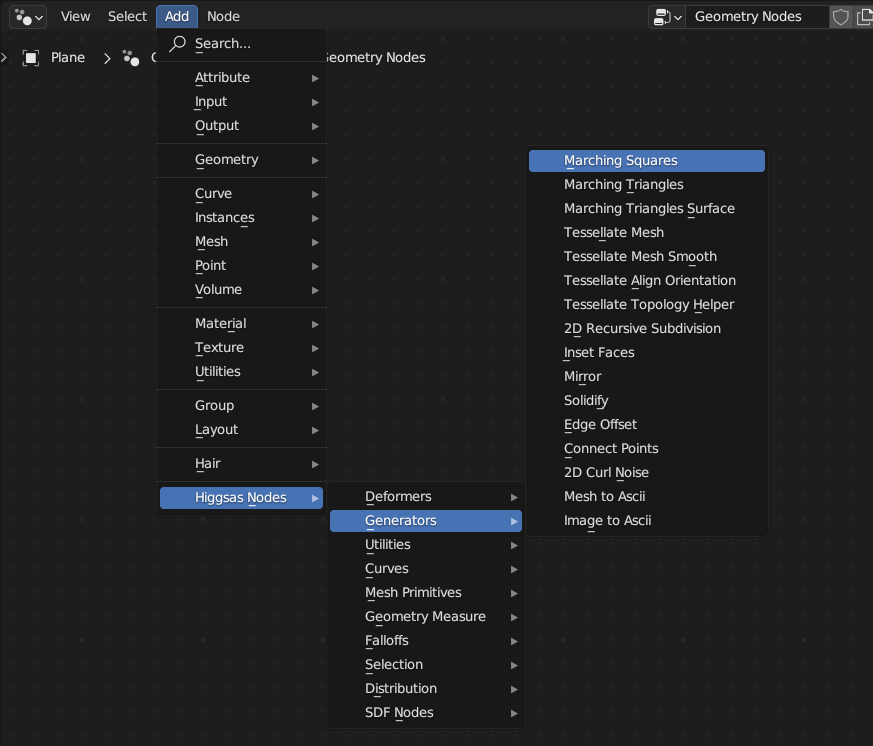

Updates
===================================

**2025-11-21 Update**

**New Nodes:**

- Plane Plane Intersection
- Face Points Grid Distribution
- Ripples Solver
- Mesh Falloff
- Mesh Points Fracture
- Mesh Islands to Instances
- Wrap

**Updates:**

- Added Blender 5.0 version
- Added new category: Instances
- Renamed "Adaptive Catenary Curves" to "Dynamic Catenary Curves"

**2025-10-28 Update**

**New Nodes:**

- Bezier Curve Resample
- Image Grid
- Bezier Extend
- Image Color Palate
- Image Thinning
- Camera Grid
- Camera Perspective Shift
- Index Selection
- SDF Lidinoid 
- SDF IWP
- SDF IWP Skeletal
- Fit in Camera
- Face UV
- Scales Texture
- Index Falloff
- Quad Disk
- UV Measure
- Camera View Transform
- Shadow Mask
- Boundary Edge Smooth
- UV Align to Direction

**Updates:**

- Renamed "Index Ratio" to "Instances Index Ratio", added collapsible values for ease of use
- Added new options to "Set Center" node
- Sli1ghtly improved "Triangle Mesh Circle Packing" node
- Updated nodes icons visuals, added missing nodes icons

- Removed "Mesh Island Measure" node. Combined same functionality into "Mesh Measure" node. Added Bounds Center output
- Improved "Curve Bisect" node
- "Marching Squares/Triangles Isolines" slightly faster
- Improved "Mesh to Ascii" node 
- "Image nodes" and "Reaction Diffusion" nodes now automatically adds material

**2025-10-20 Update**

Added dark-theme to the documentation website

**2025-09-16 Update**

**Updates:**

- Added Blender 4.5 version
- Various node groups UI updates for 4.5 version
- Set Center - Added Edge/Corners centers option
- Camera Culling - simplified node - removed camera info input values, now works with orthographic camera
- Camera UV Coordinates - simplified node - removed camera info input values, now works with orthographic camera. Added Normalized and Uniform options

**New Nodes:**

- Rounded Cone
- Box Selection
- Checker Selection
- Spur Gear
- Curve Forward Kinematics
- Infinite Cube
- Mesh Auxetic Structure 
- Mesh Face Groups Relax
- Blend Curves

**2025-05-20 Update**

**New Nodes:**

- Strange Attractors
- SDF Diamond - https://higgsas-geo-nodes-manual.readthedocs.io/en/latest/sdf.html#sdf-diamond
- Circles Arc Tangent
- Circles Line Tangent
- Image String Art
- Place objects on ground
- Projectile Trajectory
- Image Quad Tree
- Even Grid Profile Surface
- Klein Bottle - https://higgsas-geo-nodes-manual.readthedocs.io/en/latest/primitives.html#klein-bottle
- Image Hilbert Curve
- Curve Median Axis 2D - https://higgsas-geo-nodes-manual.readthedocs.io/en/latest/curves.html#curve-median-axis-2d
- Spherical Spiral - https://higgsas-geo-nodes-manual.readthedocs.io/en/latest/curveprimitives.html#spherical-spiral
- Super Ellipse
- Super Ellipsoid
- Shortest Points Path - https://higgsas-geo-nodes-manual.readthedocs.io/en/latest/generators.html#shortest-points-path
- Curves Inverse Kinematics
- 4 Points Sphere
- Capadera Curve - https://higgsas-geo-nodes-manual.readthedocs.io/en/latest/curveprimitives.html#capareda-curve
- Gabriels Horn
- Instances Tile
- Flatten Geometry
- Lissajous Curve
- Differential Growth
- Camera Perspective to Orthographic Transformation
- Curve Circles Arc Tangent
- Dubins CSC Path
- Stereographic Projection
- Pyramid - https://higgsas-geo-nodes-manual.readthedocs.io/en/latest/primitives.html#pyramid
- Mobius Transformation
- Points Cluster
- Bounding Box AABB Collision

**Updates:**

- Added 4.4 Blender Version
- Added color tag to all nodes for better readability

- Instances Bounding Box much faster in Blender 4.3 version
- Mesh Face Strips now works with triangles while using Guide Direction
- Renamed "2D Hilbert Curve" to "Hilbert Curve" and added 3d Hilbert Curve variation
- Changed and renamed "Align Curve Normal" to "Align Curve to Surface"
- Curve Deform now take into account the curve radius
- Mesh Unfold - node now 6 times faster and preserve materials and other attributes
- Tessellate Mesh - Added Keep Z Offset option, added Align to Direction option and now works with triangle faces
- Removed "Tessellate Align Orientation" node, now its integrated in tessellate nodes
- Wave Falloff - added "Cylindrical" option and fixed falloff option being incorrect
- Reworked and renamed "Curve Circle Inner/Outer Tangent Lines" to "Curve Circle Line Tangent"
- Fixed "TSP Mesh" creating multiples splines, added "Shortest Path" option - https://higgsas-geo-nodes-manual.readthedocs.io/en/latest/utilities.html#tsp-mesh
- Fixed "Instances AABB Collision" node deleting too many instances, now it preserves 1.5x times more non intersecting instances and its 2x times faster in some cases
- Added XYZ option in "Array" node

**2024-11-28 Update**

Added Gizmos to SDF nodes

Added Gizmo to Bezier Easing 

Added Solid option to SDF Gyroid

Added Slice and Xor options to SDF Boolean

Fixed SDF to Mesh node inconsistent grid location

**New Nodes:**

Delete mesh smooth

SDF Spiral

SDF Round Cone

Dragon Curve

SDF Schwarz P

**2024-10-23 Update**

Revorked face tangent node

Added option to Fit Size node - Fit in Geometry

Added Absolute option to Mesh Fresnel node

Added Push/Pull option in Points Relax on Surface node

Remade and renamed 2D Recursive Subdivision to Mesh Face Recursive Subdivision. Also it works with any quad and triangle faces

**New Nodes:**

Fit Plane - https://higgsas-geo-nodes-manual.readthedocs.io/en/latest/geometry_measure.html#fit-plane

Oloid - https://higgsas-geo-nodes-manual.readthedocs.io/en/latest/primitives.html#oloid

Cairo Tiles Grid - https://higgsas-geo-nodes-manual.readthedocs.io/en/latest/primitives.html#cairo-tile-grid

Points Relax in Volume - https://higgsas-geo-nodes-manual.readthedocs.io/en/latest/distribution.html#points-relax-in-volume

Belousov-zhabotinsky Reaction - https://higgsas-geo-nodes-manual.readthedocs.io/en/latest/simulation.html#belousovzhabotinsky-reaction

**2024-10-11 Update**

Renamed Effects node category to Vector Fields to better match what nodes do

Adden new nodes category - Image

Removed old 2D Curl Noise node, you can achieve same results with better performance using Advect Splines + Curl Noise 2D/3D

Added NURBS option in Lost Splines Node

Reworked Expand / Contract Selection node to improve performance

**New Nodes:**

Polar to Cartesian

Cartesian to Polar

Triangle Mesh to Voronoi - https://higgsas-geo-nodes-manual.readthedocs.io/en/latest/generators.html#triangle-mesh-to-voronoi

Mesh Curvature - https://higgsas-geo-nodes-manual.readthedocs.io/en/latest/geometry_measure.html#mesh-curvature

Mesh Fresnel - https://higgsas-geo-nodes-manual.readthedocs.io/en/latest/geometry_measure.html#mesh-fresnel

Points Relax

Image Points Distribute

Image Trace

Image Dithering - https://higgsas-geo-nodes-manual.readthedocs.io/en/latest/image.html#image-dithering

UV Transform

Sphere Plane Intersection

2D Distance to Edge Circle Packing - https://higgsas-geo-nodes-manual.readthedocs.io/en/latest/distribution.html#d-distance-to-edge-circle-packing

Ray Sphere Intersection

Index String Selection - https://higgsas-geo-nodes-manual.readthedocs.io/en/latest/selection.html#index-string-selection

**2024-09-09 Update**

Added new option in Image Pixel Sorting - Max Threshold/Min Threshold, for more control 

**2024-09-08 Update**

Added option in Image Pixel Sorting - Whole Image Sort

**2024-09-08 Update**

Added Image Pixel Sorting

**2024-09-07 Update**

Added Curve Intersection

**2024-08-29 Update**

Added documentation for Mesh Topology Face Strips

https://higgsas-geo-nodes-manual.readthedocs.io/en/latest/generators.html#mesh-topology-face-strips

**2024-08-27 Update**

Added Mesh Unfold - https://higgsas-geo-nodes-manual.readthedocs.io/en/latest/generators.html#mesh-unfold

**2024-08-25 Update**

Fixed Even Curve to Mesh not working with bezier curves

**2024-08-21 Update**

Added version for blender 4.2 with some updates

Camera Culling - updated with matrix nodes making it faster

Camera UV Coordinates - updated with matrix nodes making it faster

Bend - updated with matrix nodes making it 2-5 times faster

VDM Points Scatter - updated with matrix nodes making it 2-5 times faster

VDM Brush - added Fast/Accurate modes. Fast mode increse performance up to 10 times compate to accurate mode

Twist, Strech, Taper - added Smooth Limits option

Box Image Mapping - updated with matrix nodes

Sphere/Cyling UV Mapping - updated with matrix nodes

New nodes:

Mesh Curve Direction Guide

Correct UV

UV Seam

**2024-04-20 Update**

Added 2 new nodes: 2D Hilbert Curve, Bricks Grid

Removed installation guide for blender 3.3 version because it caused confusion

**2024-03-29 Update**

Added Blender 4.1 version with some improvements

Added position attribute to falloffs nodes in blender 4.1 

Normalized falloffs directions

Improved mesh contours fill curves performance in blender 4.1 

Improved Easing node usability using new menus switch in blender 4.1 

3d curve fill much faster in blender 4.1

VDM Points Scatter added better option for boundaries blur

**2024-03-27 Update**

Added option to submit feedback using Google Forms - https://higgsas-geo-nodes-manual.readthedocs.io/en/latest/contact.html 

**2024-03-19 Update**

23 New Nodes

Instances Bounding Box - https://higgsas-geo-nodes-manual.readthedocs.io/en/latest/utilities.html#instances-aabb-colision

Maze solver - https://higgsas-geo-nodes-manual.readthedocs.io/en/latest/generators.html#maze-solver

Curve Banking - https://higgsas-geo-nodes-manual.readthedocs.io/en/latest/curves.html#curve-banking

Spine Heart - https://higgsas-geo-nodes-manual.readthedocs.io/en/latest/curves.html#heart

SDF Heart - https://higgsas-geo-nodes-manual.readthedocs.io/en/latest/sdf.html#sdf-heart

2D Remesh - https://higgsas-geo-nodes-manual.readthedocs.io/en/latest/generators.html#d-triangular-remesh

Tubes to Splines - https://higgsas-geo-nodes-manual.readthedocs.io/en/latest/curves.html#tubes-to-splines

Advect Splines - https://higgsas-geo-nodes-manual.readthedocs.io/en/latest/curves.html#advect-splines

Phyllotaxis Surface - https://higgsas-geo-nodes-manual.readthedocs.io/en/latest/distribution.html#phyllotaxis-profile-surface

Sharpen Mesh - https://higgsas-geo-nodes-manual.readthedocs.io/en/latest/deformers.html#sharpen-mesh

Rounded Cube - https://higgsas-geo-nodes-manual.readthedocs.io/en/latest/primitives.html#rounded-cube

Image Points Stippling - https://higgsas-geo-nodes-manual.readthedocs.io/en/latest/simulation.html#image-points-stippling

Triangle Mesh Circle Packing - https://higgsas-geo-nodes-manual.readthedocs.io/en/latest/simulation.html#triangle-mesh-circle-packing

Edge Bundling 

TSP mesh

UV Mirror

Sphere Intersection - https://higgsas-geo-nodes-manual.readthedocs.io/en/latest/generators.html#spheres-intersections

Instances AABB Collision - https://higgsas-geo-nodes-manual.readthedocs.io/en/latest/utilities.html#instances-aabb-colision

Spin - https://higgsas-geo-nodes-manual.readthedocs.io/en/latest/generators.html#spin

Splines Packing - https://higgsas-geo-nodes-manual.readthedocs.io/en/latest/simulation.html#splines-packing

SDF Volume Points Fracture 

Circe Outer/Inner Tangent Curve - https://higgsas-geo-nodes-manual.readthedocs.io/en/latest/curves.html#circle-outer-inner-tangent-curve

Directional Reaction Diffusion - 

Updates:

Moved UV nodes to new UV category

Moved curl noise nodes to new Effects category

Reaction Diffusion Solver - added time steps and simplified the node

Distance to Edge Voronoi - updated to use Repeat Zone for performance

Mesh Face Divided - updated to use Repeat Zone for performance

Circle Packing - now using Repeat Zone instead of Simulation Zone, so you won’t need to play animation for the packing

VDM Points Scatter - Added blur option thanks to Benny_G feedback

Catenary Curves - updated to use Repeat Zone for performance

Poly Arc - updated to use Repeat Zone for performance

Curve Offset - fixed direction being not normalized

Surface Curl Noise - added option to project to surface and simplified normal input just use mesh

**2024-03-08 Update**

Fixed Curve Offset node not working in blender 4.0

**2024-01-27 Update**

Added version for Blender 4.0

**2023-08-31 Update**

Added Fill Curves option to Mesh Contours node

**2023-08-29 Update**

New node: Adaptive Catenary Splines - https://higgsas-geo-nodes-manual.readthedocs.io/en/latest/curves.html#adaptive-catenary-splines

**2023-08-16 Update**

Replaced **Mesh Section** node with **Mesh Contour** node. New mesh contour node works much better and has ability to do multiple countour slices

**2023-08-11 Update**

26 new nodes:

VDM Brush, VDM Point Scatter, Sphere UV Mapping, Cylinder UV Mapping, Voxel Remesh, Mesh Face Divider, Mesh Face Subdivide, Rotate Eelement, Triangle Incircle, Triangle circumcircle, Triangle Tangent Circle, 3D Curve Fill, Curve Bisect, Curve Mesh Boolean, Curve Decimate, Index Ratio, Mix Splines, Poly Arc, Cube Deform, Mesh Offset, Mesh Section, Torus, Curl Noise 2D, Curl Noise 3D, Surface Curl Noise, Reaction Diffusion Solver

Fixed Mesh Island Measure incorrect measurments

Updated Mesh Tension to work with rest_position attribute

Added thumbnails for nodes assets

Added Blender 3.6

**2023-06-09 Update**

Added expermental rope simulation solver - https://higgsas-geo-nodes-manual.readthedocs.io/en/latest/experimental.html#rope-simulation

**2023-05-30 Update**

**New node:**

Bezier Easing - https://higgsas-geo-nodes-manual.readthedocs.io/en/latest/utilities.html#bezier-easing

**2023-05-13 Update**

Updated SDF nodes documentation

**New nodes:**

Line Line Intersection - https://higgsas-geo-nodes-manual.readthedocs.io/en/latest/geometry_measure.html#line-line-intersection

Line Plane Intersection - https://higgsas-geo-nodes-manual.readthedocs.io/en/latest/geometry_measure.html#line-plane-intersection

Edge Bisect - https://higgsas-geo-nodes-manual.readthedocs.io/en/latest/generators.html#edge-bisect

Cube Recursive Subdivision - https://higgsas-geo-nodes-manual.readthedocs.io/en/latest/generators.html#cube-recursive-subdivision

Surface Bind

Mesh Ambient Occlusion - https://higgsas-geo-nodes-manual.readthedocs.io/en/latest/geometry_measure.html#mesh-ambient-occlusion

Distance to Edge Voronoi - https://higgsas-geo-nodes-manual.readthedocs.io/en/latest/utilities.html#distance-to-edge-voronoi

Wave Falloff

**Added Expermental nodes:**

Reaction diffusion solver

VDM displace

2023-04-27 Update

New node: Marching Squares Surface
Renamed Marching Squares to Marching Squares Isolines

2023-04-21 Update

New node: Splines Patch - https://higgsas-geo-nodes-manual.readthedocs.io/en/latest/curves.html#splines-patch

2023-04-20 Update

Added boundary edge option to Marching Squares/Triangles nodes, and performance improvements

Fixed issue with Tessellate Mesh Smooth not working correctly with Tessellate Topology Helper

New node: Set Center

2023-04-17 Update

Added limits to Bend node

2023-04-14 Update

Updated installation methods 

Fixed artifacts with Align Curve Normal

New nodes:

Fit Size

UV Deform

2023-04-05 Update

Fixed nodes not loading when opening new blend files

2023-04-04 Update

Added installation addon with node groups menu categories

https://higgsas-geo-nodes-manual.readthedocs.io/en/latest/installation.html

2023-03-27 Update

New nodes:

Tessellate Align Orientation - https://higgsas-geo-nodes-manual.readthedocs.io/en/latest/generators.html#tessellate-align-orientation

Align Curve Normal - https://higgsas-geo-nodes-manual.readthedocs.io/en/latest/curves.html#align-curve-normal

