Utilities
===================================

************************************************************
Easing 
************************************************************

Easing functions specify the rate of change of a parameter over time

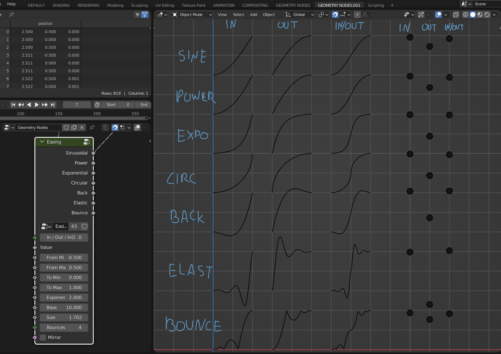

In / Out / InOut
  In / Out / InOut
  
Value
  Value that will be remapped
  
From Min
  The lower bound of the range to remap from

From Max
  The higher bound of the range to remap from

To Min
  The lower bound of the target range

To Max
  The higher bound of the target range
  
Exponent
  Exponent of the **Power** and **Expoential** functions
  
Base
  Base of the **Power** function
  
Size
  Size of the **Back** function
  
Bounces
  Bounces of the **Elastic** function
  
Mirror
  Mirros functions
 
.. warning::
    Bounces input doesn't work on **Bounce** function
  

************************************************************
Bezier Easing 
************************************************************

Easing functions specify the rate of change of a parameter over time

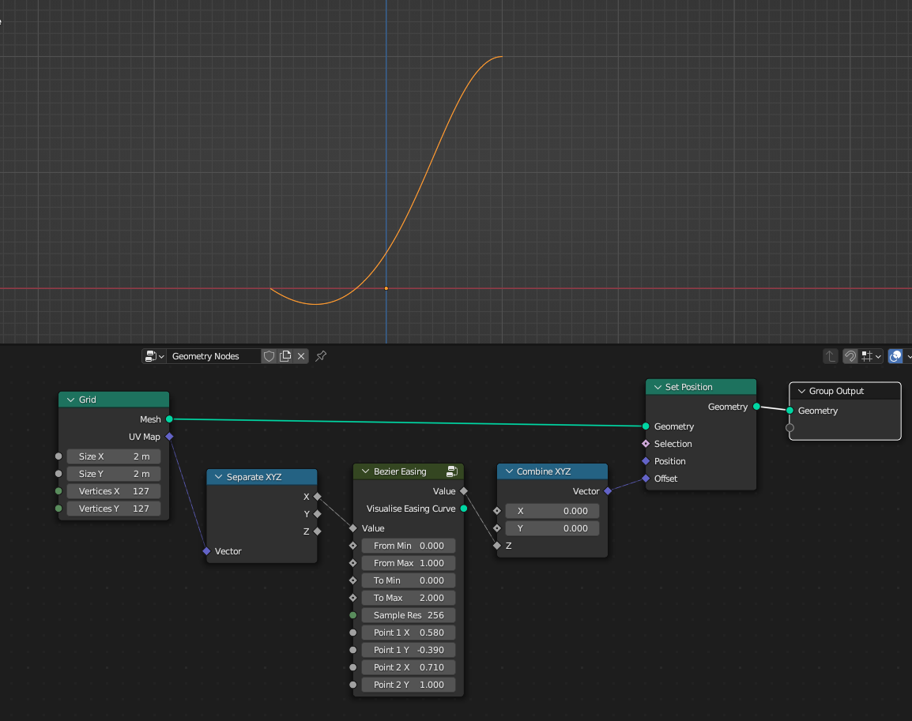

Value
  Value that will be remapped
  
From Min
  The lower bound of the range to remap from

From Max
  The higher bound of the range to remap from

To Min
  The lower bound of the target range

To Max
  The higher bound of the target range
  
Sample Resolution
  Resolution of the bezier curve that values will be sampled
  
Point 1 X
  Bezier curve handle point X location

Point 1 Y
  Bezier curve handle point Y location

Point 2 X
  Bezier curve handle point X location

Point 2 Y
  Bezier curve handle point Y location
  
Mirror
  Mirros output values
  
Visualise Easing Curve
  Shows easing curve
  
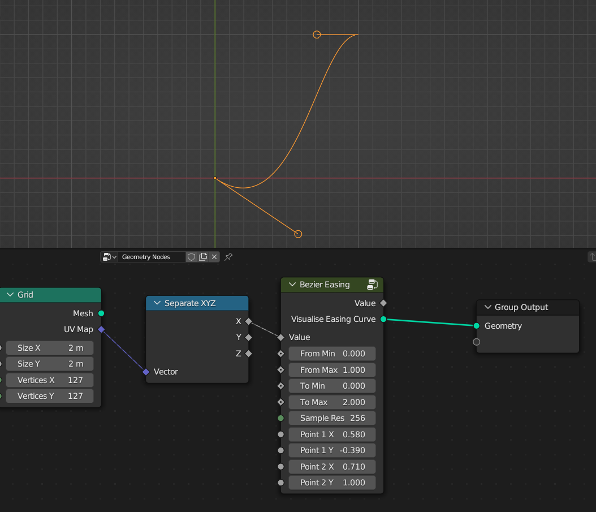

************************************************************
Box Mapping  
************************************************************

Map image on mesh using box mapping method 

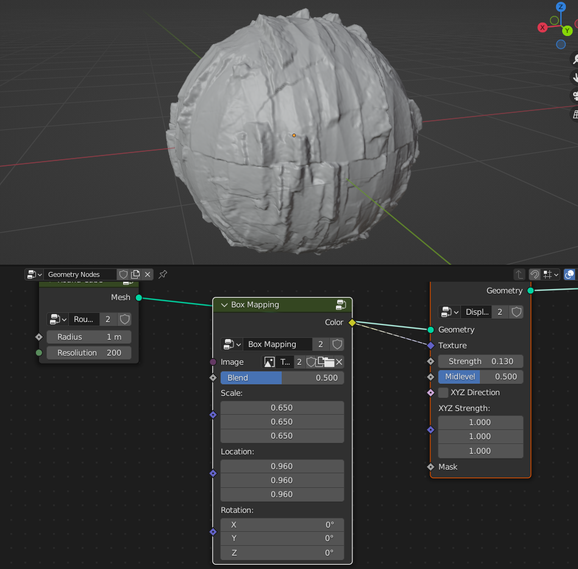

Image
  Input of the image that will be box mapped on the mesh
  
Blend
  Blends between seams

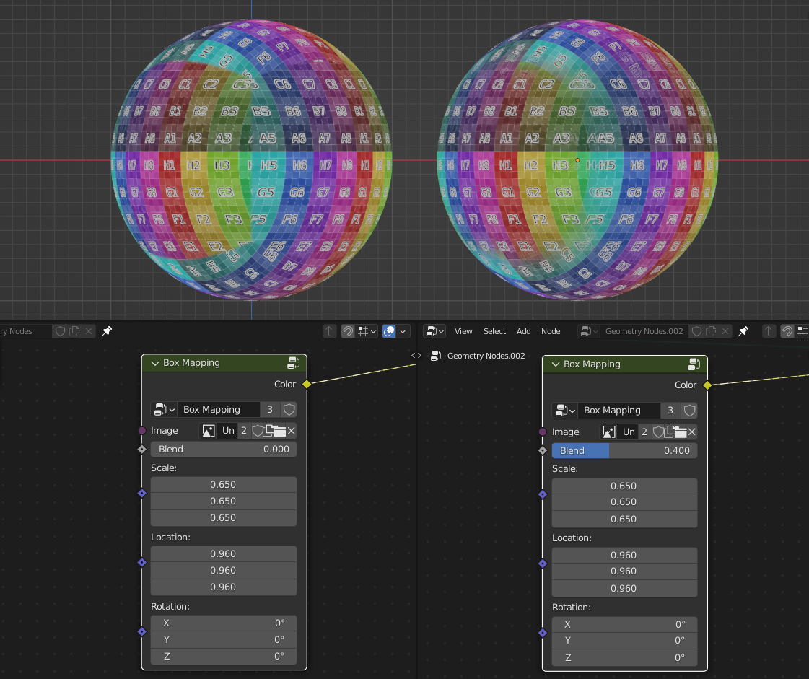

Translation
  Translation of box mapping
  
Rotation
  Rotation of box mapping
  
Scale
  Scale of box mapping
  

************************************************************
Geometry Visualizer
************************************************************

Show geometry Index values or directional vectors on Vertex, Edges, Faces, Face Corners domains

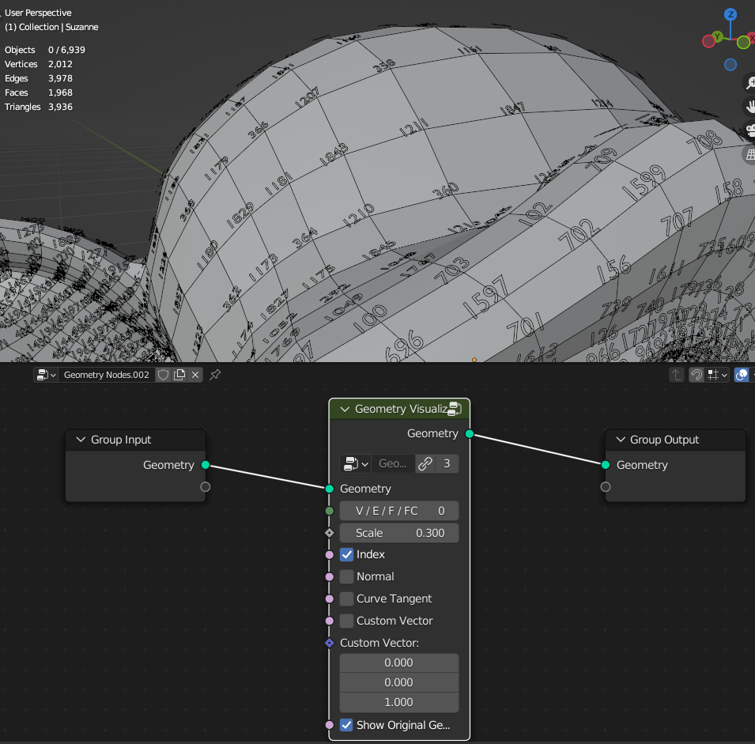
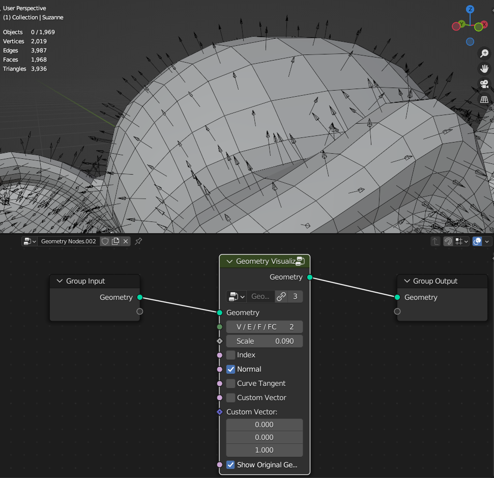

**V / E / F / FC**

- **V** Shows **Vertex** or Points Indices/Vectors
- **E** Shows **Edge** Indices/Vectors
- **F** Shows **Face** or Indices/Vectors
- **FC** Shows **Face Corner** Indices/Vectors

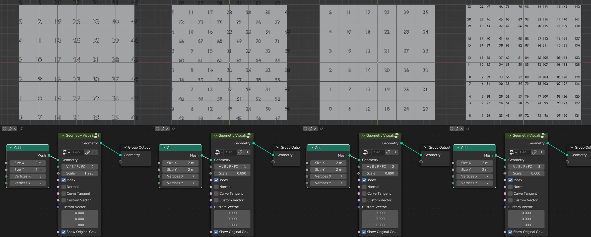

Scale
  Scale of indices letters and directional vectors arros size
  
Index
  Shows indices of selected domain
  
Normal
 Shows geometry normals arrows
 
Curve Tangent
  Show curve tangent arrors
   
Custom Vector
  Show custom vector arrors
  
Custom Vector
  Directional vector values that will show as arros if **Custom Vector** on
  
Show Original Geometry
  Show original geometry

************************************************************
Camera Culling
************************************************************

Creates true boolean values inside camera view

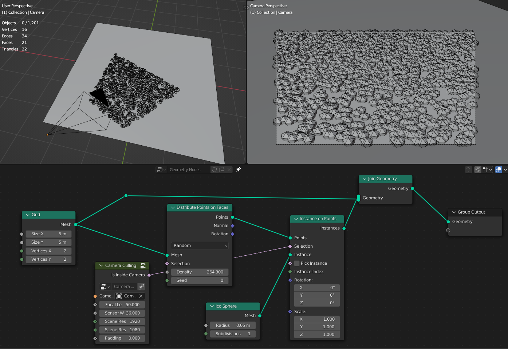

Focal Lenth
  Camera focal lenth 
  
Sensor Size
  Camera sensor size
  
Scene Res X
  Scene X resolution

Scene Res Y
  Scene Y resolution

Padding
  Camera view boundaries offset

************************************************************
Distance to Edge Voronoi
************************************************************

Creates distance to edge voronoi texture from points 

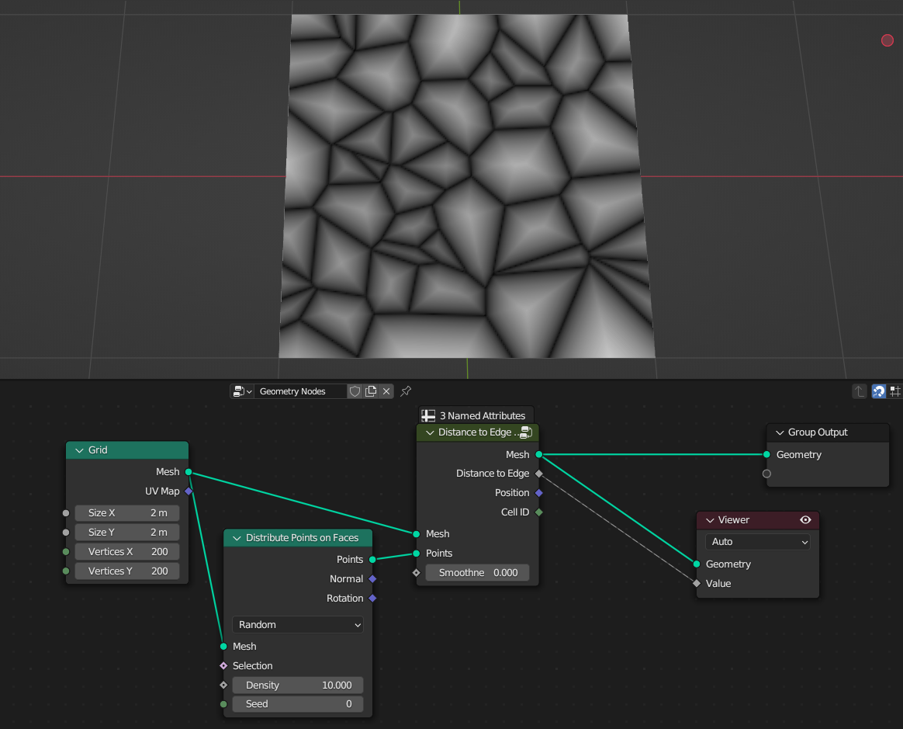
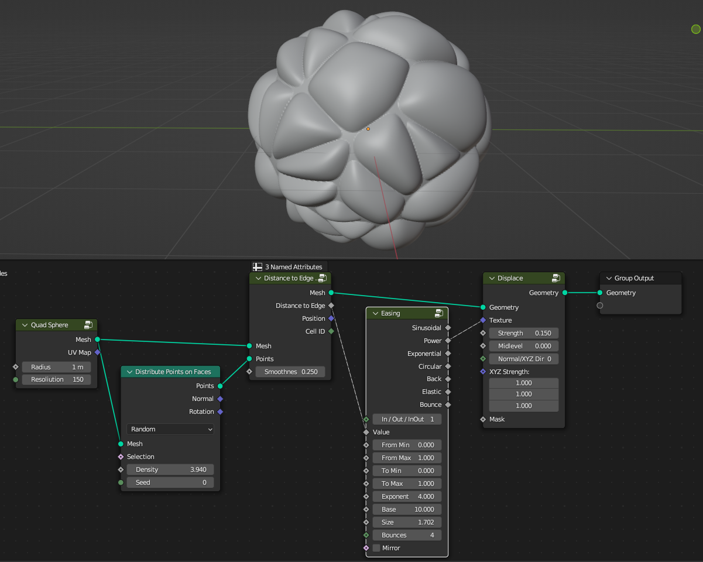

Points
  Points that voronoi texture will be calculated
  
Smoothness
  Smoothness of the distance to edge texture

.. warning::
    Maximum input points are 100. For more points, inside the node group duplicate "NodeGroupVor" node group and connect it with the rest of nodes 

************************************************************
Random Normal Distribution
************************************************************

Creates random values that form bell curve (Gaussian Distribution)

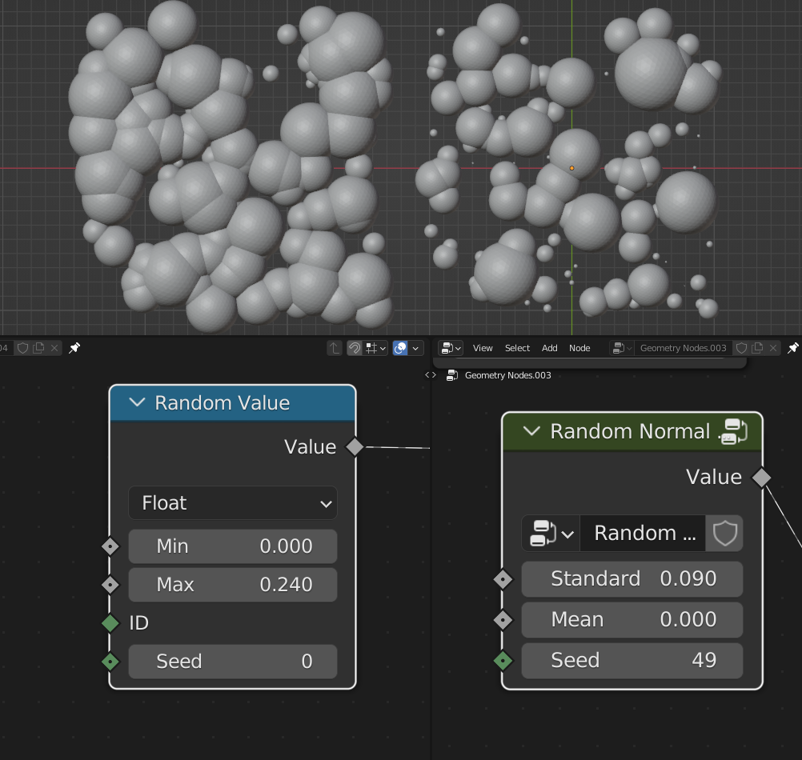
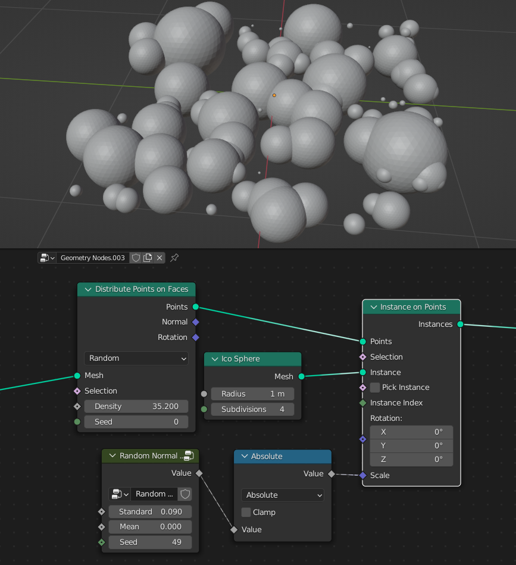

Standard deviation
  Spread of the distribution
  
Mean
  Center of the distribution

Seed
  Seed of the random values

