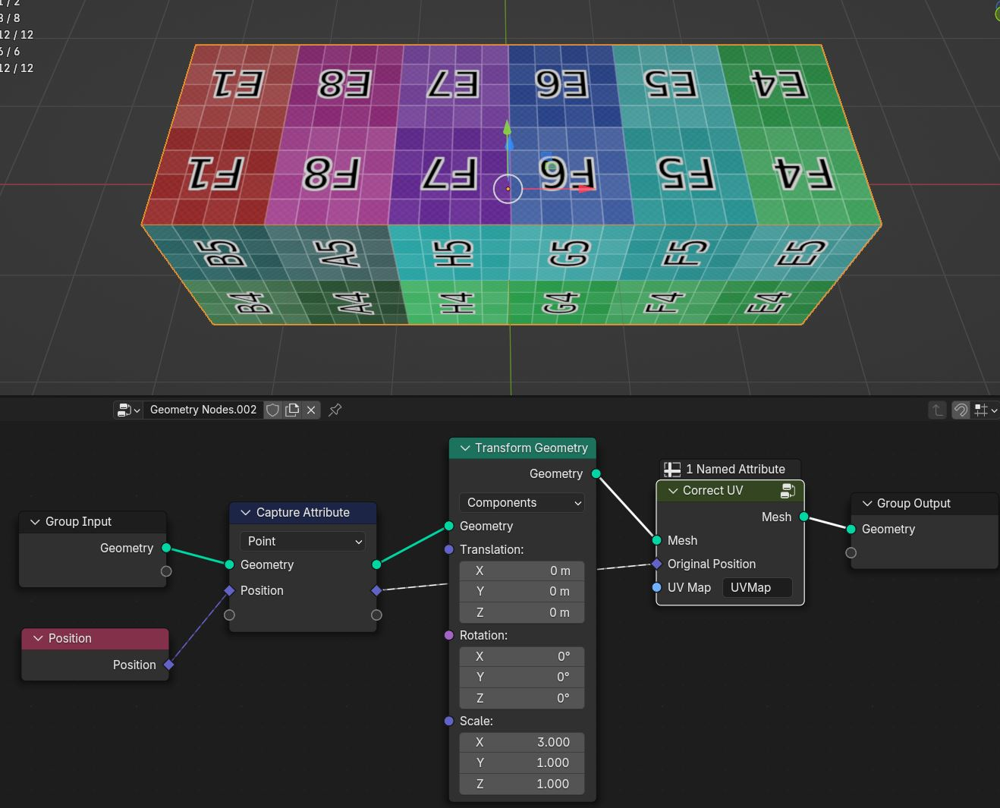
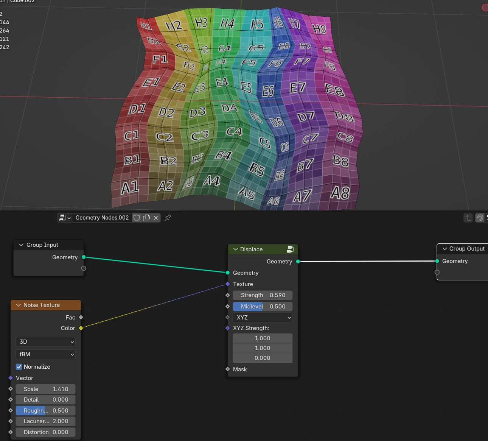

UV
===================================

************************************************************
Camera UV Coordinates
************************************************************

Creates UV coordinates inside camera view

Focal Lenth
  Camera focal lenth 
  
Sensor Size
  Camera sensor size
  
Scene Res X
  Scene X resolution

Scene Res Y
  Scene Y resolution

************************************************************
UV Correct
************************************************************

Corrects UV attribute with simple objects

Focal Lenth
  Camera focal lenth 
  
Sensor Size
  Camera sensor size
  
Scene Res X
  Scene X resolution

Scene Res Y
  Scene Y resolution

.. warning::
    Subsuface subdivied or complex meshes will give bad results

    .. image:: images/uvcor5.JPG

************************************************************
Triplanar UV Mapping  
************************************************************

Creates UV map using triplanar projection method

.. image:: images/tri_uv2.PNG

Translation
  Translation of Triplanar projection
  
Rotation
  Rotation of Triplanar projection
  
Scale
  Scale of Triplanar projection
  
UV Attribute
  UV attribute name that will be stored on the mesh on face corner domain
  
Pack UV Islands
  Packs UV islands
  
Margin
  Distance between UV islands
  
Rotate
  Rotates packed UV island

************************************************************
UV Mirror
************************************************************

Mirrors UV from one side of the mesh to other

Axis
  Axis in 3d space that UV will be mirrored

Center
  Center in 3d space that UV will be mirrored

UV Map
  UV map attribute

************************************************************
UV Seam
************************************************************

Detects uv edge seam

Epsilon
  Small value is used as a threshold to check if edges are edges are close to each other
