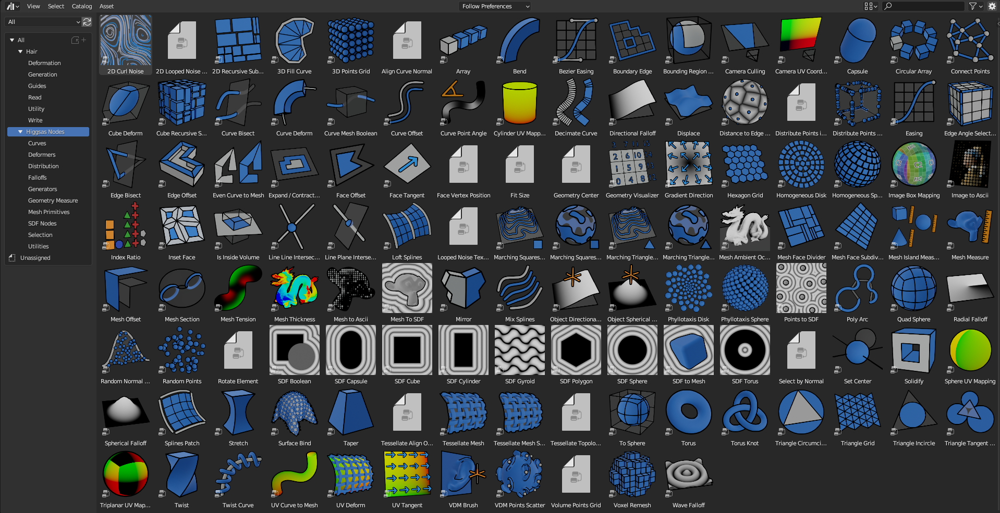

Updates
===================================

**2023-08-11 Update**

26 new nodes:

VDM Brush, VDM Point Scatter, Sphere UV Mapping, Cylinder UV Mapping, Voxel Remesh, Mesh Face Divider, Mesh Face Subdivide, Rotate Eelement, Triangle Incircle, Triangle circumcircle, Triangle Tangent Circle, 3D Curve Fill, Curve Bisect, Curve Mesh Boolean, Curve Decimate, Index Ratio, Mix Splines, Poly Arc, Cube Deform, Mesh Offset, Mesh Section, Torus, Curl Noise 2D, Curl Noise 3D, Surface Curl Noise, Reaction Diffusion Solver

Fixed Mesh Island Measure incorrect measurments

Updated Mesh Tension to work with rest_position attribute

Added thumbnails for nodes assets

Added Blender 3.6

**2023-06-09 Update**

Added expermental rope simulation solver - https://higgsas-geo-nodes-manual.readthedocs.io/en/latest/experimental.html#rope-simulation

**2023-05-30 Update**

**New node:**

Bezier Easing - https://higgsas-geo-nodes-manual.readthedocs.io/en/latest/utilities.html#bezier-easing

**2023-05-13 Update**

Updated SDF nodes documentation

**New nodes:**

Line Line Intersection - https://higgsas-geo-nodes-manual.readthedocs.io/en/latest/geometry_measure.html#line-line-intersection

Line Plane Intersection - https://higgsas-geo-nodes-manual.readthedocs.io/en/latest/geometry_measure.html#line-plane-intersection

Edge Bisect - https://higgsas-geo-nodes-manual.readthedocs.io/en/latest/generators.html#edge-bisect

Cube Recursive Subdivision - https://higgsas-geo-nodes-manual.readthedocs.io/en/latest/generators.html#cube-recursive-subdivision

Surface Bind

Mesh Ambient Occlusion - https://higgsas-geo-nodes-manual.readthedocs.io/en/latest/geometry_measure.html#mesh-ambient-occlusion

Distance to Edge Voronoi - https://higgsas-geo-nodes-manual.readthedocs.io/en/latest/utilities.html#distance-to-edge-voronoi

Wave Falloff

**Added Expermental nodes:**

Reaction diffusion solver

VDM displace

2023-04-27 Update

New node: Marching Squares Surface
Renamed Marching Squares to Marching Squares Isolines

2023-04-21 Update

New node: Splines Patch - https://higgsas-geo-nodes-manual.readthedocs.io/en/latest/curves.html#splines-patch

2023-04-20 Update

Added boundary edge option to Marching Squares/Triangles nodes, and performance improvements

Fixed issue with Tessellate Mesh Smooth not working correctly with Tessellate Topology Helper

New node: Set Center

2023-04-17 Update

Added limits to Bend node

2023-04-14 Update

Updated installation methods 

Fixed artifacts with Align Curve Normal

New nodes:

Fit Size

UV Deform

2023-04-05 Update

Fixed nodes not loading when opening new blend files

2023-04-04 Update

Added installation addon with node groups menu categories

.. image:: images/search.PNG

https://higgsas-geo-nodes-manual.readthedocs.io/en/latest/installation.html

2023-03-27 Update

New nodes:

Tessellate Align Orientation - https://higgsas-geo-nodes-manual.readthedocs.io/en/latest/generators.html#tessellate-align-orientation

Align Curve Normal - https://higgsas-geo-nodes-manual.readthedocs.io/en/latest/curves.html#align-curve-normal

