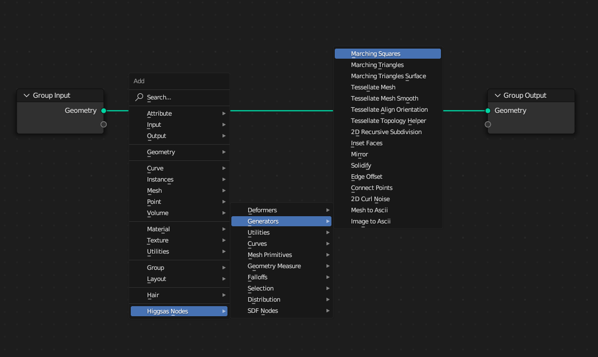

Updates
===================================

2023-05-13 Update

New nodes:

Line Line Intersection - https://higgsas-geo-nodes-manual.readthedocs.io/en/latest/geometry_measure.html#line-line-intersection

Line Plane Intersection - https://higgsas-geo-nodes-manual.readthedocs.io/en/latest/geometry_measure.html#line-plane-intersection

Edge Bisect - https://higgsas-geo-nodes-manual.readthedocs.io/en/latest/generators.html#edge-bisect

Cube Recursive Subdivision

Surface Bind

Mesh Ambient Occlusion - https://higgsas-geo-nodes-manual.readthedocs.io/en/latest/geometry_measure.html#mesh-ambient-occlusion

Distance to Edge Voronoi

Wave Falloff

2023-04-27 Update

New node: Marching Squares Surface
Renamed Marching Squares to Marching Squares Isolines

2023-04-21 Update

New node: Splines Patch - https://higgsas-geo-nodes-manual.readthedocs.io/en/latest/curves.html#splines-patch

2023-04-20 Update

Added boundary edge option to Marching Squares/Triangles nodes, and performance improvements

Fixed issue with Tessellate Mesh Smooth not working correctly with Tessellate Topology Helper

New node: Set Center

2023-04-17 Update

Added limits to Bend node

2023-04-14 Update

Updated installation methods 

Fixed artifacts with Align Curve Normal

New nodes:

Fit Size

UV Deform

2023-04-05 Update

Fixed nodes not loading when opening new blend files

2023-04-04 Update

Added installation addon with node groups menu categories

https://higgsas-geo-nodes-manual.readthedocs.io/en/latest/installation.html

2023-03-27 Update

New nodes:

Tessellate Align Orientation - https://higgsas-geo-nodes-manual.readthedocs.io/en/latest/generators.html#tessellate-align-orientation

Align Curve Normal - https://higgsas-geo-nodes-manual.readthedocs.io/en/latest/curves.html#align-curve-normal

