Utilities
===================================

************************************************************
Smooth Attribute
************************************************************

Smooths/blurs attribute

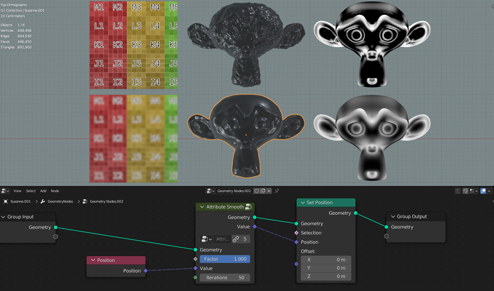
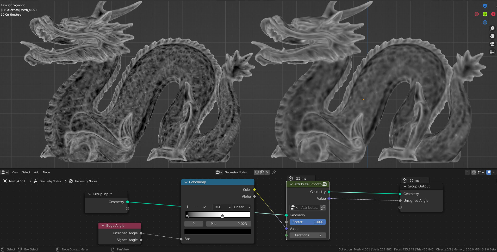

Factor
  Factor of the original and smooth attribute value
  
Value
  Value that will be smoothed/blured
  
Iterations
  Amount of smooth/blur

************************************************************
Easing 
************************************************************

Smooths/blurs attribute

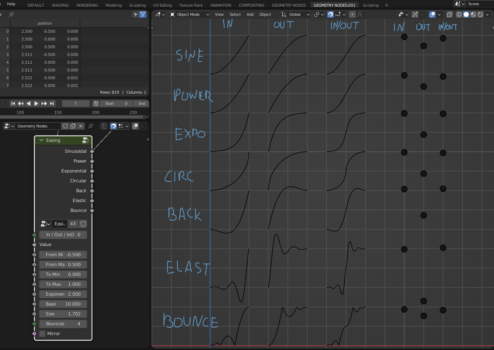

In / Out / InOut
  asd
  
Value
  Value that will be remapped
  
From Min
  The lower bound of the range to remap from

From Max
  The higher bound of the range to remap from

To Min
  The lower bound of the target range

To Max
  The higher bound of the target range
  
Exponent
  Exponent of the **Power** and **Expoential** functions
  
Base
  Base of the **Power** function
  
Size
  Size of the **Back** function
  
Bounces
  Bounces of the **Elastic** function
  
Mirror
  Mirros functions
 
.. warning::
    Bounces input doesn't work on **Bounce** function
  
  

************************************************************
Triplanar UV Mapping  
************************************************************

Creates UV map using triplanar projection method

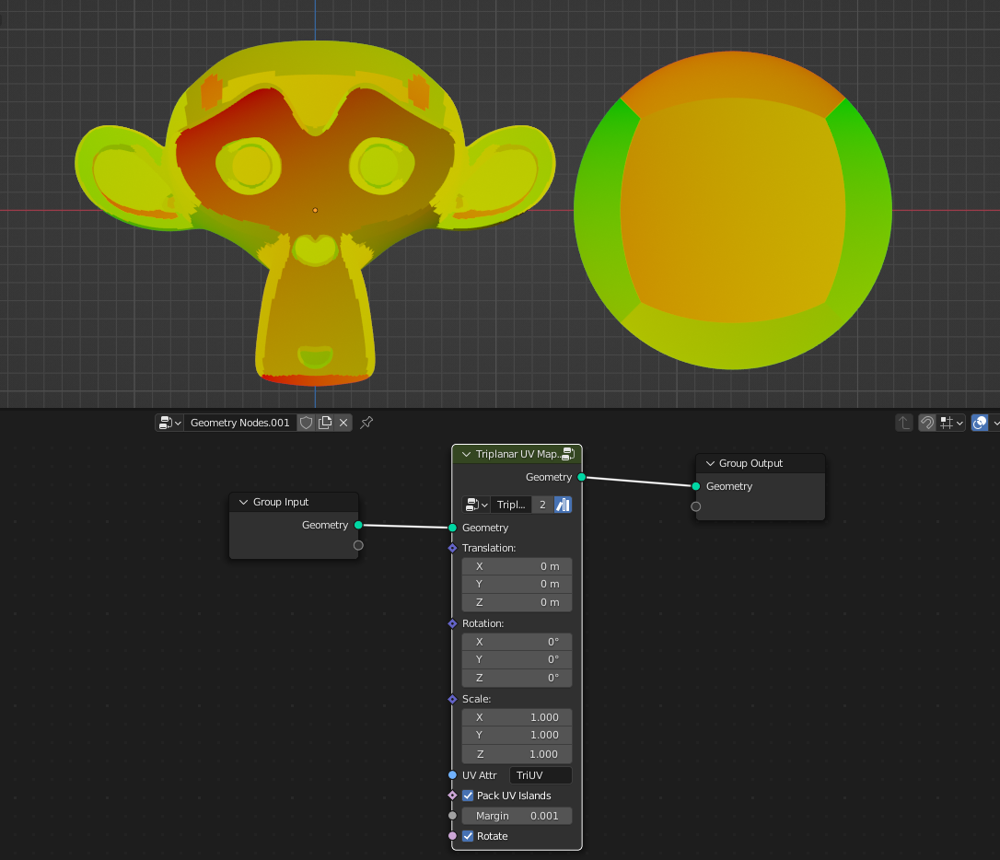
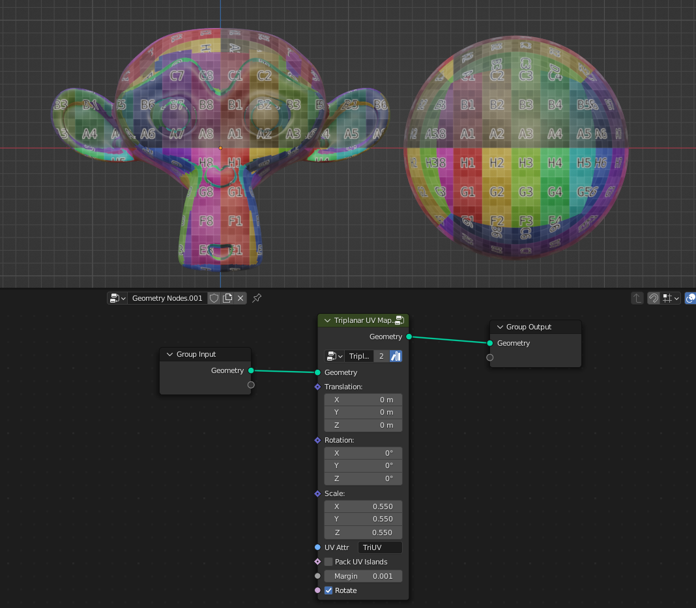

Translation
  Translation of Triplanar projection
  
Rotation
  Rotation of Triplanar projection
  
Scale
  Scale of Triplanar projection
  
UV Attribute
  UV attribute name that will be stored on the mesh on face corner domain
  
Pack UV Islands
  Packs UV islands
  
Margin
  Distance between UV islands
  
Rotate
  Rotates packed UV islands

************************************************************
Box Mapping  
************************************************************

Map image on mesh using box mapping method 

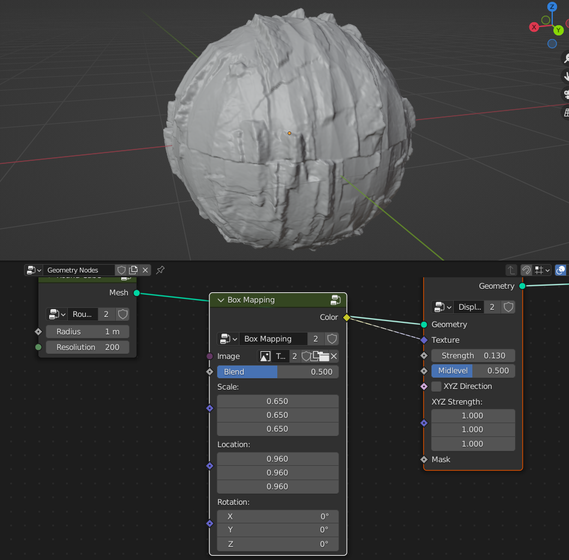

Image
  Input of the image that will be box mapped on the mesh
  
Blend
  Blends between seams

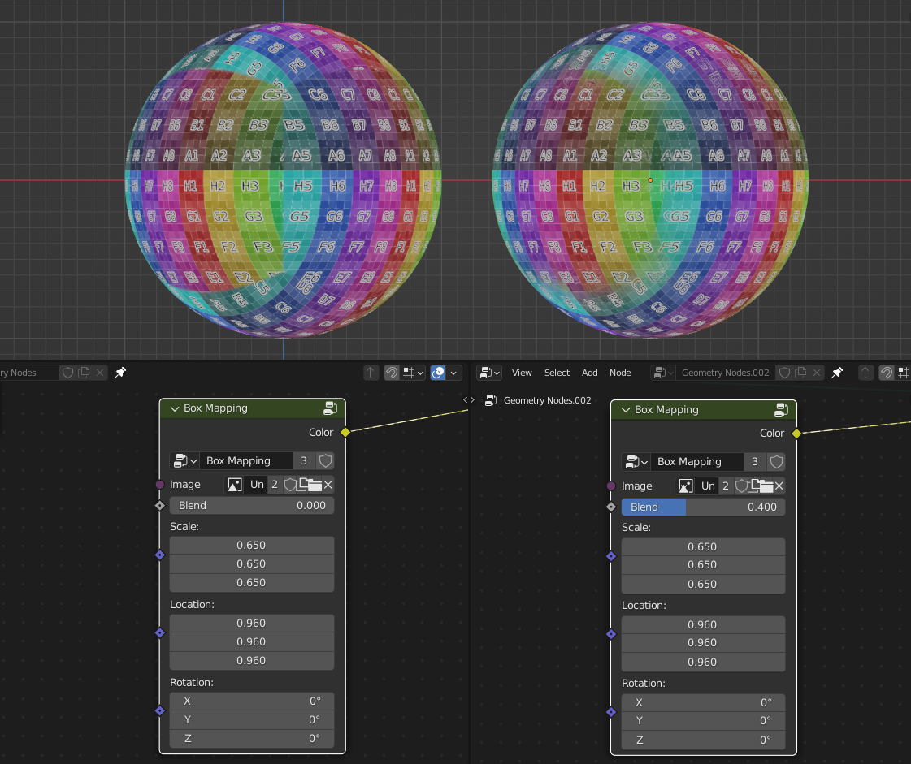

Translation
  Translation of box mapping
  
Rotation
  Rotation of box mapping
  
Scale
  Scale of box mapping
  

************************************************************
Mix Float
************************************************************

Mixes between two float values

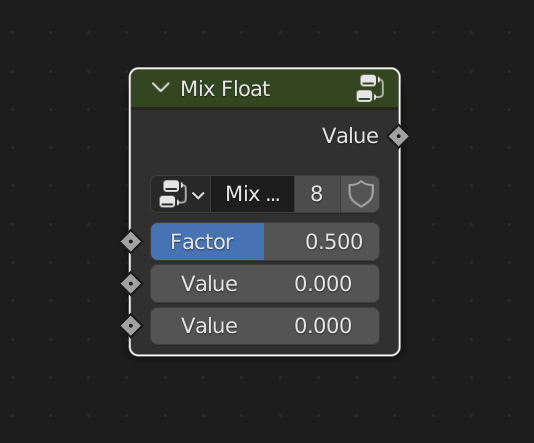

Factor
  Mix factor
  
Value
  Float Value
  
Value
  Float Value
  
  
  
************************************************************
Mix Vector
************************************************************

Mixes between two vector values

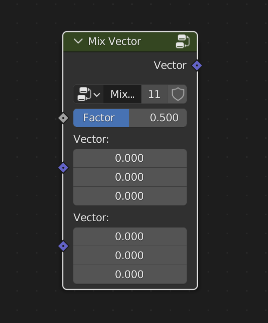

Factor
  Mix factor
  
Value
  Vector Value
  
Value
  Vector Value

************************************************************
Random Normal Distribution
************************************************************

Creates random values that form bell curve (Gaussian Distribution)

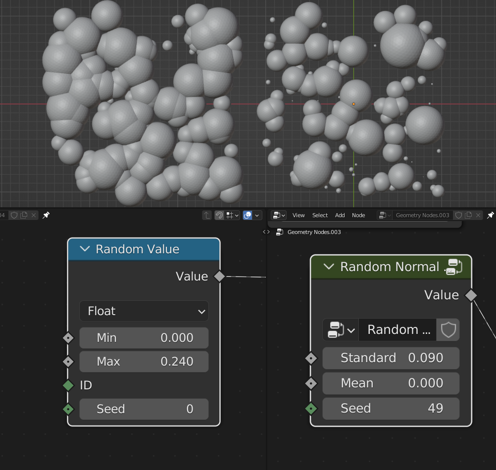
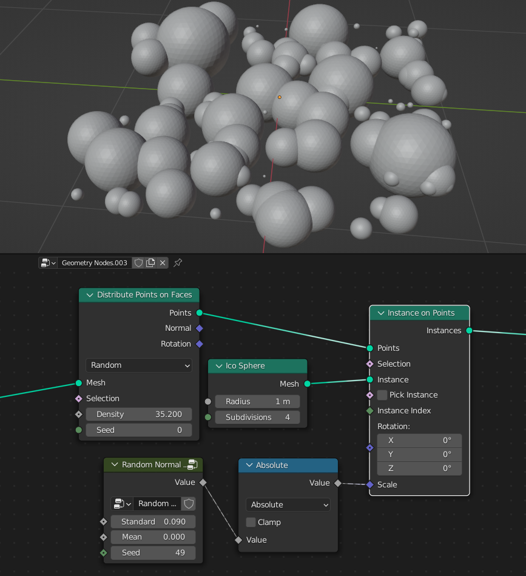

Standard deviation
  Spread of the distribution
  
Mean
  Center of the distribution

Seed
  Seed of the random values

