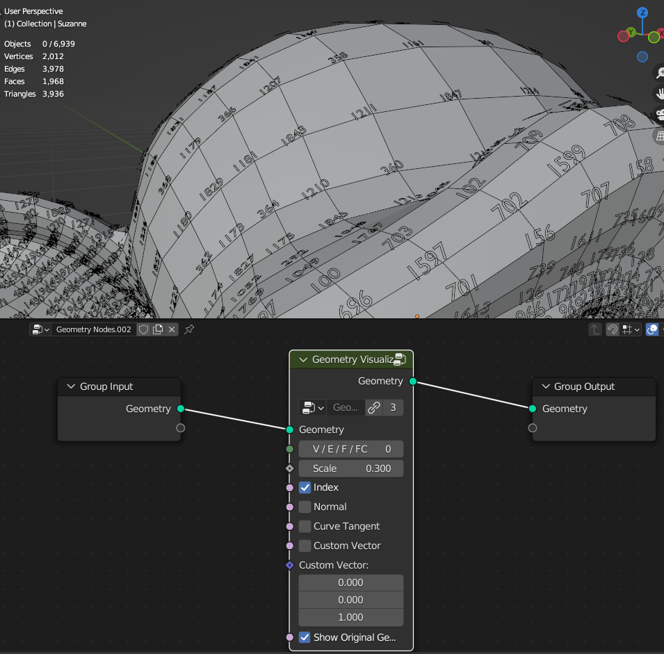
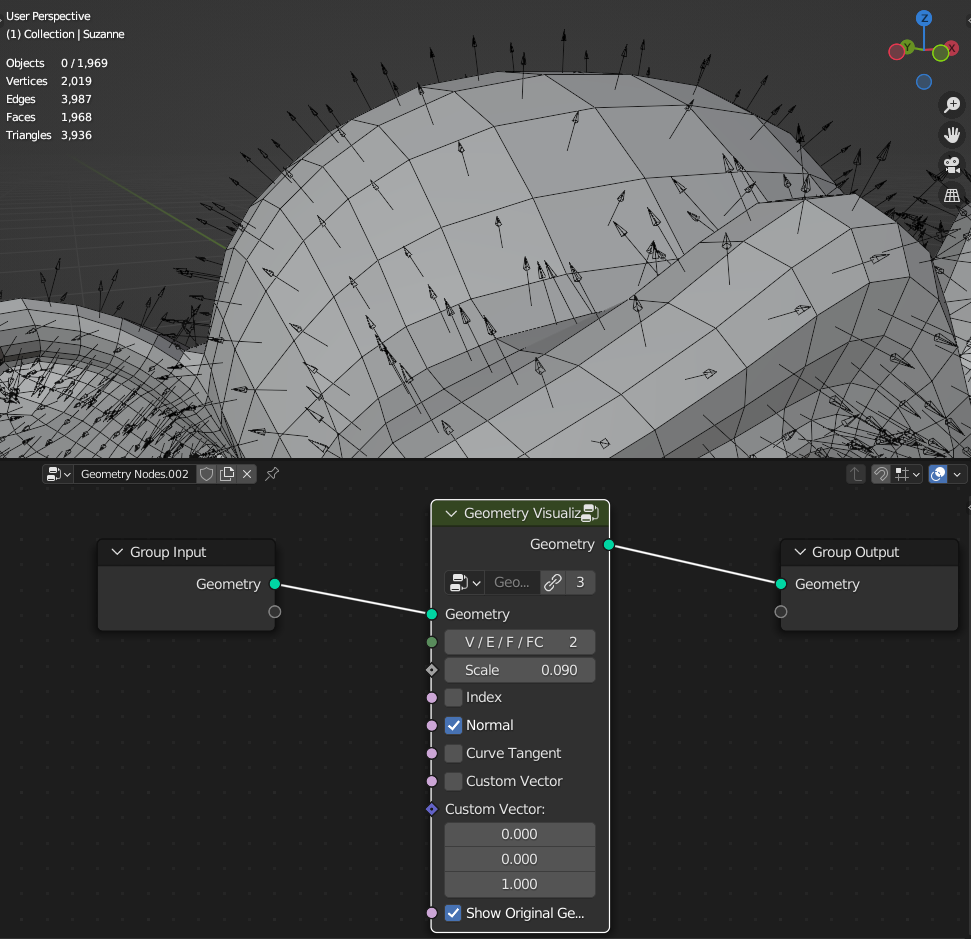
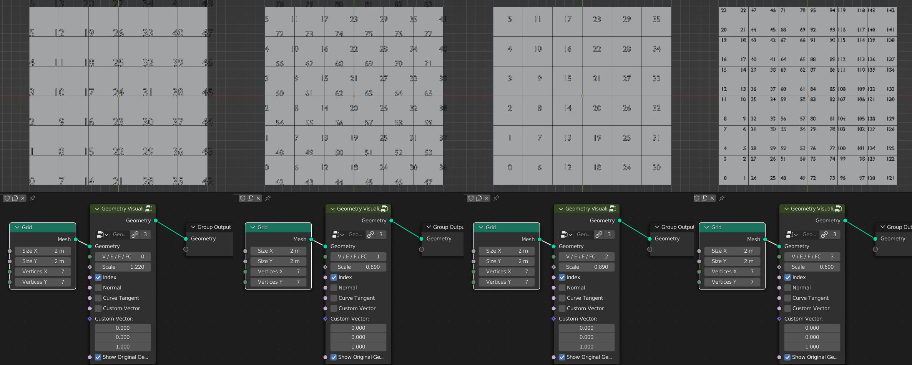
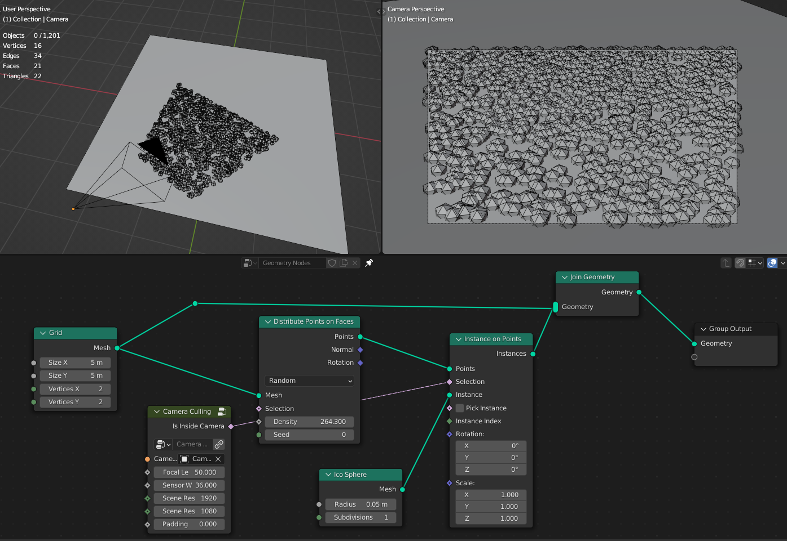
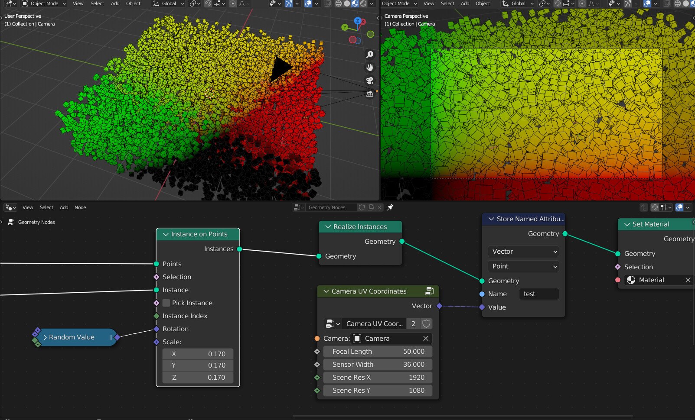

Utilities
===================================

************************************************************
Smooth Attribute
************************************************************

Smooths/blurs attribute

.. image:: images/sm_att.png
.. image:: images/sm_att2.png

Factor
  Factor of the original and smooth attribute value
  
Value
  Value that will be smoothed/blured
  
Iterations
  Amount of smooth/blur

************************************************************
Easing 
************************************************************

Smooths/blurs attribute

.. image:: images/easing.png

In / Out / InOut
  asd
  
Value
  Value that will be remapped
  
From Min
  The lower bound of the range to remap from

From Max
  The higher bound of the range to remap from

To Min
  The lower bound of the target range

To Max
  The higher bound of the target range
  
Exponent
  Exponent of the **Power** and **Expoential** functions
  
Base
  Base of the **Power** function
  
Size
  Size of the **Back** function
  
Bounces
  Bounces of the **Elastic** function
  
Mirror
  Mirros functions
 
.. warning::
    Bounces input doesn't work on **Bounce** function
  
  

************************************************************
Triplanar UV Mapping  
************************************************************

Creates UV map using triplanar projection method

.. image:: images/tri_uv.PNG
.. image:: images/tri_uv2.PNG

Translation
  Translation of Triplanar projection
  
Rotation
  Rotation of Triplanar projection
  
Scale
  Scale of Triplanar projection
  
UV Attribute
  UV attribute name that will be stored on the mesh on face corner domain
  
Pack UV Islands
  Packs UV islands
  
Margin
  Distance between UV islands
  
Rotate
  Rotates packed UV islands

************************************************************
Box Mapping  
************************************************************

Map image on mesh using box mapping method 

.. image:: images/box_map.png

Image
  Input of the image that will be box mapped on the mesh
  
Blend
  Blends between seams

.. image:: images/box_map2.png

Translation
  Translation of box mapping
  
Rotation
  Rotation of box mapping
  
Scale
  Scale of box mapping
  

************************************************************
Geometry Visualizer
************************************************************

Show geometry Index values or directional vectors on Vertex, Edges, Faces, Face Corners domains

**V / E / F / FC**

- **V** Shows **Vertex** or Points Indices/Vectors
- **E** Shows **Edge** Indices/Vectors
- **F** Shows **Face** or Indices/Vectors
- **FC** Shows **Face Corner** Indices/Vectors

Scale
  Scale of indices letters and directional vectors arros size
  
Index
  Shows indices of selected domain
  
Normal
 Shows geometry normals arrows
 
Curve Tangent
  Show curve tangent arrors
   
Custom Vector
  Show custom vector arrors
  
Custom Vector
  Directional vector values that will show as arros if **Custom Vector** on
  
Show Original Geometry
  Show original geometry

************************************************************
Mesh to Ascii
************************************************************

Creates Ascii representation of geometry inside camera

.. image:: images/m_t_a.jpeg
.. image:: images/m_t_a.gif

Mesh
  Mesh that will be projected as Ascii

Camera
  Camera that Ascii will be projected from

Focal Lenth
  Camera focal lenth
  
Sensor Size
  Camera censor size
  
Scene Res X
  Scene X resoliution
   
Scene Res Y
  Scene Y resoliution
  
Grid Resoliution
  Resoliution of the Ascii grid
  
Grid offset
  Grid offset inside camera
  
Contrast Min
  Min contrast of the mesh normals dot product

Contrast Max
  Max contrast of the mesh normals dot product

Light Direction
  Gradient direction
  
Ascii
  Ascii characters that used for gradient values. Black/empty is space " " 

************************************************************
Image to Ascii
************************************************************

Creates Ascii from image

.. image:: images/i_t_ac.jpeg

Image
  Image input
  
Resoliution
  Grid resolution of Ascii
  
Img Res X
  Input image X resolution

Img Res Y
  Input image Y resolution

Contrast Min
  Min contrast of the image values

Contrast Max
  Max contrast of the image values

Ascii
  Ascii characters that used for gradient values. Black/empty is space " " 
  
Frame
  Frame of the image input
  
Color Attribute
  Creates color attribute from image colors
  

************************************************************
Camera Culling
************************************************************

Creates true boolean values inside camera view

Focal Lenth
  Camera focal lenth 
  
Sensor Size
  Camera sensor size
  
Scene Res X
  Scene X resolution

Scene Res Y
  Scene Y resolution

Padding
  Camera view boundaries offset

************************************************************
Camera UV Coordinates
************************************************************

Creates UV coordinates inside camera view

Focal Lenth
  Camera focal lenth 
  
Sensor Size
  Camera sensor size
  
Scene Res X
  Scene X resolution

Scene Res Y
  Scene Y resolution

************************************************************
Mix Float
************************************************************

Mixes between two float values

.. image:: images/mix_float.png

Factor
  Mix factor
  
Value
  Float Value
  
Value
  Float Value
  
  
  
************************************************************
Mix Vector
************************************************************

Mixes between two vector values

.. image:: images/mix_vector.png

Factor
  Mix factor
  
Value
  Vector Value
  
Value
  Vector Value

************************************************************
Random Normal Distribution
************************************************************

Creates random values that form bell curve (Gaussian Distribution)

.. image:: images/r_n_d.png
.. image:: images/r_n_d2.png

Standard deviation
  Spread of the distribution
  
Mean
  Center of the distribution

Seed
  Seed of the random values

